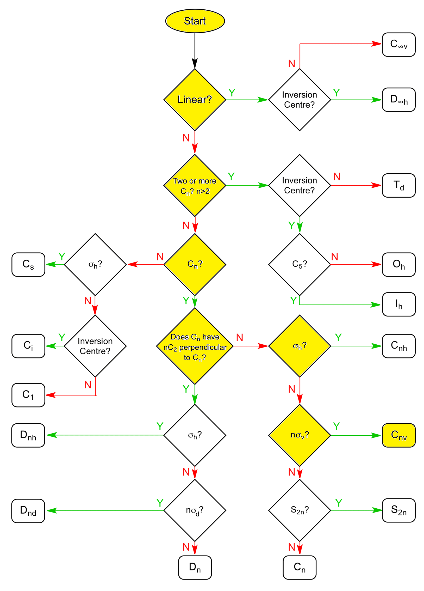
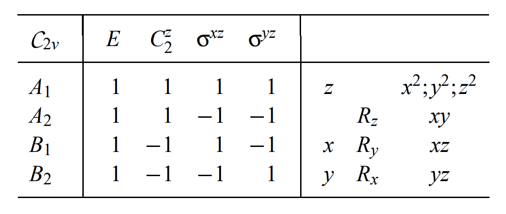
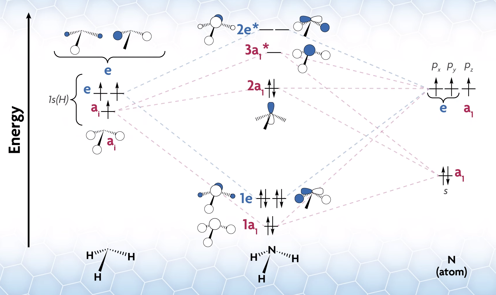
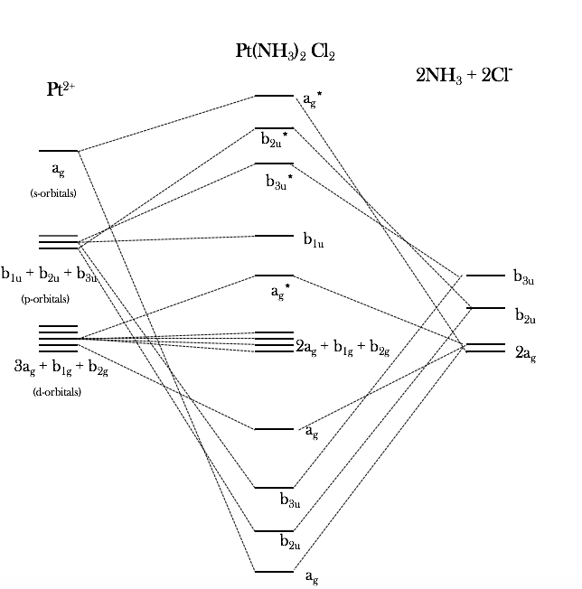

---

title: "The Inorganic Chemistry of Cisplatin"
subtitle: Exploring crystal field theory and ligand field theory through a famous chemotherapy drug
date:
summary:
draft: false
featured: false
tags:
  - chemistry
categories: []

image:
    preview_only: true
    filename: featured.jpg

commentable: true

---

The platinum-based "antineoplastic drugs" are a class of anti-cancer agents with a surprisingly simple structure compared to most other pharmaceuticals. Unlike the majority of drugs, which are organic compounds, these drugs are coordination complexes of platinum. The most famous of these drugs is [cisplatin](https://en.wikipedia.org/wiki/Cisplatin), which has been used to treat a variety of cancers since the 1970s. In this post, we will explore the inorganic chemistry of cisplatin, focusing on the crystal field theory and ligand field theory that help explain its properties.

## Structure of Cisplatin

### Electronic Structure

Cisplatin has molecular formula $ [Pt(NH_3)_2Cl_2] $: a neutral complex with two ammine ($NH_3$) and two chloride ($Cl^-$) ligands, and a platinum ($Pt^{2+}$) metal centre. Let's get started by predicting the geometry of cisplatin. We've already seen from the diagram above (leftmost complex) that cisplatin is a square planar complex, but how can we rationalise this? After all, complexes with four ligands could be tetrahedral, square planar, or some other shape. We will follow the electron counting procedure to make our prediction.

First, we need to determine the oxidation state of the platinum centre. We know that the ammine ligands ($NH_3$) are uncharged, and the chloride ligands ($Cl^-$) have a -1 charge each, so by a simple charge balance, the platinum centre must carry a +2 charge, being in the +2 oxidation state.

The electron configuration of neutral platinum atom is $ [Xe] \ 4f^{14} \ 5d^9 \ 6s^1 $.
But in cisplatin, the platinum is in the +2 oxidation state (a $ Pt^{2+} $ ion), so we need to remove two electrons. The highest energy electrons are removed first - that's the 6s electrons, then the 5d electrons. So, we get the electron configuration of $ Pt^{2+} $ as $ [Xe] \ 4f^{14} \ 5d^8 $.

The platinum centre also receives electrons from its ligands. The ammine ligands use their lone pair to form coordinate covalent bonds, donating two electrons each, while the chloride ligands also donate one of their lone pairs each. So, the ligands collectively donate 8 electrons to the platinum centre, giving a total of 16 valence electrons for the complex - or 16 + 14 = 30 electrons if counting the $ f $ orbital electrons as well.

According to the [18 electron rule](https://en.wikipedia.org/wiki/18-electron_rule), a stable complex tends to have 18 valence electrons around the metal centre - or 32 electrons if counting the $ f $ orbital electrons as well. This is an extension to the 'octet rule', following the numbers of electrons in the noble gases (from Bohr's model: 2, 8, 8, 18, 18, 32, 32, ...). We can see that cisplatin is two electrons short of meeting this rule. This is [not unusual for complexes with fewer numbers of ligands](https://en.wikipedia.org/wiki/18-electron_rule#16-electron_complexes), as they tend to be more reactive. In fact, cisplatin is a very reactive complex, which is why it is used as a chemotherapy drug as it binds to DNA to exert its cytotoxic effects.

### Stereoisomerism in Cisplatin

As seen in the above diagram, *cisplatin* (shown leftmost) is a square-planar complex. The two types of ligands, chloride ($Cl^-$) and ammonia ($NH_3$), are arranged in the *cis* configuration, meaning that the pairs are located on the same side as each other. This is in contrast to a *trans* configuration, which would have the four ligands alternating around the square planar complex. Stereoisomerism is extremely important in pharmacology, as biomolecules have complex 3D structures so the molecular mechanisms and interactions with the drug are geometry dependent. In the case of cisplatin, the close proximity of the two most labile ligands allows the drug to tightly bind adjacent nucleobases in DNA, allowing it to exert its cytotoxic effects.

## Mechanism of Action of Cisplatin

Cisplatin contains two labile chlorido ligands. The reaction of cisplatin with water (aquation) does not occur in the blood plasma, since the plasma's high chloride ion concentration of 100 mM keeps the equilibrium to the left. Cisplatin, being a small molecule, can diffuse through the cell membrane and enter the cytoplasm, where the chloride ion concentration is much lower (4 - 12 mM), shifting the equilibrium to the right, and replacing its chlorido ligands with water molecules from the cytosol. The di-hydrated complex has a +2 charge and is the active form of cisplatin, which migrates to the nucleus. According to [Dasari & Tchounwou, 2015](https://pmc.ncbi.nlm.nih.gov/articles/PMC4146684/), various transport proteins also play a key role in the active transport of cisplatin through these membranes.

Once in the nucleus, the active cisplatin complex binds to DNA, substituting its two water ligands with the nitrogen atoms on nearby nucleobases of the DNA double helix. The most common binding sites are the N7 (nitrogen) atoms of directly adjacent purine bases (adenine and guanine), but sometimes an inter-strand crosslink is formed between guanines on complementary strands of the double helix.



Once bound to the DNA, the DNA polymerase enzymes are obstructed, preventing DNA replication and killing the cell. This inhibits tissue growth in the regions affected, killing the cancer.

The intrastrand crosslinks tend to give the strongest cytotoxic effects. According to [Mantri, Lippard & Baik, 2007](https://pmc.ncbi.nlm.nih.gov/articles/PMC2495024/), when cisplatin binds to adenine and guanine, it only ever binds with AG dinucleotides, not the other way around, GA (reading from 5' to 3'). This is due to a stabilising hydrogen bond to a phosphate group in the transition state that only occurs in one direction due to the right-handed helicity of the DNA backbone, verified by [density functional theory (DFT)](https://en.wikipedia.org/wiki/Density_functional_theory) studies.

## Synthesis of Cisplatin

The scheme below shows the most common synthesis of cisplatin, starting from potassium tetrachloroplatinate(II) ($K_2PtCl_4$).

In the first step, an excess of at least four equivalents of iodide ions is added, undergoing ligand substitution to form the tetraiodoplatinate(II) complex.

In the second step, the stereoisomerism comes into play. Two equivalents of ammonia are added to the tetraiodoplatinate(II) complex. The first ammonia molecule replaces one of the iodide ligands. But when a second ammonia molecule approaches, it has two choices: it can either displace an adjacent iodide ligand, which would form the *cis* complex, or it can displace the diametrically opposite iodide ligand, which would form the *trans* complex.

### The Kinetic Trans Effect

Reaction kinetics turns out to favour one over the other. The [kinetic trans effect](https://en.wikipedia.org/wiki/Trans_effect) is the phenomenon where the rate of ligand substitution is faster when substituting at the *trans* position to an existing ligand. The *trans*-directing strength of ligands follows this series:

$$ F^−, H_2O, OH^− < NH_3 < py < Cl^− < Br^− < I^−, SCN^−, NO_2^−, $$ 
$$ SC(NH_2)_2, Ph^− < SO_3^{2−} < PR_3, AsR_3, SR_2, CH_3^− $$ 
$$ < H^−, NO, CO, CN^−, C_2H_4 $$

Considering the intermediate complex, $ \[PtI_3(NH_3)\]^- $, the iodide ligand ($I^-$) appears to be a stronger *trans*-directing ligand than ammonia ($NH_3$). The second ammonia molecule is therefore directed *opposite* an iodide ligand, which (2 out of the 3 times it doesn't just replace the first ammonia molecule) forms the *cis* complex.

In the third step of the synthesis, aqueous silver nitrate precipitates out the iodide as silver iodide, leaving water molecules in the metal complex. Finally, in the fourth step, addition of a concentrated solution of chloride ions leads to another ligand substitution, displacing the water ligands and forming the final cisplatin complex.

## Crystal Field Theory

[Crystal Field Theory (CFT)](https://en.wikipedia.org/wiki/Crystal_field_theory) is a model that describes the bonding in coordination complexes. It assumes that the metal ion is a point charge, and that the ligands are also point charges. It can therefore be considered a model of ionic bonding. Depending on the geometry of the complex, the ligands will approach the metal ion's five different $d$ orbitals in slightly different ways, leading to more electron repulsion in some than others, therefore splitting the energy levels of the $d$ orbitals.

CFT is often successful in predicting some properties of complexes, such as the molecular geometry, the colour of the solution, and its response to a magnetic field. Let's see how it can be done, using cisplatin as an example.

First, we will try to predict whether cisplatin will be tetrahedral or square planar, as both are possible for complexes with four ligands. We already know that the answer should be square planar from the first diagram, but this will be a nice test of CFT.

We have already seen that the $ Pt^{2+} $ ion has electron configuration $ [Xe] \ 4f^{14} \ 5d^8 $. In CFT, we typically ignore the $ f $ orbitals, as they tend to be inert, being buried deep inside the atom.

Next, we need to consider 'strength' of the ligands. This indicates the magnitude of the splitting that will occur. If the splitting energy is large, the repulsive effect of pairing two electrons in the same orbital with opposite spins will not be enough to overcome the energy difference, and the orbitals will be filled according to the [Aufbau principle](https://en.wikipedia.org/wiki/Aufbau_principle) as usual. This is the *strong field, low spin* case. If the splitting energy is small, the electrons will pair up in the lower energy orbitals before filling the higher energy orbitals, leading to a *weak field, high spin* case.

Another series, the [spectrochemical series](https://en.wikipedia.org/wiki/Spectrochemical_series), can be used to predict the strength of the ligands. The series is as follows:

$$ \text{(Weak Field, High-spin)} $$ $$ I^− < Br^− < S^{2−} < SCN^− < Cl^− < NO_3^− < N_3^− < F^− < OH^− $$
$$ < C_2O_4^{2−} < H_2O < NCS^− < CH_3CN < py < NH_3 $$
$$ \text{(Strong Field, Low-spin)} $$
$$ < en < bipy < phen < NO_2^− < PPh_3 < CN^− < CO $$

According to the spectrochemical series, both chloride and ammonia are weak field ligands. This means that we can expect the splitting energy will be small, so the orbitals will be half-filled with unpaired electrons first, with the exception of the two highest energy orbitals in the square planar geometry, which are always separated by a large enough energy to make pairing up more favourable.

Our filled orbital diagram for the $ Pt^{2+} $ ion therefore looks like this:

We can now numerically determine the total energy of the $d$ electrons on the metal ion, by adding up the energies relative to the baseline (the *barycentre*). Whichever geometry minimises this energy will be the most stable.

### Predicting Molecular Geometry

For the tetrahedral case:

- 4 electrons ($ e $ orbitals) at $ E = -\frac{3}{5} \Delta_{tet} $.
- 4 electrons ($ t_2 $ orbitals) at $ E = +\frac{2}{5} \Delta_{tet} $.
- 3 pairs of electrons in the same orbitals, giving an additional $ 3P $ energy.

Using the equation $ \Delta_{tet} = \frac{4}{9} \Delta_{oct} $, we can convert these values to the standard octahedral splitting energy, $ \Delta_{oct} $. The total energy for the tetrahedral complex is then: 

$$ E_{tet} = 4 \times -\frac{3}{5} \times \frac{4}{9} \Delta_{oct} + 4 \times \frac{2}{5} \times \frac{4}{9} \Delta_{oct} + 3P = -\frac{16}{45} \Delta_{oct} + 3P $$
$$ = -0.36 \Delta_{oct} + 3P. $$

For the square planar case:

- 4 electrons ($ d_{xz}, d_{yz} $ orbitals) at $ E = -0.51 \Delta_{oct} $.
- 2 electrons ($ d_{z^2} $ orbital) at $ E = -0.43 \Delta_{oct} $.
- 2 electrons ($ d_{xy} $ orbital) at $ E = +0.23 \Delta_{oct} $.
- 4 pairs of electrons in the same orbitals, giving an additional $ 4P $ energy.

The total energy for the square planar complex is then:

$$ E_{sq} = 4 \times -0.51 \Delta_{oct} + 2 \times -0.43 \Delta_{oct} + 2 \times 0.23 \Delta_{oct} + 4P $$
$$ = -2.44 \Delta_{oct} + 4P. $$

Comparing the two energies,

$$ E_{sq} - E_{tet} = -2.08 \Delta_{oct} + P. $$

Since we already assumed that $ P < \Delta_{oct} $ (which is generally true), we can see that $ E_{sq} < E_{tet} $, and therefore the **square planar geometry is more stable than the tetrahedral geometry**. This matches our experimental observation of cisplatin.

The crystal field stabilisation energy (CFSE) is the energy difference between the given orbital energies and the original energy of the degenerate $d$ orbitals, accounting for mutual repulsion. It is a measure of the stability of the complex. The degenerate case (*isotropic field*) has $ E_{iso} = 3P $ for the 3 paired electrons in the $d$ orbitals.

We can therefore find 

$$ CFSE_{sq} = E_{sq} - E_{iso} = -2.44 \Delta_{oct} + P < -1.44 \Delta_{oct} $$
$$ CFSE_{tet} = E_{tet} - E_{iso} = -0.36 \Delta_{oct} $$

Since $ CFSE_{sq} < CFSE_{tet} $, this confirms that the square planar arrangement is more stable than the tetrahedral geometry. CFT has done a good job of predicting the geometry of cisplatin!

### Predicting Magnetic Behaviour

The two basic responses of matter to a magnet are paramagnetism and diamagnetism. [Paramagnetic](https://en.wikipedia.org/wiki/Paramagnetism) substances are attracted to a magnetic field, while [diamagnetic](https://en.wikipedia.org/wiki/Diamagnetism) substances are repelled by it. There are [two main contributions](https://en.wikipedia.org/wiki/Magnetochemistry#Complexes_of_transition_metal_ions) to the magnetic moment of a molecule: the *spin magnetic moment* and the *orbital magnetic moment*. The spin magnetic moment arises from the intrinsic angular momentum of unpaired electrons, while the orbital magnetic moment arises from the motion of electrons around the nucleus.

We saw from CFT that the $ Pt^{2+} $ ion in cisplatin has all of its eight $ d $ electrons paired. This means that for every tiny magnetic moment generated by an electron in the presence of an external field, there is another electron with the exact opposite magnetic moment, so we expect no spin-only magnetic moment (diamagnetic).

Next we consider the orbital magnetic moment. Although a transition metal's $ d $ orbitals do possess angular momentum, the square planar geometry of the cisplatin complex complicates things. It turns out that square-planar fields quench orbital angular momentum, because the lowered symmetry removes the degeneracies. We will see what exactly this means in the ligand field theory section below, but for now we can conclude that the orbital magnetic moment is also zero. So, the total magnetic moment of cisplatin is zero, and it is **diamagnetic**. This is consistent with experimental observations, as cisplatin solutions are not attracted to a magnet.

## Ligand Field Theory

[Ligand field theory (LFT)](https://en.wikipedia.org/wiki/Ligand_field_theory) is a more advanced bonding theory that is well-suited to describing complexes which have some degree of covalent character, i.e. not perfect electrostatic interactions. In the modern formulation, LFT combines the [group theory approach](https://en.wikipedia.org/wiki/Molecular_symmetry#Symmetry_of_molecular_orbitals) of [molecular orbital (MO) theory](https://en.wikipedia.org/wiki/Molecular_orbital_theory) with CFT. It makes use of the projection operator method, a useful tool from quantum mechanics, to derive the 'symmetry adapted linear combinations' (SALCs) of the transition metal ion's orbitals, and then constructs suitable molecular orbitals from these SALCs. The results of LFT tend to give results in good agreement with numerical methods such as DFT.

### The Covalent Character of Cisplatin

First, we can look at how ionic or covalent the bonding in cisplatin is qualitatively. The ammine ligands are neutral, so we can expect their coordinate bond to be quite covalent. However, the chloride ligands are charged. According to the [hard-soft acid-base (HSAB) theory](https://en.wikipedia.org/wiki/HSAB_theory), the relatively small chloride ion is a *hard base* due to having low polarisability, so we could expect a more ionic bond with the platinum centre (which acts as a *soft acid*). The $ Pt-Cl $ bond is therefore expected to be weak but ionic, while the $ Pt-NH_3 $ bond is expected to be strong and covalent. The weak Pt-Cl bond is the reason why its synthesis involves ligand substitution of $ Pt-Cl $ with $ Pt-I $ (as $ I^- $ is a much weaker base due to its larger size), and also why cisplatin's reaction on DNA involves substitution of its chloride ligands. In any case, we can see that cisplatin has some covalent character, so LFT should be a good improvement over CFT and a suitable model to describe its bonding.

### The Symmetry of Cisplatin

To start applying LFT, we first need to identify the [point group](https://en.wikipedia.org/wiki/Molecular_symmetry#Point_groups) that cisplatin belongs to. A point group is a mathematical classification of the different symmetries of the molecule: the types of rotational symmetry, reflectional symmetry, etc. Here are all the relevant symmetry elements for cisplatin:



Note that we have treated the ammine ligands as points, ignoring their N-H bonds which extend out of the plane. This is an acceptable simplification for our purposes. We now follow this flowchart to determine the point group. The yellow boxes show the path we take.

We find that cisplatin belongs to the $ \mathcal{C}\_{2v} $ point group (since the order of the axis is $ n = 2 $), using the [Schönflies notation](https://en.wikipedia.org/wiki/Schoenflies_notation) common to MO theory. We now refer to the [character table](https://chem.libretexts.org/Bookshelves/Inorganic_Chemistry/Inorganic_Chemistry_(LibreTexts)/04%3A_Symmetry_and_Group_Theory/4.03%3A_Properties_and_Representations_of_Groups/4.3.03%3A_Character_Tables) of the $ \mathcal{C}\_{2v} $ point group:

The heading row lists the group's symmetry elements ($ E $: identity, $ C_2 $: rotational axis of order 2, $ \sigma_{xz} $ and $ \sigma_{yz} $: mirror planes of reflection). The column lists the 'symmetry species', which are all the different ways that objects (e.g. orbital wavefunctions) can transform under this group, shown by their [Mulliken symbols](https://www.cup.uni-muenchen.de/ch/compchem/geom/point3.html): $ A $ and $ B $ species are symmetric and anti-symmetric with respect to the principal axis, respectively.

We need to work out how the frontier orbitals of our platinum ion and the ligands transform in the $ \mathcal{C}_{2v} $ point group. We will start with the $ Pt^{2+} $ ion, which is the easiest to do. It has five partially filled $ 5d $ orbitals, a vacant $ 6s $ orbital and three vacant $ 6p $ orbitals.

From the basis functions given in the character table (shown on its right-hand side), we can immediately read off the irreducible representations for the $ Pt^{2+} $ ion's atomic orbitals. Linear basis functions ($ x, y, z $) apply to $ p $-orbitals along those axes, while quadratic functions (products of those) apply to the $ d $-orbitals with those names:

- $ A_1 $: $ 6s, \ 6p_z, \ 5d_{z^2}, \ 5d_{x^2-y^2} $
- $ A_2 $: $ 5d_{xy} $
- $ B_1 $: $ 6p_x, \ 5d_{xz} $
- $ B_2 $: $ 6p_y, \ 5d_{yz} $

Next, we need to do the same thing for the ligand orbitals. Since these are not located at the centre of the complex, this is trickier: we must manually compute the reducible representations by considering how each orbital transforms. For the ammine ligand, we must also find what those orbitals actually look like, which we can do with MO theory. By applying essentially the same method as outlined here to the ammonia molecule (considering nitrogen as the central atom in a trigonal pyramidal geometry), we can find the frontier orbitals of ammonia. I'll skip the work, but we find the following (as shown in [this video](https://www.youtube.com/watch?v=l7yQ9_H52_E)):

We will assume that only the $ 2a_1 $ bonding MO and the $ 3a_1^* $ and $ 2e^* $ antibonding MOs contribute, due to their higher energy levels. (Note that the symmetry labels above apply to the ammonia molecule alone; it does not apply to the whole complex.)

...

We need to convert these into irreps. In general, to reduce a representation $ \Gamma = a_1 \Gamma^{(1)} \oplus a_2 \Gamma^{(2)} \oplus ... \oplus a_n \Gamma^{(n)} $, we use the formula

$$ a_k = \frac{1}{h} \sum_R \chi^{(k)}(R)^* \ \chi(R) $$

where:

- $ \chi(R) $: character of the operation $ R $ in $ \Gamma $ (in general, $ \chi \in \mathbb{C} $)
- $ \chi^{(k)}(R) $: character of the operation $ R $ in $ \Gamma^{(k)} $
- $ h $: number of elements in the point group
- $ * $ is complex conjugate and $ \oplus $ is the direct sum of symmetry species.

...

Now we need to project our ligand MO irreps onto the components to find the ligand SALCs. We use the projection operator, defined as:

$$ \mathcal{P}^{(k)} = \frac{n_k}{h} \sum_R \chi^{(k)}(R)^* \ R $$

where:

- $ n_k $: dimension of $ \Gamma^{(k)} $ i.e. character of $ E $ (identity element) in $ \Gamma^{(k)} $
- $ h $: order of the group
- $ \chi^{(k)}(R) $: character of the symmetry operation $ R $ in $ \Gamma^{(k)} $

### Molecular Orbitals of Cisplatin

Finally, we can construct the SALCs by interfering orbitals of the same symmetry species:

#### DFT Studies of Cisplatin

[Georgieva *et al.*, 2017](https://www.sciencedirect.com/science/article/abs/pii/S1386142517300082)

[Dodoff, 2012](https://www.scirp.org/journal/paperinformation?paperid=20463)

### The Jahn-Teller Effect

### Relativistic Effects
