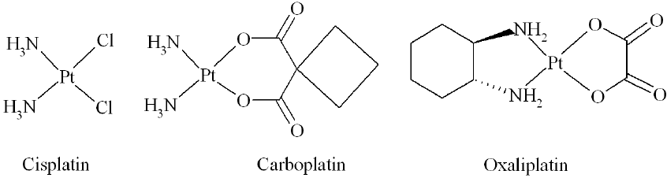
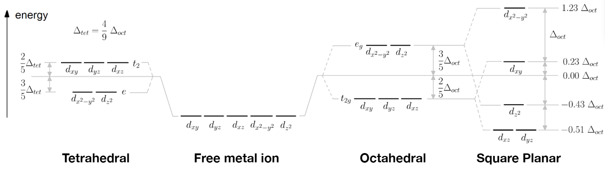
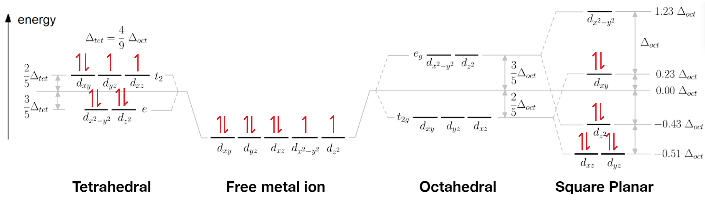

---

title: "The Inorganic Chemistry of Cisplatin"
subtitle: Exploring crystal field theory and ligand field theory through a famous chemotherapy drug
date:
summary:
draft: false
featured: false
tags:
  - chemistry
categories: []

image:
    preview_only: true
    filename: featured.jpg

commentable: true

---

The *platinum-based antineoplastic* drugs are a class of anti-cancer agents with a surprisingly simple structure compared to most other pharmaceuticals. Unlike the majority of drugs, which are organic compounds, these drugs are coordination complexes of platinum. The most famous of these drugs is cisplatin, which has been used to treat a variety of cancers since the 1970s. In this post, we will explore the inorganic chemistry of cisplatin, focusing on the crystal field theory and ligand field theory that help explain its properties.

## Stereoisomerism in Cisplatin

As seen in the above diagram, *cisplatin* (shown leftmost) is a square-planar complex. The two types of ligands, chloride ($Cl^-$) and ammonia ($NH_3$), are arranged in the *cis* configuration, meaning that the pairs are located on the same side as each other. This is in contrast to a *trans* configuration, which would have the four ligands alternating around the square planar complex. As always in pharmacology, stereoisomerism is extremely important, as it sets the mechanisms and interactions the drug can undergo. In the case of cisplatin, the close proximity of the two chloride ligands allows the drug to tightly bind adjacent nucleobases in DNA, allowing it to exert its cytotoxic effects of inhibiting cancer cell division.

## Synthesis of Cisplatin: Exploiting the Kinetic Trans Effect

The scheme below shows the most common synthesis of cisplatin, starting from potassium tetrachloroplatinate(II) ($K_2PtCl_4$).

In the first step, an excess of iodide ions is added, undergoing ligand substitution to form the tetraiodoplatinate(II) complex.

In the second step, the stereoisomerism comes into play. Two equivalents of ammonia are added to the tetraiodoplatinate(II) complex. The first ammonia molecule replaces one of the iodide ligands. But when a second ammonia molecule approaches, it has two choices: it can either displace an adjacent iodide ligand, which would form the *cis* complex, or it can displace the diametrically opposite iodide ligand, which would form the *trans* complex.

Reaction kinetics turns out to favour one over the other. The *kinetic trans effect* is the phenomenon where the rate of ligand substitution is faster when substituting at the *trans* position to an existing ligand. The *trans directing strength* of ligands follows this series:

$$ F^−, H_2O, OH^− < NH_3 < py < Cl^− < Br^− < I^−, SCN^−, NO_2^−, $$ 
$$ SC(NH_2)_2, Ph^− < SO_3^{2−} < PR_3, AsR_3, SR_2, CH_3^− $$ 
$$ < H^−, NO, CO, CN^−, C_2H_4 $$

Considering the intermediate complex, $ \[PtI_3(NH_3)\]^- $, the iodide ligand ($I^-$) appears to be a stronger *trans*-directing ligand than ammonia ($NH_3$). The second ammonia molecule is therefore directed *opposite* an iodide ligand, which (2 out of the 3 times it doesn't just replace the first ammonia molecule) forms the *cis* complex.

In the third step of the synthesis, aqueous silver nitrate precipitates out the iodide as silver iodide, leaving water molecules in the metal complex. Finally, in the fourth step, addition of a concentrated solution of chloride ions leads to another ligand substitution, displacing the water ligands and forming the final cisplatin complex.

## Crystal Field Theory

Crystal Field Theory (CFT) is a model that describes the bonding in coordination complexes. It assumes that the metal ion is a point charge, and that the ligands are also point charges. It can therefore be considered a model of ionic bonding. Depending on the geometry of the complex, the ligands will approach the metal ion's five different $d$ orbitals in slightly different ways, leading to more electron repulsion in some than others, therefore splitting the energy levels of the $d$ orbitals.

CFT is often successful in predicting some properties of complexes, such as the molecular geometry, the colour of the solution, and its response to a magnetic field. Let's see how it can be done, using cisplatin as an example.

First, we will try to predict whether cisplatin will be tetrahedral or square planar, as both are possible for complexes with four ligands. We already know that the answer should be square planar from the first diagram, but this will be a nice test of CFT.

The electron configuration of neutral platinum atom is: $ [Xe] \ 4f^{14} \ 5d^9 \ 6s^1 $.
But in cisplatin, the platinum is in the +2 oxidation state (a $ Pt^{2+} $ ion), so we need to remove two electrons. The highest energy electrons are removed first - that's the 6s electrons, then the 5d electrons. So, we get the electron configuration of $ Pt^{2+} $ as $ [Xe] \ 4f^{14} \ 5d^8 $.

Next, we need to consider 'strength' of the ligands. This indicates the magnitude of the splitting that will occur. If the splitting energy is large, the repulsive effect of pairing two electrons in the same orbital with opposite spins will not be enough to overcome the energy difference, and the orbitals will be filled according to the Aufbau principle as usual. This is the *strong field, low spin* case. If the splitting energy is small, the electrons will pair up in the lower energy orbitals before filling the higher energy orbitals, leading to a *weak field, high spin* case.

Another series, the *spectrochemical series*, can be used to predict the strength of the ligands. The series is as follows:

$$ \text{(Weak Field, High-spin)} $$ $$ I^− < Br^− < S^{2−} < SCN^− < Cl^− < NO_3^− < N_3^− < F^− < OH^− $$
$$ < C_2O_4^{2−} < H_2O < NCS^− < CH_3CN < py < NH_3 $$
$$ \text{(Strong Field, Low-spin)} $$
$$ < en < bipy < phen < NO_2^− < PPh_3 < CN^− < CO $$

According to the spectrochemical series, both chloride and ammonia are weak field ligands. This means that we can expect the splitting energy will be small, so the orbitals will be half-filled with unpaired electrons first, with the exception of the two highest energy orbitals in the square planar geometry, which are always separated by a large enough energy to make pairing up more favourable.

Our filled orbital diagram for the $ Pt^{2+} $ ion therefore looks like this:

We can now numerically determine the total energy of the $d$ electrons on the metal ion, by adding up the energies relative to the baseline (the *barycentre*). Whichever geometry minimises this energy will be the most stable.

### Predicting Molecular Geometry

For the tetrahedral case:

- 4 electrons ($ e $ orbitals) at $ E = -\frac{3}{5} \Delta_{tet} $.
- 4 electrons ($ t_2 $ orbitals) at $ E = +\frac{2}{5} \Delta_{tet} $.
- 3 pairs of electrons in the same orbitals, giving an additional $ 3P $ energy.

Using the equation $ \Delta_{tet} = \frac{4}{9} \Delta_{oct} $, we can convert these values to the standard octahedral splitting energy, $ \Delta_{oct} $. The total energy for the tetrahedral complex is then: 

$$ E_{tet} = 4 \times -\frac{3}{5} \times \frac{4}{9} \Delta_{oct} + 4 \times \frac{2}{5} \times \frac{4}{9} \Delta_{oct} + 3P = -\frac{16}{45} \Delta_{oct} + 3P $$
$$ = -0.36 \Delta_{oct} + 3P. $$

For the square planar case:

- 4 electrons ($ d_{xz}, d_{yz} $ orbitals) at $ E = -0.51 \Delta_{oct} $.
- 2 electrons ($ d_{z^2} $ orbital) at $ E = -0.43 \Delta_{oct} $.
- 2 electrons ($ d_{xy} $ orbital) at $ E = +0.23 \Delta_{oct} $.
- 4 pairs of electrons in the same orbitals, giving an additional $ 4P $ energy.

The total energy for the square planar complex is then:

$$ E_{sq} = 4 \times -0.51 \Delta_{oct} + 2 \times -0.43 \Delta_{oct} + 2 \times 0.23 \Delta_{oct} + 4P $$
$$ = -2.44 \Delta_{oct} + 4P. $$

Comparing the two energies,

$$ E_{sq} - E_{tet} = -2.08 \Delta_{oct} + P. $$

Since we already assumed that $ P < \Delta_{oct} $ (which is generally true), we can see that $ E_{sq} < E_{tet} $, and therefore the **square planar geometry is more stable than the tetrahedral geometry**. This matches our experimental observation of cisplatin.

The crystal field stabilisation energy (CFSE) is the energy difference between the given orbital energies and the original energy of the degenerate $d$ orbitals, accounting for mutual repulsion. It is a measure of the stability of the complex. The degenerate case (*isotropic field*) has $ E_{iso} = 3P $ for the 3 paired electrons in the $d$ orbitals.

We can therefore find 

$$ CFSE_{sq} = E_{sq} - E_{iso} = -2.44 \Delta_{oct} + P < -1.44 \Delta_{oct} $$
$$ CFSE_{tet} = E_{tet} - E_{iso} = -0.36 \Delta_{oct} $$

Since $ CFSE_{sq} < CFSE_{tet} $, this confirms that the square planar arrangement is more stable than the tetrahedral geometry. CFT has done a good job of predicting the geometry of cisplatin!

### Predicting Magnetic Behaviour

The two basic responses of matter to a magnet are paramagnetism and diamagnetism. Paramagnetic substances are attracted to a magnetic field, while diamagnetic substances are repelled by it. The magnetic behaviour of a complex can be predicted by the number of unpaired electrons in the $d$ orbitals. Fundamentally, this interaction is due to the alignment of the magnetic moments of the electrons with the external magnetic field. In the familiar cases of ferromagnetic materials such as iron, this alignment occurs spontaneously into *domains*, providing permanent magnetism, but most materials require an external magnetic field to become magnetised.

In the case of cisplatin, now that we know the electron configuration of the $ Pt^{2+} $ ion, we can see that all electrons are paired. This means that for every tiny magnetic moment generated by an electron in the presence of an external field, there is another electron with the exact opposite magnetic moment, meaning there will be no net magnetic moment. The only contribution to the magnetic field inside bulk cisplatin will therefore be the diamagnetic interaction, making cisplatin diamagnetic overall: it will be weakly repelled by a magnet.
