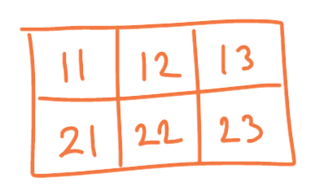
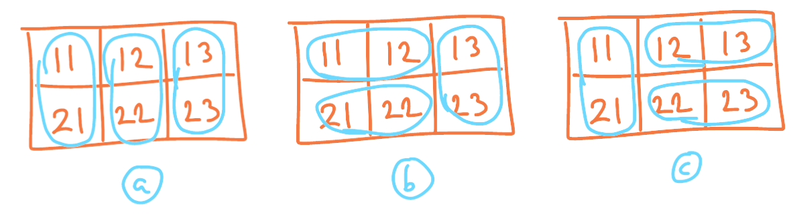
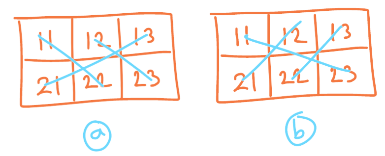
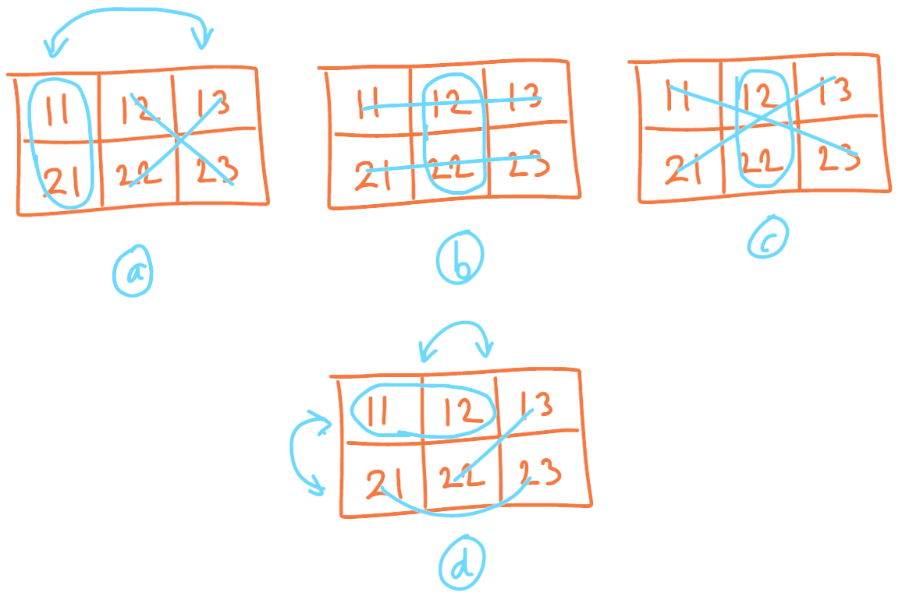
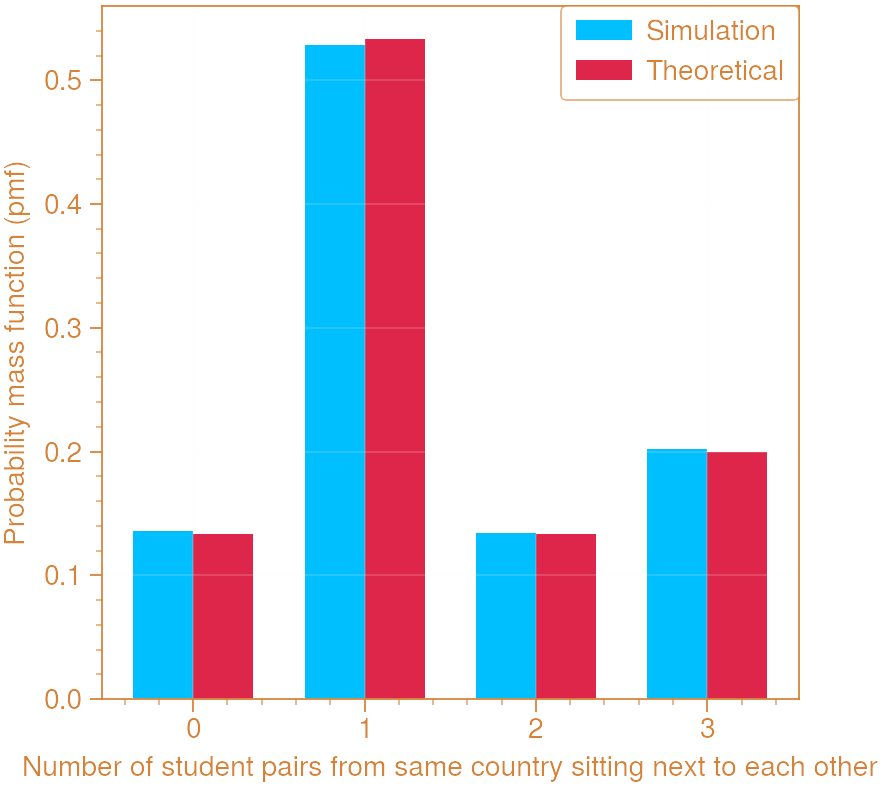

---

title: "A Counting Problem"
subtitle: A problem exploring combinatorics and discrete probability distributions
date:
summary:
draft: true
featured: false
tags:
  - maths
  - statistics
  - combinatorics
categories: []

image:
    preview_only: true
    filename: featured.jpg

commentable: true

---

<b> Problem Statement: </b>

Six students - two from China, two from Japan, two from Korea - sit down randomly in six seats. The seats are numbered distinctly from the set $ \\{11, 12, 13, 21, 22, 23 \\} $.

Two students are said to be sitting adjacent to each other if the difference 
between their seat numbers is either 1 or 10.

Let $ X \in \\{ 0, 1, 2, 3 \\} $ be the number of pairs of students from the same country 
which are sitting adjacent to each other.

Find the probability distribution for $ X $.


---

<b> Solution: </b>

<!--
Source:
Suneung Math 2011 Question 17
Paper: https://www.kice.re.kr/boardCnts/fileDown.do?fileSeq=c0aaeedf473283af7f487bb086727790
Video Solution: https://www.youtube.com/watch?v=x0ZhgKFWrkY
-->

The seats can be visualised as the following:



We will work out each probability by a different counting method. It is possible to use a tree diagram to enumerate all possible combinations, but that would take a while.

<b> Case 1: all pairs are sitting next to each other $ (X = 3) $ </b>

We can represent each pair with a bubble on the seating diagram. When they are sitting next to each other, this will be a short straight bubble either up or down covering two squares.

There are two overall patterns: all three pairs in columns, or two pairs in rows and the third pair in an end column, like this:



Arrangement (a) has 3 objects to arrange in 3 allowed spaces, giving $ 3! = 6 $ ways. Each object (pair) can then be arranged in two distinct ways (i.e. swap places), so this gives $ 2^3 = 8 $ sub-permutations for a total of $ 6 \times 8 = 48 $ ways for the students to sit in columns.

Arrangements (b) and (c) both follow identical logic, each giving $ 48 $ ways to arrange the students in their respective patterns.

This gives a total of $ 48 + 48 + 48 = 144 $ ways to match all three students in any pattern.

In total, there are $ 6! = 720 $ ways for the students to sit, so the probability is $ \frac{144}{720} = \frac{1}{5} $. We have found one of the probabilities:

$$ P(X = 3) = \frac{1}{5} = 0.2. $$

<b> Case 2: no pairs are sitting next to each other $ (X = 0) $ </b>

In this case we can still use grouping, although this time with diagonal lines to indicate two students from the same country who are not sitting next to each other. The possible patterns are:



This is really one pattern with symmetry about the horizontal so we will simply multiply the count by $ 2 $.

There are $ ^3P_2 = 6 $ ways to arrange two lines from three in their two spaces, and only 1 way to put the longer line in its space, giving $ 2 $ ways. Factor in the swapping within groups (again $ 2^3 = 8 $ ways) and multiply by 2 for the symmetry to get $ 6 \times 8 \times 2 = 96 $ ways to make no pairs.

This gives a probability of $ \frac{96}{720} = \frac{2}{15} $, so we have:

$$ P(X = 0) = \frac{2}{15} = 0.1333... $$

<b> Case 3: exactly one pair is sitting next to each other $ (X = 1) $ </b>

This time we will need both bubbles and diagonal lines. There are a few more patterns:



Pattern (a): $ 1 $ (bubble) $ \times 2 $ (lines) $ \times 2 $ (symmetry) $ \times 8 $ (swaps) $ = 32 $ ways.

Pattern (b): $ 1 $ (bubble) $ \times 2 $ (lines) $ \times 8 $ (swaps) $ = 16 $ ways.

Pattern (c): $ 1 $ (bubble) $ \times 2 $ (lines) $ \times 8 $ (swaps) $ = 16 $ ways.

Pattern (d): $ 1 $ (bubble) $ \times 1 $ (lines) $ \times 4 $ (symmetry) $ \times 8 $ (swaps) $ = 32 $ ways.

This is a total of $ 96 $ ways, for a probability of $ \frac{96}{720} = \frac{2}{15} $, so we have:

$$ P(X = 1) = \frac{2}{15} = 0.1333... $$

<b> Case 4: exactly two pairs is sitting next to each other $ (X = 2) $ </b>

Why did I solve these cases in a strange order? Because this would be the hardest one to work out by counting. Instead, since we now have all the other values, we can simply use:

$ P(X = 2) = 1 - \sum \limits_{x \neq 2}^{} P(X = x) = 1 - \left \( \frac{2}{15} + \frac{2}{15} + \frac{1}{5} \right \) = \frac{8}{15} $

and therefore:

$$ P(X = 2) = \frac{8}{15} = 0.5333... $$

<b> Simulation </b>

Here is some Python code for simulating this problem.

```python
import random
from collections import defaultdict
from matplotlib import pyplot as plt
import numpy as np

NUM_TRIALS = 100000

class Person:
    def __init__(self, country):
        self.country = country

totals = {0: 0, 1: 0, 2: 0, 3: 0}
seats = {11: None, 12: None, 13: None, 21: None, 22: None, 23: None}
people = [Person('China'), Person('China'),
          Person('Korea'), Person('Korea'),
          Person('Japan'), Person('Japan')]

for trial_no in range(NUM_TRIALS):

    # make clean copies of initial populations
    people_now = people.copy()
    seats_now = seats.copy()

    # run trial: take seats
    while None in seats_now.values():
        free_seats = [s for s in seats_now if seats_now[s] is None]
        person_to_sit = people_now.pop(random.randint(0, len(people_now) - 1))
        seats_now.update({random.choice(free_seats): person_to_sit})
        
    # check if successful
    reversed_dict = defaultdict(list)
    for seat, person in seats_now.items():
        reversed_dict[person.country].append(seat)
    
    num_adj_pairs = len([pair for pair in reversed_dict.values() if (max(pair) - min(pair)) in {1, 10}])
    totals[num_adj_pairs] += 1
    

simulated_p = [v / NUM_TRIALS for v in totals.values()]
theoretical_p = [2/15, 8/15, 2/15, 1/5]

print(f'Simulation: \t {simulated_p}')
print(f'Theoretical: \t {theoretical_p}')
```

Output:

```
Simulation:      [0.13223, 0.53303, 0.13401, 0.20073]
Theoretical:     [0.13333333333333333, 0.5333333333333333, 0.13333333333333333, 0.2]
```

We can graph these results to show the distribution more clearly:

```python
labels = ['0', '1', '2', '3']
label_x = np.arange(len(labels))
width = 0.35

fig, ax = plt.subplots()
rects1 = ax.bar(label_x - width/2, simulated_p, width, label='Simulation')
rects2 = ax.bar(label_x + width/2, theoretical_p, width, label='Theoretical')

ax.set_xlabel('Number of student pairs from same country sitting next to each other')
ax.set_ylabel('Probability mass function (pmf)')
ax.set_xticks(label_x, labels)
ax.legend()
plt.show()
```

This gives the pmf of $ X $:


