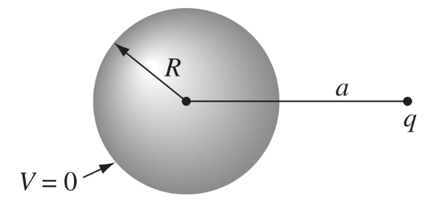
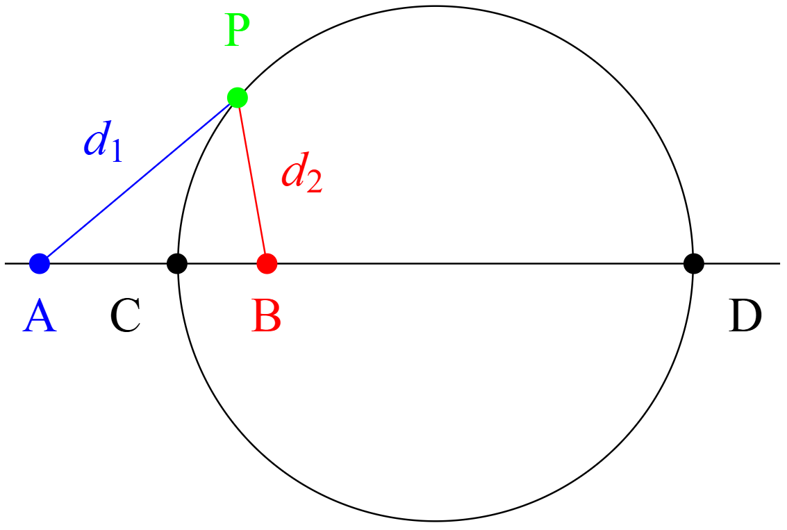
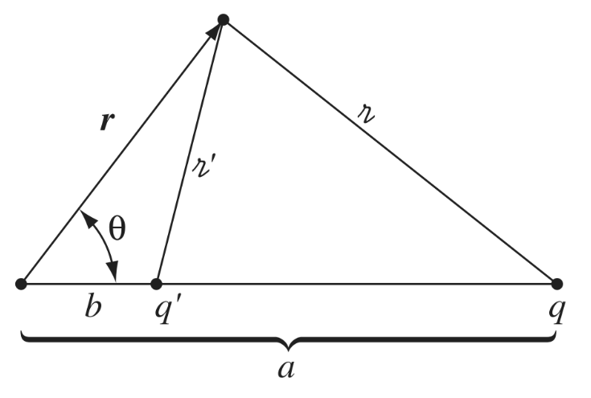

---

title: "Electrostatics using an obscure geometry theorem"
subtitle: Solving a tricky electrostatics problem using a theorem from Ancient Greek geometry
date:
summary:
draft: false
featured: false
tags:
  - physics
  - geometry
categories: []

image:
    preview_only: true
    filename: featured.png

commentable: true

---

Example 3.2 from Griffith's *Electrodynamics* text is an interesting application of the method of images in electrostatics. The problem is as follows:

Suppose we have a conducting sphere of radius $ R $ and a point charge $ q $ located at a distance $ a $ from the center of the sphere, where $ a > R $ as shown below. We want to calculate the potential (voltage) and electric field everywhere in space outside the sphere, as well as the force between the charge and the sphere, in the cases where

1. the sphere is grounded, and
2. the sphere is isolated and neutrally charged
3. the sphere is isolated and has some net charge $ Q $.

Firstly, it's worth explaining why there would be a force between the charge and the sphere at all - the sphere is neutral (in the first two cases at least), so why should there be any interaction? The answer is that the sphere is polarisable - its metallic surface contains free electrons that are attracted towards the external positive charge $ q $, which means electrons 'want' to accumulate on the near side of the sphere, acting as a region of negative charge, attracting the positive charge towards it.

If the sphere is grounded, then electrons can flow freely between the sphere and ground, so the ground supplies as many electrons as needed to ensure the potential on the surface of the sphere is zero. If the sphere is isolated, then electrons can only flow within the sphere, so the total number of electrons on the sphere must remain constant, but they can still redistribute themselves across the surface to ensure that the potential is constant across the surface. In either case, the sphere becomes polarised and attracts the charge.

Now, onto the solution. In principle, all "given a charge arrangement, find the potential" problems in electrostatics can be solved by writing out Poisson's partial differential equation and solving it with the appropriate boundary conditions:

$$ \nabla^2 V = -\frac{\rho}{\epsilon_0} $$

This equation is readily derived from Gauss's law (one of Maxwell's equations) and the definition of the electric potential as the scalar field whose gradient is the electric field.

However, this is often very difficult to do in practice. The **method of images** is a technique that allows us to solve certain electrostatics problems by replacing the actual charge distribution with an equivalent distribution of *image charges* that produce the same potential in the region of interest. The key to placing these image charges is to recognise that conducting surfaces are equipotential surfaces, and so the potential on the surface of the conductor must be constant. Sometimes, this can be exploited by considering reflective symmetry, but other times it is more subtle, like in this problem.

Griffiths gives the following context in a footnote for the problem at hand:

> This solution is due to William Thomson (later Lord Kelvin), who published it in 1848, when he was just 24. It was apparently inspired by a theorem of Apollonius (200 BC) that says the locus of points with a fixed ratio of distances from two given points is a sphere. See J. C. Maxwell, “Treatise on Electricity and Magnetism, Vol. I,” Dover, New York, p. 245. I thank Gabriel Karl for this interesting history.

So, it sounds like to reveal the appropriate placement of the image charges, we can use [Appolonius' definition of a circle](https://en.wikipedia.org/wiki/Apollonian_circles) (revolved into a sphere in 3D), which is that

> The locus of points with a fixed ratio of distances from two given points is a circle (or sphere in 3D).

Even knowing this theorem, it still might not be obvious why it helps us with this problem. We might guess that the image charge is to be placed somewhere on the line connecting the center of the sphere and the point charge, in a way that somehow ensures the potential on the surface of the sphere is constant.

Let's consider a possible charge arrangement, with real charge $ q $ at some point A and image charge $ q' $ at some other point B. By linear superposition, the potential $ V $ at a point P due to these two charges is

$$ V = \frac{1}{4\pi\epsilon_0} \left( \frac{q}{d_1} + \frac{q'}{d_2} \right) $$

where $ d_1 $ and $ d_2 $ are the distances from the point P to points A and B, respectively. For the potential to be zero at P, we must have

$$ \frac{q}{d_1} + \frac{q'}{d_2} = 0 \ \ \ \rightarrow \ \ \ \frac{q'}{q} = -\frac{d_2}{d_1}. $$

Notice that, if we want the potential to be zero at every point on the surface of some *sphere*, then the ratio $ d_2 / d_1 $ must be constant everywhere on the sphere. This is exactly what Appolonius' theorem tells us: the locus of points P with a fixed ratio of distances from two given points A and B is a circle (or sphere in 3D).

{{< figure src="featured.png" title="The field lines (blue) and equipotential lines (dashed) surrounding two like point charges (left) and two opposite point charges (right). Notice that the equipotentials for the opposing charges case are circles. These are the Apollonius circles corresponding to constant ratios of distances. The circles are centered somewhere along the line connecting the charges. Image source: [schoolphysics.co.uk](https://www.schoolphysics.co.uk/age16-19/Electricity%20and%20magnetism/Electrostatics/text/Equipotentials_and_fields/index.html)" >}}

We'll let $ k = \frac{d_2}{d_1} $ be this constant ratio, where a given $ k $ defines a given circle. Putting this into our earlier relation, we get

$$ \frac{q'}{q} = -k. $$

So, if we select the image charge to be $ q' = -k q $, the potential will be zero at every point on the Apollonius circle defined by $ \frac{d_2}{d_1} = k $. We need this circle to coincide with our real conducting sphere, so we need to express $ k $ in terms of our real geometry.

We can imagine moving the point P from an arbitrary point on the circle to the point C, where the line segment joining A and B intersects the circle. At point C, we know the distance AC is equal to $ a - R $ and the distance BC is equal to $ R - b $, where $ b $ is the unknown distance between the image charge B and the center of the sphere. Therefore, we have

$$ k = \frac{d_2}{d_1} = -\frac{b - R}{a - R} $$

Likewise, we can imagine moving the point P to the other intersection D of the line segment joining A and B with the circle. At this point, we know the distance AD is equal to $ a + R $ and the distance BD is equal to $ R + b $, so we have

$$ k = \frac{d_2}{d_1} = -\frac{b + R}{a + R} $$

$ R $ and $ a $ are known, so we have a system of two equations in two unknowns, which we can solve algebraically for $ k $ and $ b $:

$$ k = \frac{R}{a} \ \ \ \text{and} \ \ \ b = \frac{R^2}{a}. $$

Therefore, our image charge must be $ q' = -\frac{R}{a} q $ and it must be located at a distance $ b = \frac{R^2}{a} $ from the center of the sphere along the line connecting the center and the real charge:

Notice that $ b < R $, so the image charge is always located within the sphere, so the electric field and potential outside this region will always be the same as the case with the conducting sphere present.

From here, we can calculate the potential at any point in space outside the sphere using the formula we wrote down first and applying coordinate geometry. We'll skip that part - the algebra (as well as a discussion of the problem) is given in [this video](https://www.youtube.com/watch?v=ekECiysqKvM) by Dr Ben Yelverton. We'll just finish by calculating the force between the two charges, which corresponds to the force between the real charge and the conducting sphere, using Coulomb's law:

$$ F_1 = \frac{1}{4\pi\epsilon_0} \frac{q q'}{(a - b)^2} = -\frac{1}{4\pi\epsilon_0} \frac{R a q^2}{(a^2 - R^2)^2}. $$

This was for the grounded sphere case, where the sphere acquires surface charge $ q' $ from the ground. 

For the isolated sphere case, the sphere can't acquire any net charge, so we need to modify our image charges to reflect this. We can do this by adding a second image charge $ -q' $ at the center of the sphere, which ensures that the total charge in the spherical region is zero, while preserving the equipotential condition on the surface of the symmetry due to spherical symmetry. In this case, our real point charge sees an oppositely charged image charge at the same distance as before (attractive force), but also a like-charged image charge at a point further away. This effectively reduces the attractive force between the real charge and the sphere:

$$ F_2 = F_1 + \frac{-qq'}{4 \pi \epsilon_0 a^2} = \frac{1}{4\pi\epsilon_0} \frac{q^2 R}{a^3} - \frac{1}{4\pi\epsilon_0} \frac{R a q^2}{(a^2 - R^2)^2}. $$

Finally, for the case of an isolated sphere with net charge $ Q $, we can simply replace our second image charge at the centre of the sphere with a charge $ Q - q' $, which ensures that the total charge in the spherical region is now $ Q $. Intuitively, if $ Q $ is larger than $ |q'| $, then the sphere will be positively charged overall, turning the force on the real charge repulsive instead of attractive. This will occur when

$$ Q > \frac{R}{a} q. $$

Using the formula for the capacitance of an isolated sphere, we can express this condition in terms of the potential of the sphere:

$$ C = \frac{Q}{V} = 4 \pi \epsilon_0 R \ \ \ \rightarrow \ \ \ V > \frac{q}{4\pi\epsilon_0 a}. $$
