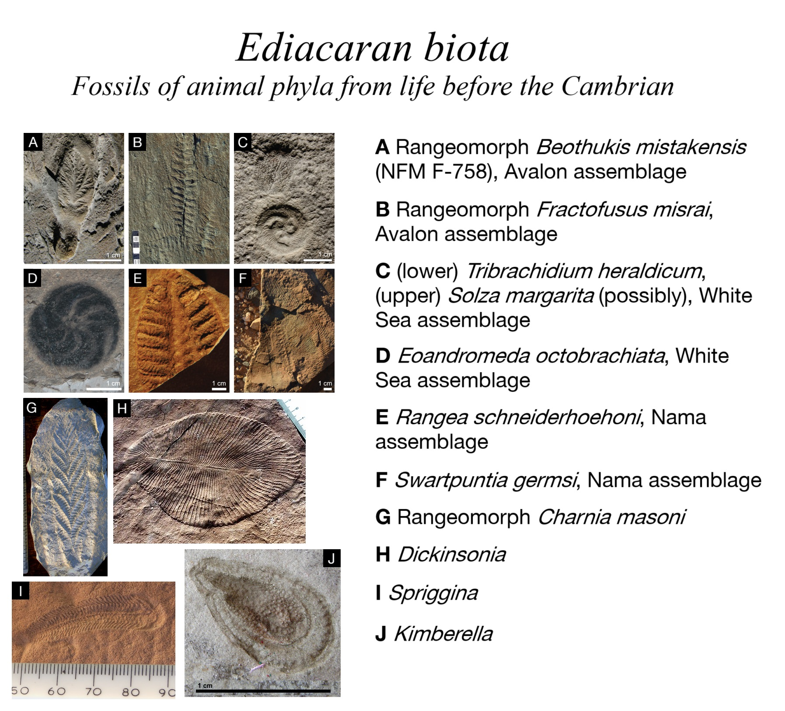
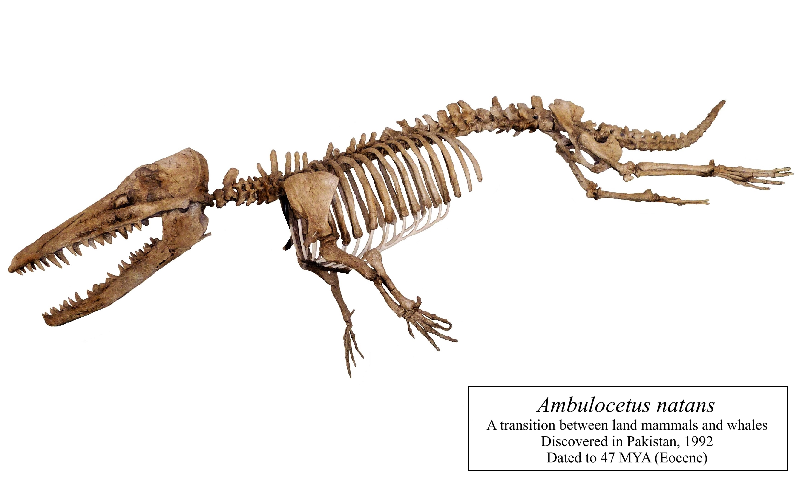
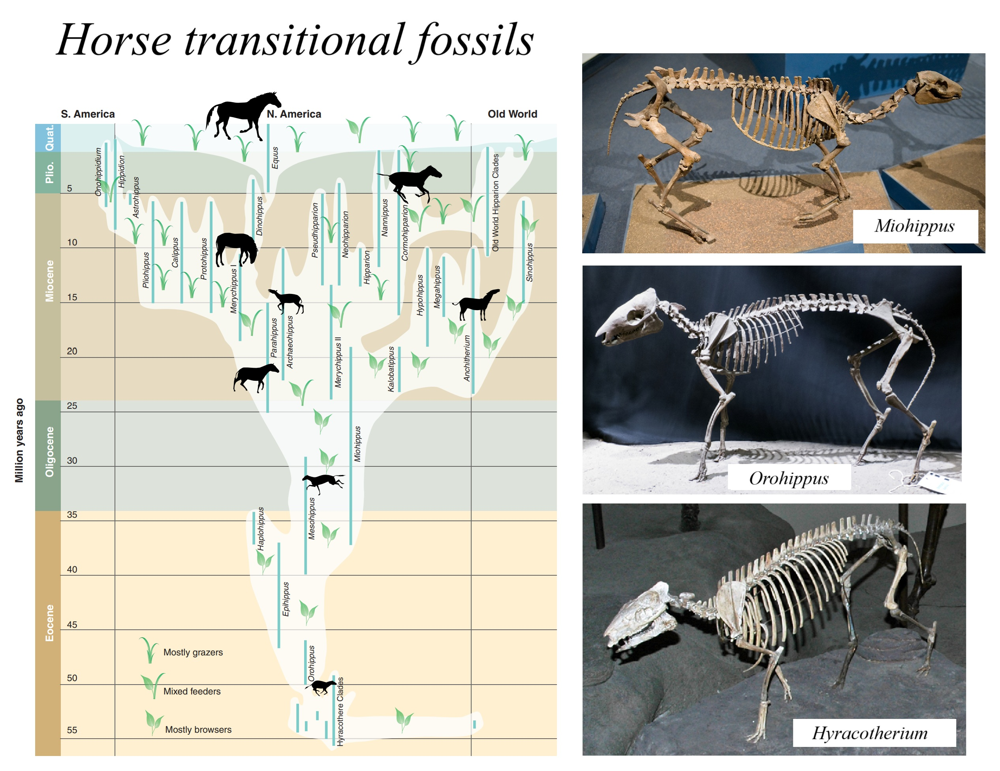
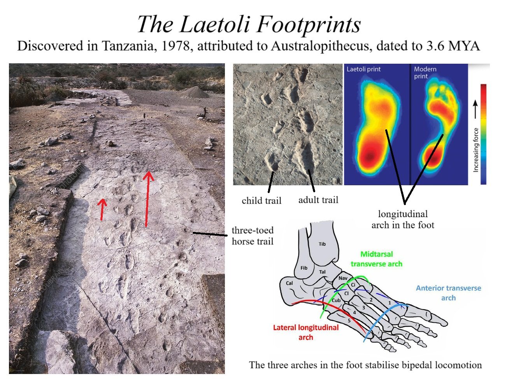
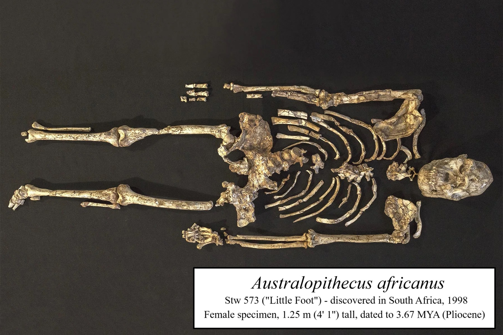
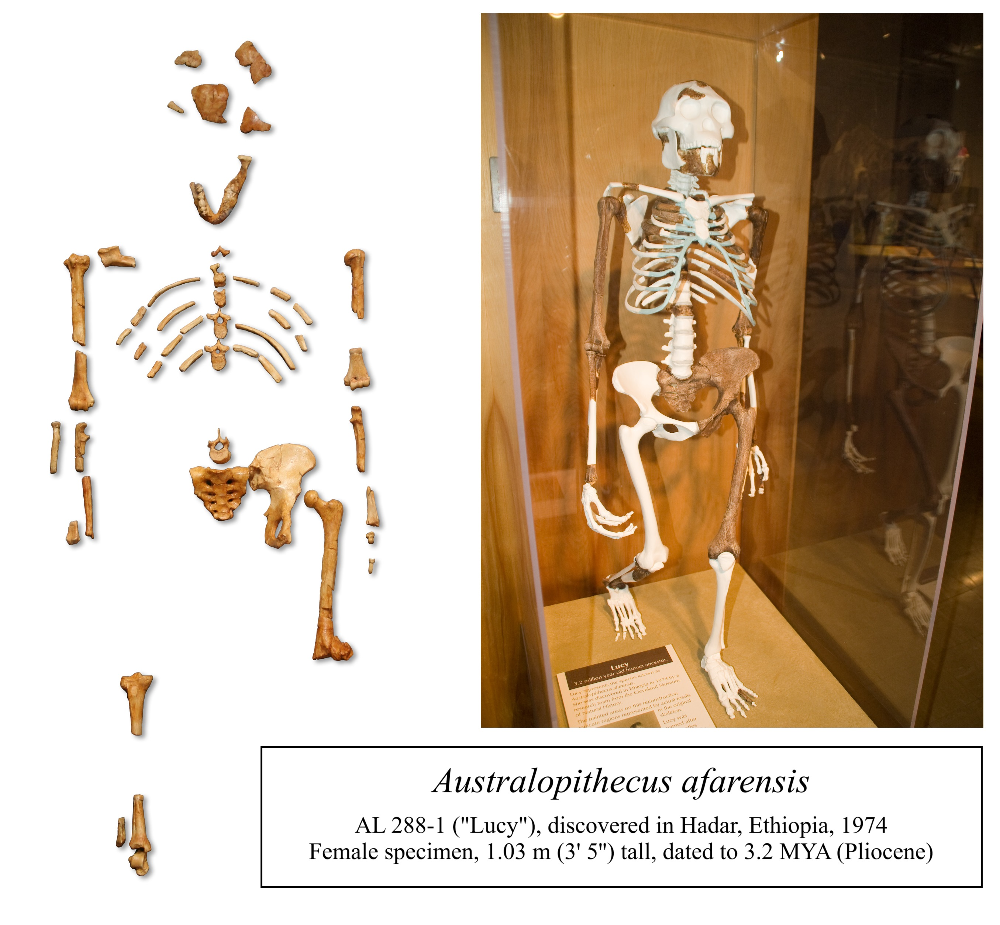
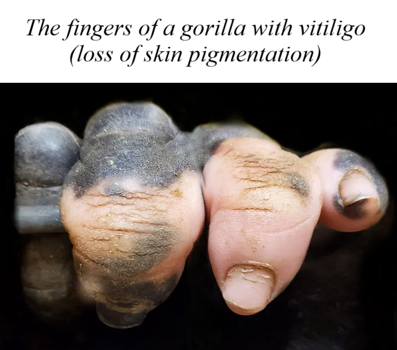
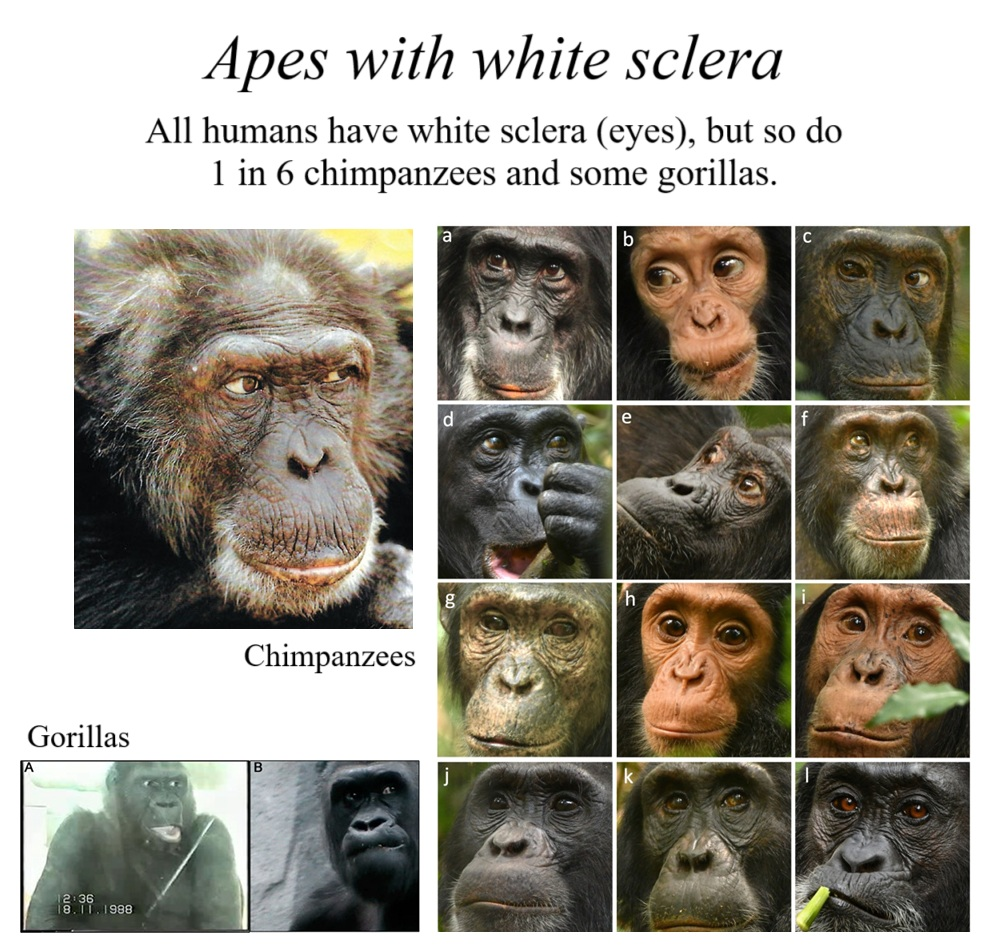

---

title: "Evidence for Evolution"
subtitle: A collection of papers, arguments and images that support the theory of evolution.
date:
summary:
draft: false
featured: true
tags:
  - biology
categories: []

image:
    preview_only: true
    filename: featured.jpg

commentable: true

---

## CONTENTS

- A. [**Paleontology**](#paleontology)
- B. [**Bioanthropology and Primatology**](#bioanthropology-and-primatology)
- C. [**Evolutionary Developmental Biology**](#evolutionary-developmental-biology)

---

## PALEONTOLOGY

---

## BIOANTHROPOLOGY AND PRIMATOLOGY

---

## EVOLUTIONARY DEVELOPMENTAL BIOLOGY

