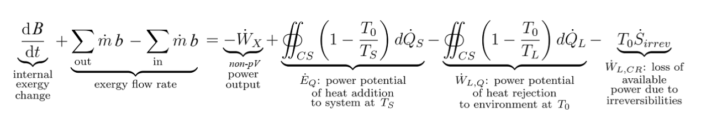

---

title: "Evidence for Evolution"
subtitle: A collection of pictures, papers and examples that support the theory of evolution.
date:
summary:
draft: false
featured: true
tags:
  - biology
categories: []

image:
    preview_only: true
    filename: featured.jpg

commentable: true

---

A collection of interesting pictures, papers and examples to show how biological evolution explains the diversity of life.

{}
This is a work in progress! It is nowhere near complete!
A small number of the cited papers are available [here](https://drive.google.com/drive/folders/1B5PZ43nqorV5OYoAeAIme7DpWfUfyXmK).
{}

## CONTENTS

1. [**Direct Observation**](#1-direct-observation)
2. [**Genetics**](#2-genetics)
3. [**Molecular Biology**](#3-molecular-biology)
4. [**Paleontology and Bioanthropology**](#4-paleontology-and-bioanthropology)
5. [**Geology**](#5-geology)
6. [**Biogeography**](#6-biogeography)
7. [**Comparative Anatomy**](#7-comparative-anatomy)
8. [**Comparative Physiology**](#8-comparative-physiology)
9. [**Developmental Biology**](#9-developmental-biology)
10.  [**Population Genetics**](#10-population-genetics)
11.  [**Metagenomics**](#11-metagenomics)
12.  [**Physics and Chemistry**](#12-physics-and-chemistry)
13.  [**Applications of Evolution**](#13-applications-of-evolution)

X. [**Miscellaneous**](#x-miscellaneous)

---

## 1. DIRECT OBSERVATION

Microevolution (adaptation and other changes within a species) is commonly observed, but the more striking consequences of evolution usually take place on timescales far too long to observe from start to finish. However, there are some well-established cases where macroevolution can be observed in real time. Some definitions here will be useful:

- *Biological species concept* \~ a species is any group who is reproductively isolated from other such groups, due to e.g. behavioural isolation, genetic incompatibility or failure to produce viable offspring. This is the most common species concept for studying extant life, but is undefined for asexual organisms (prokaryotes), so another concept is required.
- *Phylogenetic species concept* \~ a species is the smallest monophyletic grouping when performing comparative genomic analysis on a population. This is much more suited for prokaryotes, defining species via genetic similarity.
- *Speciation* \~ formation of more than one species from a population of one species, where *species* is defined suitably using one of the species concepts (like the above).
- *Macroevolution* \~ variations in heritable traits in populations with multiple species over time. Speciation marks the start of macroevolution.

Although microevolution is useful for conceptualising how Darwinian evolution works (e.g. adaptation: heritable changes with natural selection), it is somewhat trivial and is not contested by critics of evolutionary theory. Therefore, we will list here only examples of macroevolution that have been observed in real time. Most of these are in the wild, with a few lab-based studies included too.

*If* macroevolution can be observed, *and* we know of no means by which the mechanisms of neo-Darwinian evolution (mutation/selection/drift/gene flow) can stop, *and* we have consilient evidence indicating continuation of the process back through time, *and* there is no reason to believe any contrary explanations (e.g. intelligent design/creationism), *then* the methodologically naturalistic, parsimonious, evidence-driven conclusion follows.

Direct observations are not the *best evidence* of evolution as a whole. Direct observation is just one line of inquiry: the other lines serve to justify and corroborate the extrapolation of those observations through deep time, synthesising the theory of evolution as we know it.

### Lizards evolving placentas



Reptiles are known for usually giving birth via egg-laying (oviparity), but there is evidence that some snakes and lizards (order *Squamata*) transitioned to giving live birth (viviparity) independently and recently. A 'transitional form' between these two modes is 'lecithotrophic viviparity', where the egg and yolk is retained and held wholly within the mother.

While observing a population of the lizard *Zootoca vivipara* in the Alps, reproductive isolation was found between these two subgroups, and attempts at producing hybrids in the lab led to embryonic malformations. Sometimes, the viviparous group would even give birth to two live young and one egg within the same litter of three. The oviparous group is now confined to the range spanning northern Spain and southern France (the Pyrenees), while the viviparous lizards extend across most of Europe. This represents an example of speciation with complete reproductive isolation, together with the gain of a complex new function (viviparity) to boot.

Sources: [here](https://www.researchgate.net/publication/233720256_Squamate_reptiles_as_model_organisms_for_the_evolution_of_viviparity) (paper), [here](https://pmc.ncbi.nlm.nih.gov/articles/PMC4806899/) (paper) and [here](https://www.youtube.com/watch?v=t1xy9XaEaeo) (video).

### Fruit flies feeding on apples



The apple maggot fly (*Rhagoletis pomonella*) usually feeds on the berries of hawthorn trees, and is named after apples only because eastern American/Canadian apple growers in 1864 found its maggots feeding on their trees. Since then, the apple-eating and berry-eating groups have become more distinct. 

This is a case of 'sympatric speciation': the geographic range of the apple group (north-eastern America) is contained within that of the berry group (temperate biomes globally). There is a barrier between the groups because 1) the two trees flower at different times of the year (apples in summer, hawthorns in autumn/fall) so flies must reproduce asynchronously, and 2) each group only lays its eggs on their respective fruit.

Sources: [here](https://caspar.bgsu.edu/~courses/4510/Classes/Entries/2015/4/14_Species_&_Speciation_II_(chp_14)_files/AppleHawthorn.pdf).

### The London Underground mosquito



They were named due to people being bit by them while hiding in the underground tunnels of London's tube train network during the Blitz of World War 2. It's recently been shown that they did *not* first evolve there. It turns out that the ancestral species, *Culex pipiens*, lived above ground, while the new species, *C. p. f. molestus*, evolved in the Middle East \~2000 years ago, adapted to warm and dark below-ground city environments, of which the sealed tunnels of the 1860s London Underground was one. 

The new species breeds all-year-round, is cold intolerant and bites rats, mice and humans, while the prior species hibernates in winter. This is a case of 'allopatric speciation' (geographic isolation) by 'disruptive selection', a rarer type of natural selection where an intermediate trait is selected against while extreme traits are favoured, leading to rapid separation into a bimodal distribution of the two lifecycles. Cross-breeding the two forms in the lab led to infertile eggs, implying reproductive isolation.

Sources: [here](https://www.researchgate.net/publication/371326691_Rapid_Speciation_of_the_London_Underground_Mosquito_Culex_pipiens_molestus/fulltext/647f5872b3dfd73b776979eb/Rapid-Speciation-of-the-London-Underground-Mosquito-Culex-pipiens-molestus.pdf) and [here](https://www.nature.com/articles/d41586-025-00323-9).

### Multicellularity in Green Algae



'Colonialism' (simple clumping/aggregation of single-celled organisms) is well-known, and does not count as multicellularity. But if the cells become obligately multicellular (lifecycle uses clonal division by mitosis and remain together, and splitting them apart kills the organism), the groundwork for *de novo* multicellularity is laid. This was observed in the lab  by introducing a population of green algae (*Chlamydomonas reinhardtii*, a protist) to cultures of another predatory protist, over a period of 1 year (\~750 generations). The strong selective pressure to defend against predation led to obligate multicellularity in the algae. This process, featuring increasingly large clusters of cells, is well-reflected in the extant clade *Archaeplastida*, which includes green algae (single cell protist), a variety of other colonial protists and plants (complex multicellular).

Another common trait of extant multicellular life is differentiated tissue formation due to cell specialisation. This too has been observed, and represents the formation of complex genetic control systems (by negative feedback loops) as studied by [evolutionary developmental biology](https://en.wikipedia.org/wiki/Evolutionary_developmental_biology). *Volvox* is a good example, being within clade *Archaeplastida* (above) and having two cell types - one for sexual reproduction, one for phototaxis. Genetics also finds that the famous 'Yamanaka factors' for cell differentiation (as well as many other key innovations like cell-to-cell signaling, adhesion and the innate immune system) in animals inherit from those in choanoflagellates (the closest-related protists to animals and our likely last unicellular ancestors). So, both protist-to-plant and protist-to-animal transitions look pretty reasonable on this alone.

Sources: [here](https://www.nature.com/articles/s41598-019-39558-8), [here](https://bmcecolevol.biomedcentral.com/articles/10.1186/s12862-016-0794-x) (papers), [here](https://www.nature.com/articles/s41467-024-54152-x) for cell specialisation, [here](https://www.youtube.com/watch?v=pnua_NkuYoU) (video) and [here](https://www.youtube.com/watch?v=k8Y29mBgNf0) (long video).

### Darwin's Finches, revisited 150 years later



This is a [textbook example](https://en.wikipedia.org/wiki/Darwin%27s_finches) of bird microevolution from Darwin's 1830s voyage of the Galápagos islands, but studies from the 1980s onwards have identified speciation in the '[Big Bird lineage](https://en.wikipedia.org/wiki/Big_Bird_(finch))' on Daphne Major island. Regional droughts which reduce seed dispersal to the islands, such as those that occurred in 1977 and 2004, as well as arrival of competitors, were found to be drivers of selection for beak stiffness. The new lineage of finches reproduces only with its own.

Sources: [here](https://www.science.org/doi/10.1126/science.aao4593) (paper), [here](https://www.princeton.edu/news/2017/11/27/study-darwins-finches-reveals-new-species-can-develop-little-two-generations) (article) and [here](https://www.science.org/doi/10.1126/science.1128374).

### Salamanders, a classic ring species



A '[ring species](https://en.wikipedia.org/wiki/Ring_species)' is a rare and aesthetically-pleasing display of speciation wherein a population living outside a circular barrier (e.g. the sands surrounding a lagoon) sequentially mutates and migrates around the circle, so that when they meet up again on the other side, they cannot interbreed. One of the most well-known cases of this is the salamander *Ensatina eschscholtzii*, which spread around the edge of a dry uninhabitable valley in California. A total of seven subspecies of these salamanders developed around the circle, two of which cannot interbreed with each other. Actually, this case is *not* a 'true' ring species, as the diversification process was more complex than simply continuously spreading around the circle, but it still does represent an example of complete speciation.

This process took millions of years, so it wasn't *directly* observed, but the studies showing interbreeding capability of neighbouring subspecies despite isolation between two were done in the present, so it's pretty conclusive as to what happened.

Source: [here](https://whyevolutionistrue.com/2014/07/16/there-are-no-ring-species/).

### Greenish Warbler, another ring species



This is another ring species, and one that is *closer* to a true ring species than the Californian salamanders (though still not a perfect ring species - it seems there are no simple true cases!). These birds, *Phylloscopus trochiloides*, inhabit the closed boundary of the Tibetan Plateau, of which two reproductively isolated forms co-exist in central Siberia. Genetic studies find some degree of selection against interbreeding, contributing to the speciation process. This happened over about a million years, so we're using the phylogenetic species concept here.

Sources: [here](https://whyevolutionistrue.com/2014/07/16/there-are-no-ring-species/) and [here](https://www.nature.com/articles/nature13285).

### Hybrid plants and polyploidy



*Tragopogon miscellus* are 'allopolyploid' plants (multiple sets of chromosomes, some from another species) that formed repeatedly during the past 80 years following the introduction of three diploid species from Europe to the US. This new species has become established in the wild and reproduces on its own. The crossbreeding process that we have used to make new fruits and crops more generally exploits polyploidy (e.g. cultivated strawberries) to enhance susceptibility to selection for desired traits.

Source: [here](https://academic.oup.com/biolinnean/article-abstract/82/4/485/2643081).

### Alligators and chickens growing feathers



In the lab, a change in the expression patterns (controlled by upstream genes) of two regulatory genes led to alligators developing feathers on their skin instead of scales. These occur via the 'Sonic hedgehog' (Shh) pathway, one of the many developmental cascades activated by homeotic genes. The phenotypes observed in these experiments closely resembled those of the unusual filamentous appendages found in the fossils of some feathered dinosaurs, as if transitional.

A similar thing has been done to turn the chickens' scales on their feet into feathers, this time with only one change to the Shh pathway, showing how birds are indeed dinosaurs and descend within *Sauropsida*.

Sources: [here](https://academic.oup.com/mbe/article/32/1/23/2925601), [here](https://academic.oup.com/mbe/article/35/2/417/4627828) and [here](https://academic.oup.com/mbe/article/37/9/2477/5818883).

### Endosymbiosis in an amoeba



There is excessive evidence that the organelles like mitochondria and chloroplasts (and more recently discovered, the [nitroplast](https://asm.org/articles/2024/june/beyond-endosymbiosis-discovering-first-nitroplast)) found within extant eukaryotes were originally free-living prokaryotes, which became incorporated (endosymbiosis), but no such thing had been observed, until now. The bacterial order *Legionellales* are responsible for Legionnaire's disease and live in water, but are uniquely able to survive and reproduce even after being 'eaten' by some amoebae before returning to free-living conditions. 

In the lab, it was found that some strains of wild amoeboid protists in clade *Rhizaria*, class *Thecofilosea*, were transmitting fully-incorporated *Legionellales* vertically by cell division. Extracellular transmission of bacteria was not observed, indicating mutualistic endosymbiosis, and genetic studies confirmed divergence of the endosymbiont via a shrinkage of its genome (as expected) and gene translocation to the protist's nuclear DNA.

Sources: [here](https://www.frontiersin.org/journals/cellular-and-infection-microbiology/articles/10.3389/fcimb.2021.642216/full) and [here](https://kids.frontiersin.org/articles/10.3389/frym.2022.1104350).

### Eurasian Blackcap



The migratory bird *Sylvia atricapilla* typically flies either south-westerly towards Spain or south-easterly into Asia as winter approaches in Europe, but the rise of birdwatching as a hobby in the UK in the 1960s led to a new food source in Britain that the westerly-flying birds could migrate to. This change is known to be genetic in basis. Those that instead migrated to the British Isles in winter returned home 10 days earlier (due to the shorter distance to central Europe) than those that went towards Spain, and therefore would mate only with themselves (sympatric speciation). The UK-migrating group now has rounder wings and narrower, longer beaks, over just \~30 generations, and although genetic differentiation has not yet reached the point of preventing interbreeding entirely, these birds are quite clearly well on their way to speciation.

Sources: [here](https://www.science.org/content/article/feed-bird-split-species), [here](https://reflectionsonpaperspast.wordpress.com/2017/12/31/revisiting-berthold-et-al-1992/) and [here](https://pmc.ncbi.nlm.nih.gov/articles/PMC3836794/).

Another collection of observed cases of macroevolution is given [here](https://www.talkorigins.org/faqs/faq-speciation.html) and [here](https://www.talkorigins.org/faqs/speciation.html), known for several decades now.

### Marbled Crayfish
https://www.surescreenscientifics.com/wp-content/uploads/2020/03/Marbled-Crayfish-1-min.pdf

### Cichlid fish

---

## 2. GENETICS

Genetic similarity between organisms is indicative of evolutionary relatedness, since mutation accumulate within lineages and are passed on to offspring. Studying the genomes of extant life therefore informs evolutionary history.

### Pseudogenes

29.49\% of the human genome is made up of pseudogenes, most (but not all) of which are non-functional (either not transcribed or transcribed levels too low for functionality).

**GULO** (L-gulonolactone oxidase): GULO is mostly conserved across the animal kingdom, with a similar gene GLDH appearing in other eukaryotes. It encodes for the enzyme synthesising vitamin C (ascorbic acid) from L-gulono-γ-lactone (in turn from glucose). However, in haplorhines (tarsiers, monkeys, apes: including humans), GULO has been lost, so we have to source our own vitamin C from our diet (or die from scurvy). GULO has also been lost independently in the bat genus *Pteropus* and guinea pigs (*Cavia porcellus*).

https://link.springer.com/article/10.1007/s00239-024-10165-0

**NANOG** (homeobox protein).

**DDX11L**: 6 copies in chimpanzees, 4 copies in gorillas, and 2 copies in macaques.

Sources: [here](https://pmc.ncbi.nlm.nih.gov/articles/PMC1457002/), [here](https://geneticeducation.co.in/why-humans-can-not-synthesize-vitamin-c-the-role-of-gulo-pseudogene/)

### Endogenous retroviruses (ERVs)

If a retrovirus infects a germline cell (usually a sperm cell progenitor e.g. spermatocyte), then the viral genome will be inserted inside the germline DNA. When the sperm cell multiplies and fertilises an egg, the viral genome can be passed into the offspring. As long as the virus remains in its dormant state, it will not cause any problems and may become permanently fixed in the genome due to genetic drift. ERV sequences become quickly methylated on inheritance and have their LTRs mutated so cannot jump around the genome any more like retrotransposons, becoming fixed in position before speciation occurs. The viral genome is then said to be 'endogenous' and will appear in all subsequent descendants of the first infected individual.

We can look for traces of these 'endogeneous retroviruses' (ERVs) in modern genomes. ERVs can be identified by the 'long terminal repeats' (LTRs) at either end of the genome, and the *gag*, *pol* (contains the reverse transcriptase, integrase and protease) and *env* genes for the viral proteins. Since ERVs insert themselves mostly randomly into the genome, if ERVs are found in extant species with exactly the same positions and identities, it can be safely assumed to be inherited from a common ancestor as the chance of a coincidental separate identical insertion is negligible. Most (at least 90\%: [source](https://onlinelibrary.wiley.com/doi/10.1155/2021/6660936)) ERVs are non-functional, so the common creationist argument of "common design" loses its validity for ERVs. Some ERVs can be exapted for use by the organism at a later time as a *de novo* gene, as new promoters form readily by random mutation alone.

For example, one type of ERV that is found in both humans and chimpanzees is called HERV-W. For this particular ERV, there are 211 of them in humans, 208 of them in chimps, of which 205 of are found in identical locations of both genomes ([source](https://bmcevolbiol.biomedcentral.com/articles/10.1186/s12862-018-1125-1)). This tells us that the human-chimp common ancestor had the 205 HERV-W insertions that we both have, and then a few more were acquired more recently after the split. The *env* gene of HERV-W remains transcribable, and produces a protein called syncytin-1, which has been co-opted for use in the formation of the placenta, but can also act as an immunogen in multiple sclerosis.

To drive the point home, we can estimate explicitly the probability that two genomes would just so happen to have the observed 205 identical insertions, when one of them has 211 and the other has 208, if the ERVs are inserted randomly without any common ancestry (the null hypothesis). We assume a total of $ N = 10,000,000 $ possible insertion sites in both genomes ('hotspots'). The problem can be stated as listing $ \{ 1, 2, 3, ..., N \} $ as the enumerated possible ERV insertion sites. We then take, uniformly, randomly, independently and without replacement, a 'human' subset of insertions $ X $ of size $ a = 211 $, and a 'chimp' subset of insertions $ Y $ of size $ b = 208 $. We want to find the probability that the intersection of $ X $ and $ Y $ has exactly $ z $ elements (shared insertions).



We can solve for the required probability with combinatorics:

$$ P(|X \cap Y| = z) = \frac{\binom{N}{z} \binom{N-z}{b-z} \binom{N-b}{a-z}}{\binom{N}{a} \binom{N}{b}}, \ \ \ \ 0 \leq z \leq \min(a, b) $$

since there are $ \binom{N}{z} $ ways of choosing the intersection, $ \binom{N-z}{b-z} $ ways of choosing the rest of the chimp elements, and $ \binom{N-b}{a-z} $ ways of choosing the rest of the human elements ([source](https://math.stackexchange.com/a/1490030/488820)). Using the binomial coefficient identity $ \binom{N}{z} \binom{N-z}{b-z} = \binom{N}{b} \binom{b}{z} $ ([source](https://en.wikipedia.org/wiki/Binomial_coefficient#Identities_involving_binomial_coefficients:~:text=Moreover%2C%20the%20following%20may%20be%20useful%3A)), we find it corresponds to the probability mass function (PMF) of a [hypergeometric distribution](https://en.wikipedia.org/wiki/Hypergeometric_distribution):

$$ P(|X \cap Y| = z) = \frac{\binom{b}{z} \binom{N-b}{a-z}}{\binom{N}{a}} \ \Rightarrow  \ |X \cap Y| \sim \textrm{Hypergeometric}(N, b, a). $$

I believe this model is more accurate than the calculations performed by some other sources (e.g. *Stated Clearly* uses a binomial distribution, source [here](https://docs.google.com/document/d/1gZWCMW7ZWhdlLPVJU4nDWkmyQbUqZG3wsS0FD2sKmn0/edit?tab=t.0), video [here](https://www.youtube.com/watch?v=oXfDF5Ew3Gc)), although it doesn't affect the conclusion we make.

Now, we sum over this probability between $ z = 205 $ and $ z = 208 $ to get our $p$-value. The answer is so tiny that normal calculators simply return zero. Using the more powerful [WolframAlpha](https://www.wolframalpha.com/input?i2d=true&i=Sum%5BDivide%5BnCr%5C%2840%29208%5C%2844%29+z%5C%2841%29+*+nCr%5C%2840%29Power%5B10%2C7%5D+-+208%5C%2844%29+211+-+z%5C%2841%29%2CnCr%5C%2840%29Power%5B10%2C7%5D%5C%2844%29+211%5C%2841%29%5D%2C%7Bz%2C205%2C208%7D%5D) for the computation instead, we find that the answer is:

$$ p = \sum_{z=205}^{208} P(|X \cap Y| = z) = 4.59398489... \times 10^{-1032}. $$

As intuited, the odds of getting the observed HERV-W distribution in humans and chimps *without* common ancestry is ridiculously tiny: about 1 in $ 10^{1031} $. There are about $ 10^{80} $ atoms in the observable universe, so this is about the same chance of randomly picking the same atom in the universe 14 times in a row! And this is just for *one* type of ERV in *one* pair of species - many other types of ERVs are known in many different species (mostly mammals), and they can be used to reconstruct phylogenies in the same way as any other section of the genome.

### CpG islands

https://biologos.org/series/how-should-we-interpret-biblical-genealogies/articles/testing-common-ancestry-its-all-about-the-mutations

### Heat shock proteins

https://link.springer.com/article/10.1007/BF00182743

### Chromosome 2 fusion in the human lineage

Sources: [here](https://www.youtube.com/watch?v=ThHjhep43RI) (video), [here](https://www.youtube.com/watch?v=l0huM0blk0k) (video) and [here](https://www.youtube.com/watch?v=qVeriF1OL54) (video), [here](https://www.youtube.com/watch?v=dAYgXK_K1qk) (video) and [here](https://pmc.ncbi.nlm.nih.gov/articles/PMC52649/pdf/pnas01070-0197.pdf) (paper).

### Beneficial mutations in human evolution

The full genomes of *Homo sapiens*, *Homo neanderthalensis* and Denisovans are available, as well as all extant primates, which helps us reconstruct evolutionary relationships and study the origins of individual genes.

Most recent survey of genomes: [here](https://www.nature.com/articles/s41586-025-08816-3)

*Paranthropus* proteins: [here](https://www.youtube.com/watch?v=TbQsesNjTeo)

Human-specific mutations affecting brains and intelligence:

- **ARHGAP11**: the basal form, ARHGAP11A, encodes the protein RhoGAP with nuclear localisation, found in all extant non-human mammals. A partial duplication ~5 MYA seen in *Homo sapiens*, Neanderthals and Denisovans led to them additionally acquiring ARHGAP11B, which shows mitochondrial localisation instead. It promotes basal progenitor cells (BP cells) and increases the neocortex size significantly. Sources: [here](https://pubmed.ncbi.nlm.nih.gov/32554627/), [here](https://pubmed.ncbi.nlm.nih.gov/25721503/) and [here](https://www.science.org/doi/10.1126/sciadv.1601941).
- **TKTL1** (transketolase-like 1): modern Homo sapiens has an arginine point mutation (K261R) while Neanderthals, Denisovans, archaic Homo sapiens and other extant primates have the lysine form. The human gene promotes production of basal radial glial cells (bRG cells, neural stem cells), significantly increasing upper-layer cortical neuron production and the size of the brain’s gyri (ridges) in the frontal lobe. Source: [here](https://www.science.org/doi/10.1126/science.abl6422) and [here](https://www.youtube.com/watch?v=rnqT0K5Ls2I) (video)
- **NOTCH2NL**: NOTCH genes prolong proliferation of neuronal progenitor cells and expand cortical neurogenesis. Many of these genes are duplicated in *Homo sapiens*, Neanderthals and Denisovans to varying degrees. Source: [here](https://pubmed.ncbi.nlm.nih.gov/32330268/)
- **SRGAP2**: Partially duplicated to SRGAP2B 3.4 MYA, followed by two larger duplications at 2.4 MYA and 1 MYA. Source: [here](https://www.cell.com/fulltext/S0092-8674(12)00461-8) and [here](https://www.nature.com/articles/s41598-019-54887-4).
- **FOXP2**: Linked to development of speech and language skills. Source: [here](https://www.nature.com/articles/nature01025).
- **TBC1D3**: another human-specific gene contributing to the frontal cortex. Source: [here](https://genome.cshlp.org/content/34/11/1798.short)

Human-specific mutations affecting muscles and biomechanics:

- **PPARGC1A** and **MHY7**: promotes a higher proportion of slow-twitch muscle fibres rather than fast-twitch.
- **GDF8** (myostatin): negatively regulates skeletal muscle growth.
- **MYH16**: changes the musculature of the jaw. Source: [here](https://www.nature.com/articles/nature02358).
- **HACSN1**: a developmental enhancer leading to limb and digit specialisations. Source: [here](https://www.science.org/doi/abs/10.1126/science.1159974)

Examples from recent human evolution (<300 kYA): [source](https://en.wikipedia.org/wiki/Recent_human_evolution)

- **ADH1B** (alcohol dehydrogenase): the SNP Arg48His is more common in East Asians due to rice domestication, and reduces the risk of alcoholism. Another SNP Arg370Cys occurs in Africa which reduces alcohol dependence.
- **PDE10A**: leads to enlarged spleens in the Bajau people. The spleen is a reservoir of oxygenated red blood cells, allowing them to hold their breath for longer (hypoxia tolerance) while freediving. Source: [here](https://www.cell.com/cell/fulltext/S0092-8674(18)30386-6).
- **NOS3** (nitric oxide synthase) and others for high-altitude adaptation: in three distinct populations (Tibetans, Andeans and Ethiopians), multiple different mutations in a variety of genes lead to hypoxia tolerance, allowing for their survival at high altitudes.
- **Sickle cell trait**: in regions of Africa where malaria is prominent, carrying one copy of the recessive sickle cell anaemia allele confers resistance to the *Plasmodium* parasite. While there are associations of sickle cell trait to other medical conditions, many people with the trait remain healthy, making it net beneficial in malaria-endemic regions. Source: [here](https://www.cell.com/cell/fulltext/S0092-8674(11)00384-9).
- **White skin colour**: in northern Europeans, the *SLC24A5* gene has an SNP Ala111Thr that leads to decreases melanin expression and hence lighter skin pigmentation, which is beneficial for vitamin D synthesis in the low-sunlight high-latitude regions.

### Interesting neutral mutations in recent human evolution

In some of these cases, no harmful effect is observed despite what is typically thought of as a 'loss of function' (e.g. gene deletion). These result in variation in the population, and may serve as a substrate for future selection, or simply be neutral. Additionally, what is neutral in a current environment may become beneficial in a future environment.

- **Blue eyes**: leads to blue eyes instead of brown, due to a mutation in OCA2. It has been shown that all blue-eyed people today share a common ancestor living around 6-10 kYA (a perfectly resolved founder event). This is presumed to be a neutral mutation, with the possibility of sexual selection. Source: [here](https://link.springer.com/article/10.1007/s00439-007-0460-x)
- **Retention of the median artery into adulthood**: normally considered an embryonic structure that regresses around the 8th week of gestation, but it has been found to be retained with increasing frequency in recent times. Source: [here](https://pmc.ncbi.nlm.nih.gov/articles/PMC7495300/).
- *Palmaris longus* **muscle**: a small muscle in the forearm that is absent in about 10-15\% of the population, with negligible loss of overall grip strength or hand function (there is a small reduction in pinch strength in the 4th and 5th fingers).
- **ABCC11**: the T/T allele carried by nearly all Koreans and many other East Asians is non-functional, preventing its expression. This leads to dry flaky earwax and significantly reduced body odour, even after sweating and exercise. Source: [here](https://www.geneticlifehacks.com/ear-wax-and-body-odor-its-genetic/)
- **Third molar agenesis**: wisdom teeth are becoming less common due to humans eating softer foods that have been processed for ease of consumption, no longer requiring large strong jaws. Associated genes include PAX9, AXIN2, MSX1 and THSD7B. Source: [here](https://medicover-genetics.com/wisdom-teeth-and-genetics-why-some-people-do-not-have-wisdom-teeth/)

### Human lactose tolerance

In lactose intolerant people (\~65% of humans worldwide), the ability to digest lactose is lost during adolescence. The lactase enzyme is required to metabolise lactose into glucose and galactose. Without lactase in the small intestine, lactose remains available for the bacteria in the large intestine which ferment it, leading to fatty acid and gas production, causing symptoms of lactose intolerance.

The *LCT* gene codes for lactase, and has a low-affinity promoter. The *MCM6* gene, found upstream on chromosome 2, codes for a subunit of helicase (an unrelated protein used in DNA replication), and an intron of *MCM6* contains an enhancer for *LCT*. Transcription factors that bind to the *LCT* promoter include HNF1-α, GATA and CDX-2, while Oct1 binds to the *LCT* enhancer.

In mammals, most metabolic genes except lactase are expressed at low levels early in development as nutrients are provided primarily by breast milk, but during adolescence, as these other genes are promoted, low-affinity promoters like *LCT* are outcompeted, sharply reducing *LCT* expression. In lactase persistence, point mutations to the *LCT* enhancer result in an increased affinity for the *LCT* promoter, allowing it to remain competitive for transcription throughout life, allowing lifelong lactase synthesis. So, this is *not* a loss of regulation or function, as routinely claimed by ID advocates. Some mutations also reduce the age-related DNA methylation of the enhancer. Lactase persistence has evolved independently with several SNPs (single nucleotide polymorphisms) under strong positive selection in the past 10,000 years of human history, primarily in societies that had dairy farming and pastoralist agriculture.

Sources: [here](https://pubmed.ncbi.nlm.nih.gov/39171584/) and [here](https://www.youtube.com/watch?v=Ii8sLnCWUTo) (video)

### Herbicide and insecticide resistance

https://onlinelibrary.wiley.com/doi/full/10.1111/j.1365-3180.2007.00581.x

https://journals.plos.org/plosgenetics/article?id=10.1371/journal.pgen.0030205

### Genomics

The complete genomes of many extant species have been sequenced. Projects in bioinformatics aim to describe and compare the contents and functions of these genomes.

- The **Human Genome Project (2003)** found that there are about 22,300 protein-coding genes in humans (similar to other mammals) and contains a large number of repetitive sequences (low copy repeats).
- The **Chimpanzee Genome Project (2013)** revealed that humans and chimpanzees share 99\% sequence similarity in protein-coding regions, and 96\% sequence similarity across the full genomes, both higher than humans and any other animal.

{{< figure src="mammal_genome_comparison.png" title="Whole-genome comparisons of different pairs of animals. Sex chromosomes were omitted, slightly increasing similarity in the primates. Telomere-to-telomere assemblies were used (non-scaffolded). Analysis performed by Gutsick Gibbon, randomly sampling short sequences (1000 x 300 bp/chromosome) with gapped aligment using BLAST, documented [here](https://docs.google.com/document/d/1HlzlvxaR224U0n0-EDCPVgws6rVazstAULtcLYYzYU4/edit?tab=t.0), [here](https://www.reddit.com/r/DebateEvolution/comments/18uonlm/human_and_chimpanzee_genetic_similarity_an/) and [here](https://www.youtube.com/watch?v=ryBKzJE24Hs)." >}}



- The **ENCODE Project (2021)** found that, in humans, about 75-80\% of the genome is transcribed into RNAs. However, most of this transcription is either 1) spurious (too low-level to have meaningful biochemical functionality), or 2) forming transposons (LTRs, ERVs, SINEs, LINEs), which simply 'jump' around the genome with no useful function.
- Among human **non-coding DNA**, 5\% is for gene-related regulatory sequences (promoters, enhancers...). 20\% is for introns in genes, most of which serve no function. The rest is completely non-functional (sometimes called 'junk DNA', although historically this term was incorrectly applied to all non-coding DNA).



### *E. Coli* citrate metabolism in the LTEE

The [Lenski long-term evolution experiment](https://en.wikipedia.org/wiki/E._coli_long-term_evolution_experiment) (LTEE) is a famous study that's been ongoing since 1988, following 12 initially-identical but separate lines of *E. coli* bacteria over 80,000+ generations thus far. There are no external selective pressures in the LTEE, so the experiment is about what the bacteria could do on their own. Among the outcomes include *de novo* gene birth from non-coding DNA and near-complete speciation into two variants with differing colony size, but most importantly, one line evolved the ability to eat citrate (Cit) in aerobic conditions, a trait universally absent in wild-type *E. coli*. This led to an immediate rise in population density.

Contrary to the claims of top intelligent design (ID) proponents (e.g. Dr Michael Behe), this is *not* merely due to the loss of regulation of *CitT* (the relevant gene) expression, which would constitute a *loss* of function. In fact, the *CitT* gene was in an operon controlled by an anaerobically-active promoter, and underwent gene duplication, and the duplicate was inserted downstream of an aerobically-active promoter. This is therefore a *gain* of functionality. However, this duplication conferred a negligible (\~1%) fitness advantage in the experiment, and at least two other mutations (in an intron of the *dctA* gene after, and in the *gltA* gene before) were shown to be necessary to obtain fully-functional citrate metabolism. This therefore meets the criteria for an "irreducibly complex" trait - and it's one that emerged under experimental conditions normally adverse to innovation (stasis - promotes stabilising selection)!

In an amusing attempt to refute this, ID advocate Scott Minnich (works at Discovery Institute, a [politically-motivated creationist organisation](https://ncse.ngo/wedge-document)) reproduced the experiment in 2016 with a new colony of wild-type *E. coli* and found the same Cit+ trait emerge! And this time, much faster than in the LTEE, via the same pathway, featuring *CitT* and *dctA*. The abstract of their paper ends rather desperately: "We conclude that the rarity of the LTEE mutant was an artifact of the experimental conditions and not a unique evolutionary event. No new genetic information (novel gene function) evolved." - despite us having disproven that already.

Sources: [here](https://www.nature.com/articles/nature11514), [here](https://pubmed.ncbi.nlm.nih.gov/26833416/) and [here](https://www.youtube.com/watch?v=q0lB0GAMEsQ) (video).

### Tetherin antagonism in HIV groups M, N and O

The human immunodeficiency virus (HIV) is a retrovirus that infects human immune cells expressing the CD4 surface protein, such as helper T-cells and macrophages. Once inside cells, HIV-1's *Nef* and *Vpu* proteins work independently to reduce the expression of CD4, which prevents 'superinfection' (two viruses infecting the same cell) and decreases the chance of an immune response. The slow death of helper T-cells leads to a weakened immune system. 

If HIV infects a different immune cell, such as a macrophage, the virus' escape is hampered by the high expression of a cell protein called tetherin. This limits the virulence of HIV in macrophages. However, some strains of HIV-1 have evolved ways to antagonise tetherin using their *Vpu* and *Nef* proteins, giving them a second function in addition to retaining their CD4-degrading activity in helper T-cells:

- In [HIV-1 group M](https://pmc.ncbi.nlm.nih.gov/articles/PMC8402909/), tetherin antagonism occurred with 4 concurrent point mutations in *Vpu*.
- In [HIV-1 group N](https://journals.plos.org/plospathogens/article?id=10.1371/journal.ppat.1003093), weak tetherin antagonism occurred with 4 different point mutations in *Vpu*, but it led to loss of CD4-degrading activity.
- In [HIV-1 group O](https://pubmed.ncbi.nlm.nih.gov/25468793/), this occured with just 1 point mutation in *Nef* (C169S).

So, the same trait evolved two ways (in groups M and O), one of which (group M) was supposedly 'irreducibly complex': it was a beneficial trait that required sequential mutations in already functional proteins. Group M now dominates worldwide HIV cases while group O resides mainly in sub-Saharan Africa and group N is very rare.

HIV also simultaneously demonstrates observed 'macroevolution' (to the extent that it can be defined for viruses, which are not life). HIV has a zoonotic (animal) origin, as it came from chimpazees' endemic SIV (simian immunodeficiency virus) strain. SIV is rampant among non-human primates, but [each species has evolved to tolerate its own strain](https://pmc.ncbi.nlm.nih.gov/articles/PMC9467346/). It became human transmissible as HIV in the early 1900s due to mutations that allowed it to bind our CD4 receptors, which differ slightly between humans and other apes, and is far more virulent in humans.

Extra sources: [here](https://pmc.ncbi.nlm.nih.gov/articles/PMC9467346/).

### Re-evolution of bacterial flagella

The flagellum is the flagship allegedly irreducibly complex structure, cited ad nauseum by ID advocates. Since it is the one that has been talked about the most, it has also attracted a lot of attention from real scientists who have promptly disarmed it. In one experiment, the master regulator for flagellum synthesis (FleQ) was knocked out, leaving all of the other flagellar genes intact. But under selective pressure for motility, it was found that another transcription factor that regulates nitrogen uptake from the same protein family (NtrC) was able to 'substitute' for FleQ, essentially by becoming hyperexpressed, so there's so much NtrC in the cell that some of it binds to the FleQ-regulated genes and activates them too.

This is an incredibly reliable two-step process, after 24-48 hours we get a mutation in one of the genes upstream of NtrC that leads to higher expression and activation, then within 96 hours of the start we see a second mutation, normally within NtrC itself, that helps fine-tune the expression.

Source: [here](https://www.science.org/doi/10.1126/science.1259145).

---

## 3. MOLECULAR BIOLOGY

### rRNA phylogenetics

For the earliest stages in evolution (unicellular organisms), fossils are scarce, and genomes have mutated beyond recognition in many places, so we must look more carefully. The ribosome is a key piece of cellular machinery that translates RNA into proteins, whose functionality is so tightly constrained that it can be used to measure relatedness across the whole tree of life.

A surprising result of this analysis is according to ribosome similarities, all eukaryotes descend within archaea. This strongly supports the hypothesis of endosymbiosis, where an ancient archaea cell and an ancient bacteria cell merged to become a eukaryotic cell, with the archaea providing the genes that went into the nucleus.



### Antibiotic resistance

A striking visualisation of antibiotic resistance is a video of an experiment done by Harvard Medical School, where they created four zones with antibiotic concentrations increasing by a factor of 10 each time. The bacteria would spread outwards up to the boundaries. Most would go extinct, but a few mutants from some populations would survive and move into the next zone. When all zones had been reached, the colonies traced out the pattern of their phylogenetic tree.



Despite being a highly tangible example of evolution in action, antibiotic resistance is rarely described as "evolution" in the medical literature (sources: [here](https://journals.plos.org/plosbiology/article?id=10.1371/journal.pbio.0050030) and [here](https://pmc.ncbi.nlm.nih.gov/articles/PMC1852151/#pbio-0050112-b001)).

### Nylon-eating bacteria

Nylon is a synthetic insoluble semi-crystalline polymer of 6-aminohexanoic acid, invented in 1935 and used in a variety of consumer products.

In 1965, Japanese researcher Takashi Fukumura found that 11 bacterial strains in the wastewater of the Toyo Rayon (today Toray) 6-polyamide factory in Nagoya were able to grow on ε-caprolactam, the cyclic amide precursor to Nylon 6. One more species, *Corynebacterium aurantiacum*, also was found to be able to metabolise linear and cyclic 6-aminohexanoate oligomers. Another group of researchers 4 years later found a strain from the phylum *Pseudomonas* in the waste water of the same factory that was also able to metabolise 6-aminohexanoate oligomers.

In 1974, Hirosuke Okada conducted research on *Flavobacterium* also living in the wastewater. He found that the strain *Flavobacterium sp. K172* was able to metabolise ε-caprolactam, 6-aminohexanoate and cyclic aminohexanoate-dimer as well as the linear di- bis hexamers of 6-aminohexanoate. The new enzymes had no activity on biologically derived molecules having similar chemical structures.

After some debate in the literature, it has been concluded that one of the new 'nylonase' enzymes (6-aminohexanoate-dimer hydrolase, [EC 3.5.1.46](https://enzyme.expasy.org/EC/3.5.1.46), EII, NylB, [P07062](https://www.uniprot.org/uniprotkb/P07062/entry)) evolved in a two-step process:

1. a gene duplication in *Flavobacterium* to produce a protein named EII'
2. base substitutions of EII' to produce EII.

It has been shown ([Negoro *et al.*, 2007](https://www.sciencedirect.com/science/article/abs/pii/S0022283607005347)) that EII' has 88\% sequence similarity with EII, but only 0.5\% of the catalytic activity. Just two point mutations in EII' found in EII were needed to raise the activity to 85\% of EII.

### *De novo* promoters and orphan genes

### DNT metabolism in bacteria

https://www.talkorigins.org/faqs/dover/pf.html#p84

https://www.talkorigins.org/faqs/dover/day21am2.html#day21am844:~:text=And%20these%20are%20some%20research%20from%20the%20Air%20Force%20Research%20Laboratory%20who%20did%20some%20work%20on%20the%20biochemical%20pathway%20by%20which%20certain%20bacteria%20breakdown%20a%20substance%20called%20DNT%3F

### Antifreeze proteins

Living in cold environments poses a serious challenge to poikilothermic (not thermally regulated) life, as the water in cells may freeze, halting all metabolic processes and killing the organism. Antifreeze proteins have evolved as a solution: when an ice crystal nucleates, the protein's ice-binding domain attaches to the surface of the crystal, arresting its growth. The ice-binding domain is a regular arrangement of polar hydrophobic amino acids with a separation very close to the lattice constant of ice, creating an ideal fit for hydrogen bonding and Van der Waals' forces at the interface.

The [β-helix](https://en.wikipedia.org/wiki/Beta_helix) motif found in these proteins is common enough in natural secondary structures that it has convergently evolved many times: ice restructing proteins making use of it are known in the winter flounder (*Pseudopleuronectes americanus*), the spruce budworm (*Choristoneura fumiferana*), the mealworm beetle (*Tenebrio molitor*), the snow flea (*Hypogastrura harveyi*), some sea ice-living diatoms (*Fragilariopsis cylindrus*) and even some plants like winter rye (*Secale cereale*). The spruce budworm antifreeze can inhibit freezing as low as -30 °C, below even the supercooling limit of liquid water, but some others only work down to about -5 °C, allowing only marginal additional exploratory capacity in cold environments. These antifreeze proteins have different amino acid composition but all perform the same function. Some protein sequences resemble C-type lectins or sialic acid synthase.

In ([Zhuang *et al.*, 2019](https://www.pnas.org/doi/full/10.1073/pnas.1817138116)), it is shown that the antifreeze protein from the northern codfish originated from non-coding DNA, in a process involving frame shift mutations (by 1-nt deletion), duplications and *de novo* gene birth. Comparison to psueodgenes in closely related species is used to support this. This likely evolved in response to the cyclic northern hemisphere glaciation that began in the late Pliocene (about 3 MYA).

Sources: [here](https://pdb101.rcsb.org/motm/120), [here](https://www.youtube.com/watch?v=u85WyeOnOXA) (video) and [here](https://www.youtube.com/watch?v=l2lXiwbRhb0) (video).

### Cytochrome c oxidase

The cytochrome c oxidase (COX) enzyme is a famous and ubiquitous component of the electron transport chain for respiration, found in bacteria, archaea and the mitochondria of eukaryotes. Since COX is universally conserved, we would expect it to be more similar in closely related organisms, and less so in more distant ones. In fact we find experimentally that there is a strong correlation between the number of amino acid substitutions in the COX enzyme and the time since the divergence of the species. This is a powerful demonstration of the ‘[molecular clock](https://en.wikipedia.org/wiki/Molecular_clock)’, which gives us an estimate of the time taken for two genomes to have mutated away from a common ancestor, helping us put a time scale onto our evolutionary tree model.

Source: [here](https://www.pnas.org/doi/10.1073/pnas.50.4.672)

---

## 4. PALEONTOLOGY AND BIOANTHROPOLOGY

**NOTE: paleontology is the study of fossils, but since human evolution is a common topic, I include lots of human-specific evidence here from the broader field of bioanthropology, which includes non-fossil evidence.**

Fossils are remnants of long-dead life and provide a tangible record of the distant past. We can compare fossilised structures and estimate fossil age using radiometric dating of nearby ash layers to help piece together evolutionary lineages, which can be cross-checked against more precise genetic studies. Taken together, they serve as signposts of how lineages changed over time.

Some of the most obvious evidence for evolution is 'transitional fossils'. Technically, all fossils are 'transitional', since all life is evolving at all times, but some lineages offer especially clear changes in form over deep time, when ordered by their radiometric dates or strata.

### Horse evolution



### Bird evolution





### Whale evolution

{{< figure src="whale_fossils.png" title="Some of the most complete whale fossils: **(a)**: *Pakicetus* (49 MYA), **(b)**: *Ambulocetus* (48 MYA), **(c)**: *Kuchicetus* (48 MYA), **(d)**: *Dorudon* (35 MYA). The hind limb reduces in size, indicating a gradient of adaptation for efficient swimming. These all include the astragalus (ankle bone), which is seen in all even toed artiodactyls (cows, sheep, goats, deer, pigs, hippos...) but is lost in modern whales and dolphins. Photos edited to remove distractions in the backgrounds; original source [here](https://archosaurmusings.wordpress.com/2011/09/26/whale-evolution-series/). Many other species with nearly complete fossils are known: e.g. [here](https://en.wikipedia.org/wiki/Evolution_of_cetaceans)." >}}

{{< figure src="indohyus_fossils.png" title="*Indohyus* (50 MYA) was the land mammal ancestor of all whales, belonging to the clade *Artiodactyla*. **(a)**: skulls of *Indohyus* (left) and a modern raccoon (right), with the white box showing the ear structure of the auditory bulla, unique to all whales. **(b)**: the *Indohyus* skull in more detail. The osteosclerotic bones (such as the involucrum) are indicative of habitual aquatic lifestyle (also found in all whales), supported by oxygen-18 isotope analysis. Source: [here](https://core.ac.uk/download/291497088.pdf). **(c)**: The post-cranial fossil material found from *Indohyus*. **(d)**: Reconstruction of postcrania and artist's impression." >}}

### The earliest animals



### Plant evolution

Plant fossils has its own field of study: paleobotany.



### Fake fossils?

The fact that these fraudulent cases are so rare, are so thoroughly well-scrutinised when they do happen, and are always rejected by the scientific community, serves as reassurance that the vast majority of the fossil record is in fact perfectly reliable, just naturally incomplete.



### Human evolution

Human evolution is an especially well-studied topic. We are primates and great apes, and there is an abundance of fossils to tell us how our lineages developed over time. Genus *Homo* arose from the prior genus *Australopithecus* about 2.5 million years ago, and following a period filled with numerous species of *Homo*, our species *Homo sapiens* emerged about 300,000 years ago. Our close relationship with chimpanzees, gorillas and bonobos make them great for studying behaviour, too.











### Primate anatomy and taxonomy

The study of extant primates can also give us clues into our shared past.

In 1698, English anatomist Edward Tyson dissected a chimpanzee and noted in his book that the chimpanzee has more in common with humans than with any other ape or monkey, particularly with respect to its brain.

In 1747, taxonomist Carl Linnaeus wrote to J. G. Gmelin, expressing (with circumspect forbearance) his conclusion that humans and other apes must, by the logic of his own nested hierarchies, belong to the same group, which he called *Anthropomorpha*. He writes:

>As a natural historian according to the principles of science, up to the present time I have been not been able to discover any character by which man can be distinguished from the ape; for there are somewhere apes which are less hairy than man, erect in position, going just like him on two feet, and recalling the human species by the use they make of their hands and feet, to such an extent, that the less educated travellers have given them out as a kind of man.

>I demand of you, and of the whole world, that you show me a generic character — one that is according to generally accepted principles of classification, by which to distinguish between Man and Ape. I myself most assuredly know of none.... But, if I had called man an ape, or vice versa, I should have fallen under the ire of all the theologians. It may be that as a naturalist I ought to have done so.

These early naturalists (along with many other Western contemporaries) recognised the similarities, but, living prior to Darwin, had no theoretical framework with which to explain them.





### Primate behaviour

Primate behaviours are stunningly reminiscent of human behaviours.

Many non-human primates display a clear 'theory of mind' (the understanding that others' beliefs, desires, intentions, emotions and thoughts may be different from one's own). Primatological studies find they:

- warn unaware group members of danger ([Crockford *et al.*, 2012](https://pubmed.ncbi.nlm.nih.gov/22209531/))
- preferentially comfort bereaved mother chimps ([Goldsborough *et al.*, 2020](https://pubmed.ncbi.nlm.nih.gov/31485897/))
- mediate and resolve fights they were not involved in ([de Waal, 2004](https://journals.plos.org/plosbiology/article?id=10.1371/journal.pbio.0020101))
- use tools extensively, such as in nut cracking, termite fishing, spearing bushbabies for hunting etc. ([Gibbons, 2007](https://www.science.org/content/article/chimpanzee-stone-age) and [Hicks *et al.*, 2019](https://www.researchgate.net/publication/351050377_McGrew_2019_PAN_Review_of_Hicks_et_al_Bili-Uere_chimpanzees_DRC))
- provide a group mate with tools they need for a task they are not involved in ([Yamamoto, Humle & Tanaka, 2009](https://journals.plos.org/plosone/article?id=10.1371/journal.pone.0007416))
- use plants containing medicinal compounds to heal serious facial wounds, chewing them up and packing them in ([Laumer *et al.*, 2024](https://www.nature.com/articles/s41598-024-58988-7))
- exhibit reconciliation, consolation and empathy
- mourn their dead (source: [here](https://www.science.org/content/article/chimps-grieve-over-dead-relatives))
- engage in vicious warfare against other groups, torturing rival males to death and assimilating rival females into their group ([Wilson & Wrangham, 2003](https://www.researchgate.net/publication/216460577_Intergroup_Relations_in_Chimpanzees))
- conspire to instigate violent coups against alpha males ([Jensen, Call & Tomasello, 2007](https://www.researchgate.net/publication/6193257_Chimpanzees_Are_Vengeful_but_not_Spiteful))
- understand justice and fairness, with a similar level of prosociality as human toddlers ([Proctor *et al.*, 2013](https://www.pnas.org/doi/10.1073/pnas.1222132110))
- easily pass the 'mirror test' (recognise themself in the mirror and use it to groom themselves) 
- rescue nonrelated group members who are in mortal danger e.g. drowning in deep water ([Fouts & Mills, 1997](https://www.google.co.uk/books/edition/Next_of_Kin/7kN9AAAAMAAJ?hl=en)). 

Primates also have complex language capabilities. Gelada vocalisations follow fundamental linguistic rules of grammar called Zipf's law and Mezzarath's law ([Gustison *et al.*, 2016](https://www.pnas.org/doi/10.1073/pnas.1522072113)), Campbell's monkeys and panins both use syntax and grammar ([Ouattara, Alban & Klaus, 2009](https://pubmed.ncbi.nlm.nih.gov/20007377/)). Chimpanzees and human toddlers have a ~90\% overlap in 'innate' gestures ([Kersken *et al.*, 2019](https://link.springer.com/article/10.1007/s10071-018-1213-z))

Many of these behaviours were at one point (even recently) thought to be the unique characteristic of humans that sets us apart, but in fact they are merely differences in degree rather than kind.

Many primatologists doing fieldwork regularly observe the 'humanity' in chimpanzees in particular.

### Bipedalism in Hominins

Walking up on two feet (bipedalism) is a trait unique to humans today among the primates, so studying how this evolved is important. The suite of characteristics indicative of bipedalism, which originated in late Miocene hominids, is:

1. Anterior foramen magnum*: skull rests on the top of the spine.
2. Sagittally-oriented iliac blades*: pelvis rests upright
3. Valgus knee (bicondylar angle)*: femur angled to keep knees in line.
4. In-line hallux: the big toe is aligned with the other toes, aiding in walking.
5. Bowl-shaped pelvis: supports the visceral organs around the abdomen.
6. Lumbar lordosis (S-shaped vertebral column): supports upright posture.
7. Arched foot: three arches (medial, lateral, transverse) in the feet act as shock absorbers in walking.

\* strongest indicators, since these biomechanically prevent quadrupedalism.

Fossils of extinct primates can be analysed to see whether these traits are present, allowing us to trace the gradual evolution of bipedalism.

Morphology and biomechanics are linked by causal morphogenesis (Wolff's law).

### Taxonomy of *Australopithecus* and *Homo habilis*

Our genus, *Homo* emerged from one of the coexisting species of the genus *Australopithecus*. Based on the available fossil record, this transition appears to be quite subtle: the brain case sizes overlap, both can use stone tools, both have similar dentition (teeth), and biomechanics studies indicate both were mostly bipedal (though *A. afarensis* only had two arches plus a less-curved third arch in the foot, suggesting habitual bipedality, while *H. habilis* had three fully formed arches, suggesting full obligate bipedality). This high degree of similarity has even led to some paleoanthropologists to suggest that *H. habilis* should in fact be *Australopithecus habilis*. Although this has not been formally adopted, the challenge of a clear-cut taxonomic classification demonstrates the highly transitional nature of these species.

Another example of this comes (ironically) from creationists, who are ideologically required to divide the hominin fossil record into two allegedly mutually exclusive groups: the 'ape' kind and the 'human' kind. However, six famous hominin cranium fossils of *H. habilis* and early *H. erectus* (KNM-ER 1813, Java man, Peking man, KNM-ER 1470, KNM-ER 3733 and Turkana Boy) were all classified by seven different creationists completely differently, precisely as expected of a 'transitional' species without a true clear divide.

Sources: [here](https://royalsocietypublishing.org/doi/full/10.1098/rstb.2015.0248), [here](https://www.nature.com/articles/s41467-023-44375-9) and [here](https://www.talkorigins.org/faqs/homs/compare.html).

### Neanderthals are not our ancestors

One of our closest relatives, the Neanderthals, went extinct about 40,000 years ago. Autapomorphies (uniquely defining traits) of *Homo neanderthalensis* include retreating cheekbones (zygomatics), the occipital bun, large nasal aperture, enhanced prognathism, enhanced brow ridges (supraorbital torus), platycephalic skull, angled squamosal suture, retromolar gap and an elliptical foramen magnum.

### Significant hominin fossils, ichnofossils and artifacts

- **Ardi**: partial skeleton of *Ardipithecus ramidus*, 4.4 MYA, discovered in the Afar rift valley (Ethiopia).
- **Little Foot (StW 573)**: near-complete specimen, *Australopithecus africanus*, 3.67 MYA. Found in the 'Cradle of Humankind' in South Africa, an area home to many other early hominins.
- **Burtele foot**: partial foot, 3.4 MYA, with a divergent hallux. Tentatively assigned to *Ardipithecus ramidus*, implying contemporaneity with *Homo*, *Australopithecus*, *Paranthropus* and *Kenyanthropus*.
- **Taung Child**: skull of a 3-year-old *Australopithecus africanus*, 3.3 MYA.
- **Dikika Child (Selam)**: skull of a 3-year-old *Australopithecus afarensis*, 3.3 MYA.
- **Lucy (AL 288-1)**: partial skeleton of *Australopithecus afarensis*, 3.2 MYA.
- **Ledi Geraru mandible (LD 350-1)**: jaw assigned to basal genus *Homo*, 2.78 MYA.
- **Mrs Ples**: complete skull of *Australopthecus africanus*, 2.35 MYA.
- **Dmanisi skulls**: a set of skulls of *Homo erectus*, 1.81 MYA.
- **Turkana Boy**: near-complete young *Homo erectus*, 1.55 MYA.
- **Peking Man**: a Chinese specimen of *Homo erectus*, 500 kYA.
- **East Asian archaics**: a collection of late *Homo erectus*, archaic *Homo sapiens* and Denisovan specimens from China and surroundings, e.g. Dali man, Xiahe mandible, Harbin skull/Dragon man…
- **Denny**: teeth from a 13-year old female containing DNA, Neanderthal-Denisovan hybrid, 90 kYA.
- **Laetoli footprints**: two trackways, attributed to *Australopithecus*, 3.6 MYA. The indentations suggest a fully in-line hallux.
- **Lomekwi stone tools**: oldest stone tools, attributed to *Australopithecus* or *Kenyanthropus*.

---

## 5. GEOLOGY

### Stratigraphy

The idea that rocks are deposited in layers (strata: older below, younger above) has been known since Steno in the 17th century (the 'law of superposition'). It is therefore usually the case that fossils found in deeper layers are older than those found above, serving as a rough guide to their age (a qualitative, relative dating method). However, other geologic processes like erosion, folding and faulting can disrupt this order occasionally, so more reliable references are needed.

Fossil species that are used to distinguish one layer from another are called *index fossils*, which occur for a limited interval of time. Usually index fossils are fossil organisms that are common, easily identified, and found across a large area. When a fossil is found, the nearest volcanic ash layers above and below it can be radiometrically dated, allowing us to bound the age of the fossil (tephrochronology).

In ([Benton & Hitchen, 1997](https://pmc.ncbi.nlm.nih.gov/articles/instance/1688444/pdf/2DDQ9CUU1FA8127K_264_885.pdf)), the existing fossil record for 384 different clades all across the animal kingdom was surveyed and cross-referenced with their claimed evolutionary relationships. Using three different statistical metrics (Spearman's rank coefficient, and two others dedicated to quantifying the presence of 'ghost lineages'), it was found that all three falsify the null hypothesis (if the fossil record does not reflect the major patterns of evolution, there would be no evidence for congruence between the two sets of data in our random sample of cladograms).

### Dendrochronology

Trees grow at a rate of approximately 1 ring in their trunk per year. By sampling the rings of multiple trees in a given region, and matching the thicknesses of each ring to the others, we can estimate the age of trees. This also allows for identification of missing or additional rings in a given tree, which are indicative of ecological disturbances (e.g. wildfires, insect outbreaks...).

Dendrochronology can be used to date wooden artifacts in archaeology from about 10000 years ago to present, since the last ring can be matched to the year it was cut down and used. The carbonised wood in charcoal can be both carbon dated and dendrochronologically dated, allowing us to cross-reference the two methods. We can also infer the climate conditions over its lifetime (paleoclimatology), inferring the past temperature, precipitation and cloud cover from the ring data. Climate data can also be cross-referenced against other sources (e.g. ice cores, sediment cores, historical records, meteorological data...). Examining the trace mineral content of the rings (e.g. carbon-12/13 ratio) provides further data on atmospheric conditions (stable isotope dendrochronology).

Source: [here](https://pmc.ncbi.nlm.nih.gov/articles/PMC4853109/)

### Ice core dating

### Varve chronology

Sedimentary layers in lakes and oceans.

Source: [here](https://repository.arizona.edu/bitstream/handle/10150/654431/3828-3499-1-PB.pdf?sequence=1&isAllowed=y)

### Paleomagnetic dating

{{< figure src="geomagnetic_striping.png" title="As per the [Vine-Matthews-Morley hypothesis](https://en.wikipedia.org/wiki/Vine%E2%80%93Matthews%E2%80%93Morley_hypothesis), the rates of tectonic plate spreading at mid-oceanic ridges can be measured by recording the magnetisation of the sediment, which tracks the orientation of the geomagnetic field at its formation. This was one of the early 'smoking guns' used to support tectonic theory, and also allows dating by measuring continental drift, helping to calibrate magnetic analyses elsewhere by correlating with geomagnetic field reversals." >}}

### Iron-60 deposits in magnetofossils

Magnetotactic bacteria (MTBs) live a few centimetres below the sediment on an ocean floor. When sediment deposits on the ocean floor, the MTBs move up to maintain their depth. MTBs uniquely contain ferromagnetic particles which they use to passively align themselves to the geomagnetic field (magnetoreception). These particles are produced by the MTBs consuming iron hydroxide. When they die, their filaments retain the iron, forming a column of '[magnetofossils](https://en.wikipedia.org/wiki/Magnetofossil)' where depth correlates with age.

In 1999, a new isotope of iron was discovered on the deep seafloor, iron-60 ($ ^{60}Fe$), in polymetallic nodules. $ ^{60}Fe$ is radioactive with a half-life of 2.6 million years, and cannot be formed by stellar nucleosynthesis, so its only plausible origin is from a distant supernova showering the Earth with $ ^{60}Fe$. Using beryllium dating and stratigraphy, a sharp increase in the $ ^{60}Fe/Fe$ ratio of MTB magnetofossils was observed between 2.7 - 1.7 MYA.

Calculations were performed to estimate the required position, distance and stellar mass of a potential supernova that could be responsible. A supernova observed to have occurred within the Tuc-Hor stellar group ∼2.8 Myr ago, 330 light years away, with supernova material arriving on Earth ∼2.2 Myr ago, was identified as the likely source. It was found that the iron-60 deposits are consistent with turbulent radioisotopic transport in dust grains originating from this supernova explosion.

Sources: [here](https://www.pnas.org/doi/full/10.1073/pnas.1601040113), [here](https://arxiv.org/pdf/1903.04589) and [here](https://iopscience.iop.org/article/10.3847/0004-637X/827/1/48/meta).

### Oklo natural nuclear reactor

### Extinction of the non-avian dinosaurs

Fossils of dinosaurs stop appearing abruptly above the Cretaceous-Paleogene (K-Pg) boundary, dated to just over 66 MYA. This is the most recent of the five mass extinction events in Earth's history. Fossil record biodiversity shows a sharp drop in other species by 75\%, with a simultaneous reduction in both marine and terrestrial environments.

The most widely supported explanation for the cause of the extinction is the **impact hypothesis**. The 200-km-wide Chicxulub crater off the coast of the Yucatán Peninsula in Mexico was discovered by Alvarez and son in the 1970s. The feature was confirmed as an asteroid impact crater by gravity and magnetic anomaly surveys, and findings of shocked quartz and tektite glasses. In 1980, a worldwide thin layer of iridium-rich clay (160 times more iridium than usual) was found at the K-Pg boundary, indicating an extraterrestrial origin, since iridium is only found at high levels in asteroids. Two independent studies using argon-argon dating have obtained dates for the impact event of 66,043,000 ± 11,000 years ago and 66,051,000 ± 31,000 years ago, which are consistent with each other and the date of the K-Pg boundary itself.

Another hypothesis is the volcanic eruption of the Deccan Traps in India, which would have caused sudden climate change due to release of sulfur dioxide aerosols, suddenly dropping the temperature. However, most recent studies conclude that this was either merely a secondary factor, or that it was not a factor at all in the extinction.

Most of the world's forests died off in the event, with pollen analysis finding that only two types of fern plants survived. The tree-dwelling birds all died out with the impact, and only a small number of land-dwelling birds seems to have survived as the ancestors of all modern birds. Source: [here](https://www.audubon.org/news/how-birds-survived-asteroid-impact-wiped-out-dinosaurs).

### Radiometric Dating with Uranium series

Coral dating: [here](https://www.sciencedirect.com/science/article/abs/pii/S0277379105001654)

### Mount St Helens dating, using isochron dating

### Validation of radiometric dating

#### Argon dating of Mount Vesuvius

Many volcanic rocks naturally contain the isotope potassium-40 ($ ^{40}$K), which decays ~10\% of the time to the stable isotope argon-40 ($ ^{40}$Ar) via electron capture followed by gamma decay with a half-life of 1.25 billion years. When these rocks first form from molten lava, any argon is expelled to the atmopshere on solidification, and the $ ^{40}$K begins to decay from its initial concentration at a predictable rate, forming trapped $ ^{40}$Ar in the rock.

Pliny the Younger was a Roman eyewitness to the [**Mount Vesuvius eruption**](https://en.wikipedia.org/wiki/Eruption_of_Mount_Vesuvius_in_79_AD), which he recorded as occuring in the early afternoon of 24th August, 76 AD, destroying Pompeii, Herculaneum and other Roman cities. In 1997, a piece of volcanic tephra from the region was subject to $ ^{40}$Ar/$ ^{39}$Ar (argon) dating, yielding an age of 1925 $ \pm $ 94 years: only 7 years older than the actual age of 1918 years. A second sample, sanidine phenocrysts in pumice, was taken in 2004 using the same method, which yielded an age of 1925 $ \pm $ 66 years, which is the exact calendar year. Additionally, in 2003, the same sample was dating using the U-Th/He dating method, giving an age of 1866 ± 243 years, which is very precise considering this method is usually used for dating much older rocks.

Sources: [here](https://www.researchgate.net/publication/226755646_40Ar39Ar_ages_of_the_AD_79_eruption_of_Vesuvius_Italy) and [here](https://www.osti.gov/servlets/purl/15014443).

#### Carbon dating of the Teide volcano

The radioisotope carbon-14 is continuously formed in the upper atmosphere by cosmic rays, which can be absorbed by plant matter as CO$ _2$ (at a slightly lower $ ^{14}$C abundance due to slower gas diffusion of $ ^{14}$CO$ _2$) and incorporated into the plant's tissues (e.g. glucose, cellulose). When the plant dies, carbon exchange stops, and the remaining carbon-14 decays with a half-life of 5,700 years. The ratio of $ ^{14}$C to $ ^{12}$C in a sample of organic matter can therefore be used to estimate the time of death of the organism, up to about 50,000 years ago due to resolution limits.

The **[Teide volcano](https://agupubs.onlinelibrary.wiley.com/doi/epdf/10.1029/2000GL012821)** in located in Tenerife (the Canary Islands). Stratigraphy found an age younger than 2000 years, while paleomagnetic dating found an age of 500 - 900 years. Historical records give an age of at least 500 years (European settlement began in 1494): Christopher Columbus reported seeing "a great fire in the Orotava Valley" as he sailed past Tenerife on his first voyage to the New World in 1492, interpreted to have been the Teide eruption. $ ^{14}$C dating gave a precise range of eruption between 1470 - 1490 AD (510 - 530 years ago). K/Ar dating gave a range of 800 $ \pm $ 300 years ago. These ranges and accounts all corroborate with each other.

#### Dating of recent fossils and artifacts

**[Cheddar man](https://en.wikipedia.org/wiki/Cheddar_Man)** is a well-preserved skeleton of a Mesolithic (middle stone age) *Homo sapiens* found in the UK. DNA analysis found that he was likely a hunter-gatherer with bright blue-green eyes, slightly curly hair and black skin, with no lactase persistence. He probably arrived there via Doggerland, a low-lying region of Europe spanning between modern-day Britain, France and Germany, which sank under rising sea levels around 10-7 kYA, as the last glacial period ended. His Y-chromosomal haplogroup was I2a2, and 10% of British ancestry can be linked to Cheddar Man. Cheddar man was radiocarbon dated on two occasions to 8540-7990 BC and 8470-8230 BC, i.e. about 10,000 years ago.



**[Ötzi the Iceman](https://en.wikipedia.org/wiki/%C3%96tzi)** is a copper-age naturally frozen mummy radiocarbon dated to about 3,200 BC, found in the Alps. This is consistent with the materials, tools and food found with him, including a copper axe (at least 4,000 years old). DNA analysis found him to belong to Y-chromosomal haplogroup G2a-L91 (found today near the Mediteranean), and mitochondrial haplogroup K1f (extinct today). He had brown eyes, brown hair and a lactose intolerance. His genome is 99.7\% identical to modern Europeans, with 5\% of his DNA being Neanderthal.

**[Bog Bodies](https://en.wikipedia.org/wiki/List_of_bog_bodies)** are a category of archaeological finds of naturally mummified human remains found in peat bogs, which preserve soft tissue and hair. A large number of these finds are known, with famous cases being the [Tollund Man](https://en.wikipedia.org/wiki/Tollund_Man) and the [Elling Woman](https://en.wikipedia.org/wiki/Elling_Woman). The oldest known bog body so far is the [Koelbjerg man](https://en.wikipedia.org/wiki/Koelbjerg_Man), independently studied with carbon dating and pollen analysis to about 8,000 BC, or around 10,000 years ago. DNA and [stable strontium isotopes](https://en.wikipedia.org/wiki/Isotope_analysis_in_archaeology#Strontium) extracted from the teeth reavealed his sex and birth region, belonging to the [Maglemosian culture](https://en.wikipedia.org/wiki/Maglemosian_culture) of Mesolithic northern Europe.

The **[Dead Sea Scrolls](https://en.wikipedia.org/wiki/Dead_Sea_Scrolls)** were found in 1947 in caves near the Dead Sea, and contained the earliest known records of the books of the Bible, written in Hebrew, Greek and Aramaic. Radiocarbon dating of the different scrolls gave dates from between 400 BC and 400 AD, which were mostly within 100 years of the dates estimated by analysis of the writing style (paleography).

The **[Shroud of Turin](https://en.wikipedia.org/wiki/Radiocarbon_dating_of_the_Shroud_of_Turin)** is a linen cloth with a distinctive imprinting that resembles the traditional face of Jesus Christ, which is said to have appeared on the cloth shortly after his crucifixion. However, spectroscopic analysis in 1978 suggested the imprint was painted on using a red ochre and vermilion pigment commonly used in medieval art. Additionally, in 1988, three independent radiocarbon dating laboratories all dated the cloth to between 1260-1390 AD, matching its first known appearance in church history in France.

The **[Vinland Map](https://en.wikipedia.org/wiki/Vinland_Map)** is a medieval map that allegedly shows the Viking discovery of North America, but was later found to be a forgery. Radiocarbon dating of the parchment and ink in 2009 found that the parchment was from the 15th century, while the ink contained modern carbon black, which was not used in medieval Europe.

**[Han van Meegeren](https://en.wikipedia.org/wiki/Han_van_Meegeren#The_%22perfect_forgery%22)** was a Dutch painter during World War 2 and orchestrated a sophisticated art forgery. While his art skills were considered mediocre, he was able to create several convincing fakes of 17th century Vermeer paintings, some of which were sold to the Nazis in exchange for Nazi loot, including his piece *The Supper at Emmaus*. Van Meegeren confessed in 1946 and was found guilty with other evidence, but some doubt remained. In 1967, a study using the $ ^{210}$Pb radiometric dating technique was [used to analyse](https://www.science.org/doi/10.1126/science.155.3767.1238) the white lead (lead oxide) used in the paint. The smelting process to obtain lead removes much of the radium, which decays to $ ^{210}$Pb, so the method studied the ratio of $ ^{210}$Po (as a surrogate for $ ^{210}$Pb) to $ ^{226}$Ra. It was shown that the paint could not have been made more than a few decades prior (the 1930s), rather than the 300 years ago if it were genuine. Another study using gas chromatography in 1977 confirmed this finding.

### Thermoluminescence dating

When radioactive decay occurs in crystalline minerals, the high-energy radiation can be absorbed by nearby valence band electrons, promoting them to the conduction band and leaving behind a hole in the valence band. Due to [point defects](https://en.wikipedia.org/wiki/Crystallographic_defect) in the crystal lattice, trap levels in the band structure capture these scattered electrons in a local metastable bound state, preventing recombination and fluorescence. Only when the crystal is heated (usually above ~500 C), these trapped electrons acquire sufficient energy to escape and recombine with the holes, releasing energy as photons called [thermoluminescence](https://en.wikipedia.org/wiki/Thermoluminescence) (TL). The released TL photon intensity is proportional to the number of trapped electrons, which in turn is proportional to the amount of radiation (either by radioactivity or cosmic rays) absorbed by the crystal since its last heating event. By calculating the background radiation level per year from rates of decay and cosmic ray flux, the age of the crystal since its last heating event can be found.

In ([Roberts, Jones & Smith, 1990](https://www.nature.com/articles/345153a0)), TL dating is corroborated with radiocarbon dating and used in tandem with artefact finds to date the first peopling of northern Australia to between 50 and 60 kYA.

TL dating is also used to date ceramics, tools and pottery. In ([Rink & Bartoll, 2015](https://www.cambridge.org/core/journals/antiquity/article/abs/dating-the-geometric-nasca-lines-in-the-peruvian-desert/BC66A0CB3A36EC987BAF15BA3A3ED8E3)), TL dating was used on the geometric Nasca stone lines in the Peruvian desert, finding them to have been constructed between 400 and 650 AD.

### Electron spin resonance dating

Source: [here](https://www.sciencedirect.com/science/article/abs/pii/S1350448707003769)

### Amino acid racemisation dating

### Oxygen isotope ratio cycle ($δ^{18}O/δ^{16}O$)

The **orbital monsoon hypothesis** is based on the well-established concept of [Milankovitch cycles](https://en.wikipedia.org/wiki/Milankovitch_cycles), where long-term changes in Earth's orbit (axial tilt, eccentricity and precession) result in changing frequencies, intensities and distributions of monsoons (intense wind and rain) on Earth due to changes in solar insolation. This has a strong impact on the [climate of North Africa](https://en.wikipedia.org/wiki/North_African_climate_cycles).

There are several lines of evidence for this model, including:

1. The repeated occurence of [sapropels](https://en.wikipedia.org/wiki/Sapropel) (dark organic-rich marine sediment) in the plankton-rich sediment cores of the Mediterranean sea (low oxygen content due to freshwater influx from the River Nile).
2. The repeated occurence of freshwater diatoms blown into the ocean sediment cores in the Atlanic ocean due to heavy monsoon trade winds.
3. The cycle in isotopic ratios of oxygen-18 to oxygen-16 in calcite stalagtites/stalagmites in caves in China and Brazil, indicative of cycles in the water temperature due to the variable climate.

These cycles all have a period of about 22,000 years, closely matching the precession cycle of the Earth.

Sources: [here](https://www.youtube.com/watch?v=o1f8vfYsnHo) (video).

Saltwater and freshwater have different ratios of oxygen isotopes, due to more evaporation (depletion of oxygen-16) in the ocean. This means that we can learn about what sort of water an animal drank by studying the isotopes that were incorporated into its bones and teeth as it grew: higher oxygen-18 content implies saltwater (marine), while lower oxygen-18 content implies freshwaster (rivers and estuaries).

The isotopes show that *Ambulocetus* (transitional whale) likely drank both saltwater and freshwater, which fits perfectly with the idea that these animals lived in estuaries or bays between freshwater and the open ocean. Whales that evolved afterwards (*Kutchicetus*, etc.) show even higher levels of saltwater oxygen isotopes, indicating that they lived in nearshore marine habitats and were able to drink saltwater as today’s whales can.



### Ice core paleoclimate data

---

## 6. BIOGEOGRAPHY

### Ecological succession

This is fun one to bring up in the context of 'creationism vs evolution', as it refers to the macroscopic and very well-accepted process of '[primary succession](https://news.uchicago.edu/explainer/what-is-ecological-succession#:~:text=and%20secondary%20succession.-,Primary%20succession,-happens%20when%20a)'. This describes the sequence that follows formation of a new region of land (well-studied in physical geography) as life moves in for the first time. The resulting ecosystems that form (in the 'climax community') are highly interdependent, such that removing one would collapse the whole food web, which is a defining feature of irreducible complexity. Yet, we watch it happen all the time - and this is something that must have happened regardless of whether creation or evolution is true!

Sources: [here](https://news.uchicago.edu/explainer/what-is-ecological-succession) (article), [here](https://www.nature.com/articles/nature06154) and [here](https://www.jstor.org/stable/3545904).

### Prediction of *Tiktaalik*

---

## 7. COMPARATIVE ANATOMY











### Evolution of the vertebrate eye

Anatomical constraints in eye evolution: [here](https://evolution-outreach.biomedcentral.com/articles/10.1007/s12052-008-0092-1)

---

## 8. COMPARATIVE PHYSIOLOGY

### Endosymbiosis in insects

Aphids have an endosymbiotic relationship with *Buchnera Aphidicola* bacteria. The bacteria break down nutrients that aphids need to survive but can only live within specialised 'bacteriocyte' structures in Aphids. But some aphids later in their evolution dropped *B. Aphidicola* and now have a yeast-like symbiont (YLS) that performs similar functions. These aphids still have the bacteriocytes but the YLS is located both inside and outside of them. So, these aphids have the same specialised structures as their cousins to host the bacteria but their symbiote is a fungus that doesn't need those structures.

An example of higher-degree endosymbiosis is the Darwin termite (*Mastotermes darwiniensis*). The termite relies on a protist *Mixotricha paradoxa* to process the wood. The protists further rely on other bacteria living on its surface (each look like a thin hair that wiggles; symbiotic signalling in exchange for food). Within the protist, there is another endosymbiont spherical bacterium that digests cellulose in wood, releasing acetate for the protist. These bacteria have removed the need for *M. paradoxa* to have mitochondria, which have degraded into simpler organelles (hydrogenosomes and mitosomes).

Sources: [here](https://schaechter.asmblog.org/schaechter/2015/11/symbiont-exchange-in-the-aphidbuchnera-symbiosis-part-1.html) and Chapter 38 of *The Ancestor's Tale* by Richard Dawkins.

### Evolution of eyesight

As one of the most impressively complex sensory organs, the eye's evolution has been especially well studied. Eyes in some form have evolved independently over 50 times, with vastly different structures and functions suited to each lineage.

#### Different types of eyes

- **Retinal phototrophy**: the retinal molecule is used by *Haloarchaea* in bacteriorhodopsin proteins to capture light energy via chemiosmosis. This is the key light sensor molecule needed for eyes, without any of the complex structures that evolved later.
- **Eyespots**: a simple light-sensitive organelle found in euglenids (unicellular photosynthetic protists), containing photoreceptor proteins. Without any nerve cells, the signal cascade on light detection results in flagellar movement, enabling phototaxis.
- **Pit eye**: one of the types of eyes found in invertebrates. A pit with photosensitive cells inside allows for some vague directionality of light detection.
- **Pinhole camera eye**: Found in *Nautilus*. More directional sensitivity, by nearly closing the pit, allowing light to enter only through a small aperture.
- **Lens formation**: Evolved 8 times. An inhomogeneous lens formed of crystalline proteins continuously bends light for focussing of light onto the photosensitive layer, giving a clearer image. It also corrects for spherical aberration.
- **Multiple lenses**: Found in *Pontella*. Males have three lenses; females have two. The extra front-facing lens in males is parabolic and corrects for spherical aberration of the other 5 surfaces. The retina has only 6 receptors.
- **Telescoping lens**: Found in *Copilia*. Two lenses work like a telescope with a point-like retina and only a 3° field of view. There is a horizontal scanning eye movements at <5 Hz, while the bottom apparatus (eyepiece + retina) moves in image plane of the 'objective'. The prey (plankton) moves vertically, giving a second dimension of scanning.
- **Corneal refraction in land animals**: to correct for the air-water interface and spherical aberration. In humans, 2/3 of the optical power is in the cornea rather than the lens.
- **Reflective concave mirror** (argentea) in the scallop.
- **Tapetum lucidum**: a reflective layer behind the retina in many nocturnal and crepuscular mammals (cats, dogs, deer), aiding in night vision. A variety of structures and molecules are used.
- **Compound eyes** in insects and crustaceans.
- **Nanostructured cornea anti-reflection surfaces** for quarter-wave matching in moths.
- **Binocular/stereoscopic vision** in vertebrates.
- **Trichromatic vision** in primates. The Old World monkeys (including apes), as well as some female New World monkeys, are trichromatic, having gained a third cone from the dichromatic mammalian ancestral lineage.

#### Physical constraints in the evolution of the eye

Solar radiation is the main source of high-exergy free energy in the open biosphere, and its exploitation is therefore strongly selected for, such as in photosynthesis, photocatalysis and eyesight. At the molecular level, interaction with light requires a molecule that can absorb photons at the appropriate energy (wavelength), typically found in highly conjugated organic molecules. For wavelengths in the visible spectrum (most intense at Earth's surface), these molecules include e.g. chlorophyll, retinal, 7-dehydrocholesterol, bacteriorhodopsin and phototropin.

With eyesight, there is the additional task of extracting information from the radiation, providing both thermodynamic and information-theoretic constraints on the evolution of the eye.

- **Radiation entropy maximisation**: solar radiation is the main source of high-exergy free energy in the open biosphere, and its exploitation is therefore strongly selected for (e.g. photosynthesis). Solar radiation contains both energy and entropy, with slightly different Wien peaks for the two. The eye evolved to maximise the information extracted from the radiation, and the eye's spectral sensitivity is optimised to the maximum entropy peak instead of the energy peak. Sources: [here](https://www.nature.com/articles/srep36038) and [here](https://www.nature.com/articles/s41598-017-01622-6).

- **Utility-based coding**: updates the opponent process theory explaining how S, M, L cone signals are encoded in the optic nerve and visual pathway. The new theory describes the optimal encoding of spectral information given competing selective pressure to extract high-acuity spatial information. Source: [here](https://pmc.ncbi.nlm.nih.gov/articles/PMC10527909/pdf/nihms-1907957.pdf)

- **Principal components of reflectance spectra**: the encoding of S, M and L into three channels can be explained by the observation that the three channels are the first three PCs in a PCA of the reflectance spectra of natural materials and scenes, encoding 98\% of the total variance. This allows minimal information loss with the fewest number of channels, a consequence of the fact that the eye evolved to extract information from the environment. Source: [here](https://opg.optica.org/josaa/abstract.cfm?uri=josaa-17-2-218)

### Evolution of photosynthesis

Photosynthesis is another form of phototrophy which uses chlorophyll as the light-absorbing molecule. Like the eye, it is extremely complex today, but started out from simpler systems based on the same fundamental principles.

#### Photosystems in unicellular life

The two main parts of photosynthesis are Photosystems I and II:

- PSI: an electron transport chain using ferredoxin to generate NADPH.
- PSII: a water-splitting complex generating protons, which can be used for chemiosmosis in ATP synthase. Likely to have evolved first due to its simpler structure and immediate utility in generating ATP.

The ATP produced can then be used in a metabolic cycle to fix carbon dioxide into useful organic compounds.

The bacterial kingdom *Bacillati* contains a range of photosynthetic bacteria:

- Phylum *Cyanobacteria*: contains both Photosystem I and II, using the Calvin cycle.
- Phylum *Bacillota*: only uses Photosystem I, without any associated synthetic cycle.
- Phylum *Chloroflexota*, order *Chloroflexales*, only uses Photosystem II, using the 3-hydroxypropionate bi-cycle.

The bacterial kingdom *Pseudomonadati* also contains a similar variety:

- Phylum *Chlorobiota* (green sulfur bacteria): contains Photosystem I, using the reverse Krebs cycle.
- Phylum *Pseudomonadota* (purple bacteria): contains Photosystem II, using the Calvin cycle.

Cyanobacteria became incorporated into eukaryotes as chloroplasts via endosymbiosis, allowing plants and algae to make use of photosynthesis, with both photosystems I and II.

---

## 9. DEVELOPMENTAL BIOLOGY

How is it that every cell in your body has the same DNA, yet different body parts can have completely different functions? How does your body know where to put everything? Development from an embryo is a tightly-regulated process, with the goal of controlling what genes get expressed where and when. There is a close relationship between evolutionary diversity and developmental diversity, and so we can study one to learn about the other. This is the basis of [evolutionary developmental (evo-devo) biology](https://en.wikipedia.org/wiki/Evolutionary_developmental_biology).

### Vestigial structures





### Homeotic genes: Hox, ParaHox, Pax, MADS-box

---

## 10. POPULATION GENETICS

### Phylogenetic reconstruction

Comparative genomics studies the similarities and differences between the genomes of different species. This can be used to reconstruct phylogenetic trees, which show how closely related different species are. The more similar two genomes are, the more closely related the two species are likely to be.

A test of the validity of this reconstruction can be done using a known phylogeny. In 1992, a study was done on an artificially mutated strain of the virus bacteriophage T7, whose genome was sequenced repeatedly as it reproduced in bacteria. The experiment was stopped after 9 different viral strains had emerged, and only their genomes were used in 5 different phylogenetic reconstruction algorithms. All 5 algorithms produced the same, correct known tree, out of the 135,135 possible tree structures, with slight variation in the time to branching, showing that the algorithms are valid and can be used to reconstruct phylogenies from extant genome data more generally.

Source: [here](https://fire.biol.wwu.edu/cmoyer/zztemp_fire/biol445D_W00/exp_phylo.pdf)

### Great ape Y chromosome mutation rates

Sources: [here](https://www.youtube.com/watch?v=gWLTl5KjESA)

### Statistical evidence of common ancestry among primates

Source: [here](https://onlinelibrary.wiley.com/doi/abs/10.1111/evo.12934) (paper), [here](https://www.youtube.com/live/D7LUXDgTM3A) (video) and [here](https://www.reddit.com/r/DebateEvolution/comments/1md7c2g/the_paper_that_disproves_separate_ancestry/) (reddit post)

---

## 11. METAGENOMICS

### Great ape gut microbiome

Analyses of strain-level bacterial diversity within hominid gut microbiomes revealed that clades of *Bacteroidaceae* and *Bifidobacteriaceae* have been maintained exclusively within host lineages across hundreds of thousands of host generations. Divergence times of these cospeciating gut bacteria are congruent with those of hominids, indicating that nuclear, mitochondrial, and gut bacterial genomes diversified in concert during hominid evolution. This study identifies human gut bacteria descended from ancient symbionts that speciated simultaneously with humans and the African apes.

Source: [here](https://pmc.ncbi.nlm.nih.gov/articles/PMC4995445/)

### Adaptation of the CRISPR-Cas9 system

https://enviromicro-journals.onlinelibrary.wiley.com/doi/10.1111/j.1462-2920.2007.01444.x

---

## 12. PHYSICS AND CHEMISTRY

Everything in biology is an emergent property of the underlying chemistry and physics, and so we can study the applications of these fields to biology to probe the fundamental principles evolution and life itself has to obey.

#### Thermodynamics of life

In thermodynamics, a 'system' is a specified volume of space, whose energy and matter content can be quantified. The [three types of systems](https://en.wikipedia.org/wiki/Thermodynamic_system#/media/File:Diagram_Systems.svg) are:

- **Isolated system**: ❌ energy exchange; ❌ matter exchange.
- **Closed system**: ✅ energy exchange; ❌ matter exchange.
- **Open system**: ✅ energy exchange; ✅ matter exchange.

For example, the **Earth** is (roughly) a closed system, since it receives energy from the Sun (insolation) and radiates thermal energy back out to space, but the mass transfers (atmospheric gas escape, space dust infall, mass defect from radioactivity) are negligible (sources: [here](https://mynasadata.larc.nasa.gov/basic-page/systems-thinking-about-earth-system#:~:text=Earth%20is%20mostly%20a%20closed%20system) and [here](https://en.wikipedia.org/wiki/Earth_mass#Variation)).

The second law of thermodynamics states that

>The entropy of an isolated system never decreases over time.

In equation form, we can write this as:

$$ \Delta S \geq 0 $$

In the case of a closed system, energy inputs and outputs can allow for the entropy of the system to decrease, if compensated for with a higher increase in the entropy of the surroundings. In equation form, we can write the 2nd law for a closed system as:

$$ \Delta S_{sys} = \int_1^2 \frac{\delta Q}{T} + \Delta S_{irrev} \ \ \ \ \text{where} \ \ \ \ \Delta S_{irrev} \geq 0 $$

where $ \delta Q $ is the heat transferred to the system and $ T $ is the temperature of the system boundary where the heat is transferred (integrated over the system boundary from the two states). Notice that if heat is released from the system, then we have $ Q < 0 $, allowing a reduction in system entropy. 

Common sources of irreversible entropy production $ \Delta S_{irrev} $ include heat transfer across a finite temperature difference, turbulent mixing of viscous fluid flows, and viscous dissipation in fluid boundary layers (skin friction).

In the case of an open system, mass flows $ \dot{m} $ further allow a change in system entropy. We can write the 2nd law for an open system as:

$$ \frac{\mathrm{d} S_{sys}}{\mathrm{d} t} + \sum \dot{m}\_{out} s_{out} - \sum \dot{m}\_{in} s_{in} = \oint_{\partial V}^{} \frac{\delta \dot{Q}}{T} + \dot{S}\_{irrev} $$

$$ \text{where} \ \ \ \ \dot{S}_{irrev} \geq 0. $$

where $ \dot{S}\_{irrev} $ is the rate of entropy generation due to irreversibilities. The $ \frac{dS_{sys}}{dt} $ term is zero if the system is at **steady state**, meaning the system state variables (including entropy) do not change with time. Note that for an open system, "equilibrium" and "steady state" are different things: an open system can be at steady state but not at equilibrium, if all mass flows balance out.

The biosphere, and life itself (such as a cell) is an open system, and one in a highly non-equilibrium state, using free energy inputs to maximally generate entropy in the surroundings while maintaining a low-entropy internal state. The concept of [**exergy**](https://en.wikipedia.org/wiki/Exergy) is useful in quantifying the potential of an open system to do useful work and reduce its entropy. The exergy content of an energy source is the maximum useful work that can be extracted reversibly from it, and the exergy of a system is given by

$$ B = H - T_0 S + \frac{1}{2} mv^2 + mgz $$

where $ H $ is the enthalpy, $ S $ is the entropy and $ T_0 $ is the 'dead state temperature', which is the temperature of the surroundings where heat can potentially be dissipated to. The last two terms represent macroscopic energy (kinetic energy plus gravitational potential energy) relative to the dead state.

For example, although a plant radiates away as much energy as it receives (otherwise it would heat up!), the *exergy* of the incoming solar radiation is much higher than that of the outgoing thermal radiation, due to the Sun's high blackbody spectrum temperature giving it a low entropy. The net exergy flux into the plant is what allows its internal processes to do useful work, which is to perform the endergonic, entropy-reducing reactions in photosynthesis. The transpiration stream of the plant provides the main high-entropy output of a plant in the form of water vapour, increasing the entropy of the surroundings significantly, allowing plants to harvest the external free energy of sunlight to create internal order. All life indirectly enjoys this benefit, since plants act as producers, providing energy (released by metabolism of food intake) for organisms higher up the food chains.

Exergy can be used to combine the first law (conservation of energy) and the second law (entropy production) into a single equation, called an exergy balance. The **exergy equation** for an open system, along with the interpretations of each term, is:

While elementary thermodynamics tells us that the processes of life are **possible**, it does not tell us how likely it is to occur, or how it actually happens. The more modern field of **non-equilibrium thermodynamics** is more suited to understanding the physical processes underpinning life, since all biological systems are open systems far from equilibrium. For any system subjected to a strong gradient of free energy, non-equilibrium thermodynamics tells us that the system will spontaneously self-organise into a state of maximum entropy production, known as a **dissipative structure**. For example, when a closed system of liquid water is heated strongly with a good-conducting boundary, it naturally forms turbulent convection cells which increases the mixing of hot and cool regions of the fluid, increasing the heat transfer rate and the irreversible entropy production rate in the system.

Some useful resources on the thermodynamics of life:

- [An intro-level explainer on thermodynamics in biochemistry](https://saylordotorg.github.io/text_general-chemistry-principles-patterns-and-applications-v1.0/s22-08-thermodynamics-and-life.html)
- [Entropy and evolution](https://www.fisica.net/epistemologia/STYER_Entropy_and_Evolution.pdf) (Styer, 2008), a basic pedagogical paper explaining why evolution does not violate the 2nd law.
- [A YouTube video by Veritasium on the concept of entropy](https://www.youtube.com/watch?v=DxL2HoqLbyA), with a section on entropy in life from 17:08.
- [A YouTube video by NanoRooms on dissipative structuring in life](https://www.youtube.com/watch?v=fzcVBRdI730).
- [A practical thermodynamic analysis of photosynthesis](https://www.mb.uni-siegen.de/tts/personen/juk/biothermodynamik/photosynthese_neu.pdf) (Keller, 2013).
- [A rigorous exergy analysis of photosynthesis](https://www.sciencedirect.com/science/article/abs/pii/S0038092X07001983), (Petela, 2008), with an emphasis on quantifying the exergy of sunlight. A summary of radiation exergy is given on this [Wikipedia page](https://en.wikipedia.org/wiki/Exergy#Exergy_Analysis_involving_Radiative_Heat_Transfer).
- [Life as a manifestation of the second law of thermodynamics](https://www.sciencedirect.com/science/article/pii/0895717794901880), (Schneider & Kay, 1994), a landmark paper establishing that life arises by *necessity* of thermodynamic principles, not just by possibility.
- [Biological catalysis of the hydrological cycle: life’s thermodynamic function](https://hess.copernicus.org/articles/16/2629/2012/hess-16-2629-2012.pdf), (Michaelian, 2012), a comprehensive paper analysing the processes of life on the entropy and energy budgets of the Earth.

Some of the key figures in the field of non-equilibrium thermodynamics include:

- [Erwin Schrödinger](https://en.wikipedia.org/wiki/Erwin_Schr%C3%B6dinger), who wrote the book *What is Life?* in 1944, kickstarting the discussion of thermodynamics in the context of biology.
- [Ilya Prigogine](https://en.wikipedia.org/wiki/Ilya_Prigogine), who won the 1977 Nobel Prize in Chemistry for his work on dissipative structures and self-organisation.
- [Jacques Monod](https://en.wikipedia.org/wiki/Jacques_Monod), who won the 1965 Nobel Prize in Physiology or Medicine. In his 1971 book *Chance and Necessity*, he discusses the results of a direct experimentation how life increases the entropy of the surroundings.
- [Jeremy England](https://en.wikipedia.org/wiki/Jeremy_England), who applies dissipative structuring to the origin of life.
- [Karo Michaelian](https://scholar.google.com/citations?user=NvAthrEAAAAJ), who has written extensively on the thermodynamics of evolution and abiogenesis. Some of his papers are featured in my '[Origin of Life](/post/origin-of-life-research/#non-equilibrium-thermodynamics-and-information-theory)' bibliography.

---

## 13. APPLICATIONS OF EVOLUTION

This section focusses on practical applications of the evolutionary theory, primarily in engineering, medicine and agriculture. **It does not include applications of explaining aspects of biology itself**, which are numerous. The utility of evolution serves as a 'proof of concept' that the theory aligns with reality.

### Protein Engineering

We can develop entirely new enzymes using 'directed evolution' of proteins with a variety of uses. By artificially cloning the gene for an enzyme and introducing mutations, screening for activity and stability, we 'artificially select' more optimal enzymes for our use case. This is a well-established lab procedure that puts evolution into practice. 

**Glucose biosensors**: when type 1 diabetics need to monitor their blood glucose levels to time insulin injections, they use a glucose biosensor, which typically works by measuring the rate of reaction of a glucose-binding enzyme. The wild-type enzymes found naturally are usually not stable enough for reliable operation in a biosensor (due to activity reduction on immobilisation, stability to temperature variations and cofactor dependence), so new enzymes are needed, which come from directed evolution. These are the most common type of commericalised glucose biosensors in use today. Although enzyme-free biosensors have been researched, they have not yet been commercialised due to lacking the chemoselectivity that enzymes excel at, so evolution-backed biosensors remain the state-of-the-art in type 1 diabetes management as of 2025. Source: [here](https://www.sciencedirect.com/science/article/abs/pii/S0956566313004260) and 

**Lactate biosensors**: another type of electrochemical biosensor making use of directed evolution. Lactate biosensors are used by high-performance athletes to monitor lactate levels in the blood and sweat, indicative of fatigue, and require directed evolution for thermostability. They are also used in hospitals at triage to test for septic shock or risk of meningitis. Source: [here](https://link.springer.com/article/10.1007/BF00127437) and [here](https://www.sciencedirect.com/science/article/abs/pii/S0956566397001231).

**Artificial metalloenzymes**: new enzymes can be designed to catalyse completely new chemical reactions unseen in biology. In one study (figure below), a new enzyme was evolved containing an abiotic di-rhodium cofactor, which catalyses the cyclopropanation of styrene and diazo compounds with enantioselectivity. Industrial applications include the synthesis of pharmaceutical (e.g. sulfonamide antibiotics), improvement of enzymatic biofuel cells, carbonic anhydrase-based carbon capture technology and bioremediation by degradation of toxins (PAHs, PCBs, organophosphates...). Source: [here](https://pubmed.ncbi.nlm.nih.gov/20715024/).



**Bio-detergents**: subtilisin is a protease used in laundry detergents, which was engineered to be more stable at high temperatures and alkaline pH. Its cofactor dependence on calcium ions was also removed, as calcium would be chelated by EDTA in the wash. Source: [here](https://pubmed.ncbi.nlm.nih.gov/9634803/).

**High-fructose corn syrup**: glucose isomerase is an enzyme used in the production of high-fructose corn syrup (HFCS), which is sweeter than regular corn syrup. It was engineered to be more stable at high temperatures and to have a higher affinity for glucose. This allows for more efficient conversion of glucose to fructose, resulting in a sweeter product. Source: [here](https://foodsafety.institute/food-biotechnology/industrial-applications-engineered-glucose-isomerase/).

**Genetically engineered bacteria**: *E. coli* can be engineered to produce new useful products, such as carotenoids. They can also produce bioplastics, which are biodegradable, although issues of scale-up and durability remain. Source: [here](https://www.nature.com/articles/nbt0700_750).

### Animal Model Selection

The animals used in lab studies for medicines are chosen based on evolutionary relatedness. They use rats for most *in vivo* studies since they're one of the closest non-primate animal orders to us (order *Rodentia*). Rabbits are in another very close order (order *Lagomorpha*), and we are all mammals. For neurological studies, primates are sometimes used, as their brain structure is closer to ours, although animal welfare laws and ethics regulations mean these studies are only done for behavioural studies and occasionally for neurosurgery (e.g. neural prosthetic implants).

Without evolution, we'd be stabbing in the dark as to whether a particular animal would serve as a good model for our *in vivo* testing, which would mean significantly fewer successful drugs and therapies passing the animal testing phase.

Importantly, medicine is complicated, and evolution is not the only factor in determining suitability. In some diseases where there are relevant genotypic differences, mouse models are *not* effective representatives of humans, most notably cancer. Most cancer treatments animal-tested in mice fail in humans (more so than other drugs). In mice, telomeres are longer than in humans due to stronger telomerase activity, which reduces the contribution of cellular senescence to age-related cancers, making them less relevant for human studies. Telomerase repression is an evolutionary control measure for high body-mass mammals that compensates between longevity and cancer risk. Source: [here](https://pmc.ncbi.nlm.nih.gov/articles/PMC3733351/).

Another example is the fact that heart xenotransplants predominantly use pigs as donors rather than chimpanzees, despite the latter's closed relatedness. Chimps carry viruses that are deadly to humans and are prohibitively impractical and unethical to keep in captivity for organ donation. Chimp hearts are also too small for human patients, as we are endurance-adapted with large cardiac output while chimps are not. Chimps in general are rarely useful models for humans despite their genetic similarity, due to a variety of specific differences. Pigs happen to have the right sized hearts and are far easier to domesticate. Genetic engineering of the pigs is required to remove the proteins that would trigger an immune rejection in humans: all xenotransplants without such genetic modification have failed. Source: [here](https://journals.sagepub.com/doi/10.1177/026119291103900608).

### Protein Folding Prediction

Protein structure prediction is famously hard task, and has only recently become feasible with powerful machine learning models like *AlphaFold*, trained on structures painstakingly obtained manually via cryo-electron microscopy and X-ray crystallography. *AlphaFold* uses a transformer-based ML architecture (the same structure as used in LLMs like ChatGPT) called the *EvoFormer*, which combines protein sequence data with data on sequence identity conservation across evolutionary lineages, which essentially provides information on which amino acid residues are crucial to the 3D structure and which are less constrained. 

It's hard to understate how revolutionary solving protein folding has been: it's already been used to develop lots of new medicines by predicting protein-substrate interactions, and the newest model AlphaFold 3 can handle protein-DNA interactions too. AlphaFold 3 has recently been used to predict the consequences of how a virus will mutate during a pandemic which could help develop more robust vaccines. That's using evolution to fight evolution! Source: [here](https://arxiv.org/html/2411.12370v1).

### Universal Flu Vaccine

Influenza has been around since antiquity, but the most famous outbreak was the Spanish Flu pandemic (1918-1919, 1/3 world infected, 50 million deaths). Influenza A has 8 segments of ssRNA in their capsid, with two glycoproteins (envelope spike proteins): neuraminidase (N) and hemagglutinin (H). There are several isotypes of the H and N proteins, denoted H1, H2…, N1, N2… . Only H1-3 and N1-2 are human transmissible (at present!). The swine flu epidemic of 2009 was due to *reassortment* (genetic mixing) of the H1N1 bird flu, the H1N1 swine flu and the H3N2 seasonal human flu. The virus' *fitness* is a balance of H and N expression, as too much of either will limit the lifetime of the virus. Anti-influenza drugs (e.g. Tamiflu) inhibit N activity, but must be taken early after infection.

Due to **antigenic drift** (spike protein point mutations allowing evasion of antibodies), flu is a *seasonal virus*. The DNA polymerase within influenza A is error-prone (lacks proofreading) and therefore mutates rapidly, maintaining its virulence by the high viral loads. Influenza usually has a low mortality rate, and most of its deaths are due to secondary bacterial infections (e.g. pneumonia) which occur when the lung tissue is compromised. If two different influenza virus subtypes infect the same cell at the same time, their individual ssRNA segments may form a 'hybrid' virus during capsid assembly (**antigenic shift**), which is how influenza can jump between species.

The PB1 protein in influenza A steals the protective 5' caps from host nuclear mRNAs and uses them on its own RNA, both increasing its virulence and dampening the host's self-protein synthesis and immune response. An alternate reading frame intrinsically disordered protein, PB1-F2, also contributes to virulence by inducing apoptosis in infected cells. A single point mutation, Asn66Ser, in PB1-F2 is associated with signfiicantly stronger pathogenicity and a more aggressive influenza infection.

A **bird flu** (H5N1) epidemic occurred in 1997. Since 2020, there has been an ongoing pandemic of H5N1, due to reassortments from a variety of flu strains increasing virulence among domestic poultry, and the virus is primarily responsible for the US chicken egg shortage in 2025. There have been a small number of human cases, though human-human transmission has not been observed as of 2025. The neuraminidase spike protein has been mutating over time, with longer alpha-helix stalk structure associated with increased transmissibility across mammalian species, and the rapid mutation rate of the H5N1 spike proteins make vaccine development challenging. A potential **universal vaccine** approach instead targets the nucleoproteins inside the capsid e.g. PB1, which are less tolerant to mutations, and can be recognised in infected cell MHC class I molecules by T cells. Universal bird flu vaccines are currently under development in case of a future human-transmissible bird flu pandemic.

- How evolution explains *virulence*: [here](https://www.youtube.com/watch?v=N6DDWJ_Ml34&list=PLzz-uby_-OeufAipSylYFWv8wb-f8POxO&index=2) (video)
- Explanation of bird flu and the universal vaccine: [here](https://www.youtube.com/watch?v=pneWAnQZZM0) (video)
- Development programme for universal flu vaccines (April 2025): [here](https://firstwordpharma.com/story/5951542)

### Cancer Research

The evolutionary concept of *virulence* extends to cancer cells, with additional complications due to *multi-level selection*: cancer breaks the altruistic nature of multicellularity, placing them in direct competition with the host. Cancer's trajectory is only explainable via evolutionary dynamics. It behaves like a pathogen where *intra-host* competition is maximised and *inter-host* competition is absent.

In her 2020 book *Rebel Cell: Cancer, Evolution and the Science of Life*, biomedical scientist Dr Kat Arney (PhD from Cambridge) writes about how *not* recognising the evolutionary processes involved in cancer has held the field of cancer therapeutics back for decades, and we're only now just catching up, breaking the stagnation in progress.

Chemotherapy or radiotherapy are 'brute force' approaches that can kill as many healthy cells as cancer cells. Additionally, the 'gene targeted' approaches developed in the 2000s are ineffective as the cancer cells often mutate to resist the drug, and the cancer returns at a later date, so that further treatments of the same drug simply select for the resistant cancer cells. An *adaptive therapy* strategy is needed, modulating doses to force the cancer cells to compete with each other, rather than growing unimpeded. The tumor microenvironment behaves as an ecological niche which can be manipulated. This being incorporated into modern cancer therapies. Some of the treatments that can be/have been augmented with evolutionary principles to yield improved prognoses include:

- **Mitotic checkpoint gene transfection, via mRNA vaccines**: intended to control the cell cycle of cancer cells.
- **Oncolytic virus therapy**: immunotherapy, triggering an immune response. Effective in immune-rich tissues.
- **Dendritic cell vaccines**: another immunotherapy approach. Personalised medicine is required to moderate the immune response to avoid autoimmunity.
- **Combination chemodrug-loaded hyaluronan hydrogels**: cancer cells are less likely to evolve mutations to multiple bio-orthogonal drugs when delivered at once, reducing the risk of resistance. Using hyaluronan to target CD44 receptors increases specificity to leukemia stem cells. However, toxicity is also additive in combination drugs.

More info:

- How evolution explains *cancer*: [here](https://www.youtube.com/playlist?list=PLzz-uby_-OeufAipSylYFWv8wb-f8POxO) (video #3 in playlist)
- Dr Kat Arney discusses her book *Rebel Cell*: [here](https://www.youtube.com/watch?v=dvCM1Va5dyE)
- Approved evolution-based treatment regime for prostate cancer: [here](https://www.nature.com/articles/s41467-017-01968-5)
- Hyaluronan for CD44 targeting in leukemia: [here](https://www.science.org/doi/10.1126/sciadv.ado3923)

### Basin Modelling for Oil and Gas Exploration

[Basin modelling](https://wiki.seg.org/wiki/Basin_modeling) is a technique widespread in the global multi-trillion-dollar oil and gas industry, which synthesises geological, petrological and paleontological data to predict the locations of oil and gas reserves within the Earth's crust. Common targets include oil shales from the Cambrian, Ordovician, Devonian, and Jurassic (as source rocks), as well as tight oil reservoirs found in Devonian, Carboniferous, and Cretaceous formations. It makes extensive use of radiometric dating and stratigraphy (e.g. foraminifera (protist) biostratigraphy) to date the sedimentary layers and model the thermal history of the hydrocarbon-bearing rocks.

In oil and gas, predictions mean profits, and errors mean tremendous financial losses! The success of this industry (at the expense of the climate, unfortunately...) would not be possible without the validity of the underlying theory.

There exists only one oil prospecting company in the world that refuses to use old-earth evolutionary models in their work: they are Zion Oil and Gas Corporation (ZNOG), founded by Christian fundamentalists who believe that Israel would yield oil reserves on theological grounds. Zion Oil has failed to find any 'economically recoverable' oil reserves in over 20 years of trying, operates incurring annual losses of several tens of millions of USD and are practically bankrupt as of 2025, staying afloat only by selling shares to gullible investors. Sources: [here](https://www.sec.gov/ix?doc=/Archives/edgar/data/1131312/000121390024024404/f10k2023_zionoil.htm) and [here](https://finance.yahoo.com/quote/ZNOG/).

Radiometric dating has also been used by mining companies. For example, in 2021, Hannan Metals used U-Pb dating of zircons to expand a Miocene-epoch deposit of gold and copper in Peru. Source: [here](https://hannanmetals.com/news/2021/hannan-radiometric-dating-confirms-miocene-porphyry-belt-at-the-previsto-copper-gold-project-peru/).

Historically, American coal miners in the 19th century would use fossils of *Archimedes* (a Paleozoic-era bryozoan with a distinctive screw-shaped stalk) to indicate how to deep to dig when searching for coal. These bryozoans are commonly found in limestones that were older (lower in strata) than the mostly siliciclastic coal-bearing rocks and do not contain much of any coal, so would be pointless to excavate. Source: [here](https://www.researchgate.net/publication/264383478_David_Dale_Owen_1807-1860_and_the_naming_of_Archimedes_the_first_described_fenestrate_bryozoan_a_complex_fossil_with_important_stratigraphic_and_economic_implications)

### Evolutionary Algorithms

Evolutionary (genetic) algorithms are rarely the best solution to a problem since they are stochastic and highly generalised: they are essentially biased parallelised random searches, and this goes some way to explaining why biological evolution is so slow and messy. However, with domain-specific knowledge and a well-designed objective function and genetic encoding scheme, they can be very powerful, outcompeting conventional algorithms in some cases, illustrating the power of the underlying Darwinian principles.

- Topology optimisation - Evolutionary Structural Optimisation (ESO) and 'Generative Design' in Autodesk Fusion 360. Examples [here](https://link.springer.com/article/10.1007/s42791-021-00040-0).
- [Hyperparameter optimisation in neural networks](https://link.springer.com/article/10.1023/A:1008272615525) and [this](https://arxiv.org/pdf/1711.09846) from DeepMind.
- [Training deep neural networks in reinforcement learning](https://github.com/uber-research/deep-neuroevolution), from Uber's research team, also [this](https://arxiv.org/abs/1611.01578) from Google Brain, and [this](https://openai.com/index/evolution-strategies/) post from OpenAI.
- [Diffusion models](https://arxiv.org/pdf/2410.02543) are a type of generative AI used to create images or videos, and have been mathematically shown to be equivalent to an evolutionary algorithm.
- [Operations research](https://www.sciencedirect.com/science/article/abs/pii/S095219761830174X) (e.g. facility layout design, supply network design, vehicle routing, capacity planning, inventory management, scheduling, risk management)
- Inverse problems (e.g. inverse kinematics).
- [Evolved antennas](https://en.wikipedia.org/wiki/Evolved_antenna) - Space Technology 5, and using COMSOL [here](https://www.comsol.com/blogs/optimizing-the-geometry-of-optical-antennas-with-genetic-algorithms)
- [FPGA circuit design](https://www.osti.gov/servlets/purl/1118155)

### Artificial Selection and Genetic Engineering

Artificial selection is nothing more than natural selection but with humans deciding what is 'most fit', widely used in agriculture and animal husbandry. We can guide the evolutionary process towards exhibiting desired traits using selective breeding.





- Domestication of dogs and cats
- Domestication of livestock
- Gene drive for mosquitoes to eliminate malaria

### Universal Darwinism

While "evolution" generally simply means "change over time", the more specific meaning in biology can be generalised. Any imperfectly self-replicating system (subject to random variation with some mechanism for selection of survival based on that variation) can be said to evolve: this is the concept of [Universal Darwinism](https://en.wikipedia.org/wiki/Universal_Darwinism), and it can be used as a philosophical or metaphysical framework to understand the dynamics of various other phenomena.

Chemical evolution refers to self-replicating molecules (autocatalytic systems) that can change their structures over time, which is especially relevant to the origin of life. Lone biomolecules like RNA are not alive and are therefore not part of biological evolution, but can still undergo this more general notion of 'chemical evolution'.

Richard Dawkins extends evolution to the development of cultures, a concept called [memetics](https://en.wikipedia.org/wiki/Memetics), where ideas and cultural practices are the 'genes' that are subject to selection and variation, and can evolve over time.

---

## X. MISCELLANEOUS

These are not necessarily evidence for evolution, but are tangentially related and generally support the theory.

### Scientific Consensus

The overwhelming majority of scientists accept evolution as the best explanation for the diversity of life on Earth. It is **not** an 'argument from authority' fallacy to cite the scientific community for a scientific argument, as the consensus is based on the evidence acquired through the scientific method, not on opinions or beliefs of individuals with power.

According to Pew Research Center, as of 2019, 98\% of scientists accept evolution, whether religious or not. This percentage is higher than.

The status of a scientific theory is completely independent of the general public's level of support for it. For example, among the American public (sources: [here](https://www.theatlantic.com/technology/archive/2014/04/a-majority-of-americans-question-the-science-of-the-big-bang/360976/), [here](https://www.forbes.com/sites/trevornace/2018/04/04/only-two-thirds-of-american-millennials-believe-the-earth-is-round/) and [here](https://news.gallup.com/poll/647594/majority-credits-god-humankind-not-creationism.aspx))

- 94\% believe smoking causes cancer
- 84\% of Americans who believe the Earth is round
- 83\% believe vaccines are safe and effective (in 2014; may be lower now!)
- 60\% believe the Earth is about 4.5 billion years old
- 58\% believe in evolution (naturalistic or theistic)
- 46\% believe in the Big Bang theory

despite all of the above being scientific facts that are undisputed in the scientific community.

There are practically zero scientists who reject evolution on scientific grounds, and those who do are often paid by religious organisation to promote their agenda i.e. they are strongly biased.



A significant number of scientific societies have [explicitly rejected intelligent design](https://en.wikipedia.org/wiki/List_of_scientific_bodies_explicitly_rejecting_intelligent_design).

Other relevant info: [Level of support for evolution](https://en.wikipedia.org/wiki/Level_of_support_for_evolution)

### Intelligent Design is Political, not Scientific

The concept of intelligent design (ID) was conceived by the Discovery Institute (DI), an evangelical Christian 'think tank', as an attempt to circumvent the 1987 *Edwards v. Aguillard* ruling prohibiting the teaching of creationism in public schools due to violation of church-state separation. ID was also intended to be more appealing to the general public, a necessary part of the DI's "Wedge Strategy", whose long-term goal is to effectively work towards installing theocracy in the US, as outlined in their leaked [Wedge Document](https://ncse.ngo/wedge-document) in 2001. Once this document was exposed, the DI published [The Wedge Document: So What?](https://www.discovery.org/m/2019/04/Wedge-Document-So-What.pdf) in an attempt at damage control, where they both denied and doubled down on some their intentions.

As part of this effort to promote ID, the DI put out a petition called ["Dissent from Darwinism"](https://en.wikipedia.org/wiki/A_Scientific_Dissent_from_Darwinism), which asked a wide variety of experts including scientists, doctors and engineers whether they agreed with the following statement: 

>"I am skeptical of claims for the ability of random mutation and natural selection to account for the complexity of life".

This petition was intentionally and deceptively worded, since a reasonable scientist may well agree that mutation and selection are **not** sufficient for evolution, since there are in fact other mechanisms of evolution (e.g. genetic drift, gene flow, sexual selection...). Additionally, by including non-biologists such as engineers and doctors, the DI deliberately inflated the number of qualified signatories, and in fact the vast majority of the signatories were **not** biologists, totalling about 1,000 individuals in total.

The National Center for Science Education (NCSE) put out a counter-petition called ["Project Steve"](https://ncse.ngo/project-steve), which asked scientists (not engineers or doctors) a far more precise statement to the contrary, and only signatories named "Steve" (or some close variation thereof) were counted. About 1,500 Steves signed this petition, outnumbering the original.

The teaching of ID in US public schools was challenged in the 2005 *Kitzmiller v. Dover* case, which ruled that **ID is not science, but creationism**, and therefore cannot be taught. Overwhelming evidence was brought against the ID proponents, including several refutations to talking points which are still parroted to this day by their followers. After the trial, it was noticed that the DI's creation science textbook had simply copy-pasted the word "design proponents" in place of "creationists" in the text, with one edition of the book featuring the telling typo, ["cdesign proponentsists"](https://ncse.ngo/cdesign-proponentsists).



In the run-up to the 2024 US presidential election, the DI quietly became a ['coalition partner' for Project 2025](https://www.heritage.org/press/project-2025-reaches-100-coalition-partners-continues-grow-preparation-next-president#:~:text=of%20Freedom%20Institute-,Discovery%20Institute,-Eagle%20Forum). Once the public became aware of Project 2025 and its draconian plans, the DI seemingly requested its logo be removed from the Project 2025 website to cover its tracks, but this was caught and the DI remains a coalition partner as of 2025.



Creationism is not science, and intelligent design (ID) is merely creationism with a science-coloured coat of paint. Neither of these ideas make any testable falsifiable predictions, except for those which have already been tested and falsified.

Video playlist extensively exposing the DI: [here](https://www.youtube.com/playlist?list=PLybg94GvOJ9HD-GlBnTYutk8D1e71y__q).

The DI was originally and continues to be funded by rich Christian nationalist organisations, with over $15 million per year in donations (source: [here](https://www.desmog.com/discovery-institute/)).

### Incompetence of "Creation Scientists"

"Creation scientists" are degree-holding scientists who intend to use science to find evidence for their religious convictions. Despite being qualified (sometimes), they have a reputation for being exceptionally dishonest, untrustworthy, and most importantly, highly incompetent in their work promoting creationism. Examples include:

- [Jeffrey Tomkins](https://www.reddit.com/r/DebateEvolution/comments/18uonlm/human_and_chimpanzee_genetic_similarity_an/), who made numerous basic arithmetic and methodological errors in attempting to show that humans and chimpanzees share much less DNA than the conventional figure of >95\%.

- ["Mendel's Accountant"](https://www.reddit.com/r/DebateEvolution/comments/1gx4mgc/mendels_accountants_tax_fraud/), a computer program written by John Sanford, intended to show that mutation would always lead to 'genetic entropy' (loss of genetic information and degradation). The code was found to be heavily skewed to favour this conclusion, by biassing the effect of harmful mutations, among several other flaws.

- ["Biblical Radiocarbon"](https://www.reddit.com/r/DebateEvolution/comments/1e8j9rv/answers_research_journal_publishes_an_impressive/), a website published by creationists at Answers in Genesis (AiG) running a program that aims to 'recalibrate' conventional radiocarbon dates into a young-earth timeline. The program's code was found to be of exceptionally poor quality with numerous bugs.

- [Salvador (Sal) Cordova](https://www.reddit.com/r/DebateEvolution/comments/1m5yc24/sals_latest_yettobepublished_totally_legit/), a creation scientist who gave a presentation at a conventional evolution conference. The presentation was highly unprofessional and he made no attempt to communicate any of his points clearly. Dr Dan Stern Cardinale and Dr Zach Hancock reviewed the presentation [here](https://www.youtube.com/watch?v=Vfj2_3QgkUc). He has also written a very poor quality paper [here](https://drive.google.com/file/d/13zbR3TsSJTmaLzFmR9yQxiNXW_Y-47ST/view?usp=sharing) which was rejected from the BioArxiv preprint server as well as several journals over a course of 8 years.

- [Nathaniel Jeanson](https://www.icr.org/article/new-icr-research-associate-nathaniel/#:~:text=How%20can%20I%20use%20and%20abuse%20my%20training) is a Harvard PhD who has readily admitted that he only acquired his prestigious degree in order to promote creationism with authority. He has been caught recycling arguments without addressing the counters many times.

- Raw Matt (Matthew Nailor) is an accomplice on the 'Standing for Truth' YouTube channel, a bottom-tier platform for YEC apologetics. He wrote a "paper" [here](https://drive.google.com/file/d/1AQyq2X7uaYMqNmb1hhHEJfaaPBAR-GIW/view?usp=sharing) with some of the most terrible formatting and content imaginable, and also fraudulently copied-and-pasted the PLOS One logo onto his paper, to pretend that the PLOS journal published his paper.

It is often difficult to discern whether these "creation scientists" are incompetent or intentionally dishonest - the former seems far less likely in the case of the more qualified individuals.

There is also a group of intelligent design (ID) proponents working at the Discovery Institute (DI). Unlike the YECs, the DI's ID proponents are **all liars**: no exceptions. They are paid to lie for a specific wider agenda and have been exposed many times, such as in [this video series](https://youtube.com/playlist?list=PLybg94GvOJ9HD-GlBnTYutk8D1e71y__q&si=2mzV14zBaG9iSaC8). Some examples:

- Casey Luskin: deceptively edited a segment of a PBS Nova documentary to remove a voiceover explaining how a scientist made a plaster cast of the 'Lucy' (*Australopithecus afarensis*) pelvis fossil. He substituted this with a narrative claiming the scientists fraudulently cut and deformed the original specimen to make it falsely appear bipedal.

- [Günter Bechly](https://evolutionnews.org/2025/01/farewell-to-gunter-bechly/) worked at the DI and allegedly ended his life in a murder-suicide car crash, killing one other person. The DI made no mention of these allegations in their post reminiscing on his career. Sources: [here](https://www.krone.at/3644919) and [here](https://www.reddit.com/r/DebateEvolution/comments/1i383fr/deleted_by_user/).

- Michael Behe: selectively deleted parts of a data table showing the effect of mutations in a population of polar bears to falsely claim that neutral (benign) mutations are far rarer than they actually are.
  
- Jonathan McLatchie: attended a Bible college (i.e. virtually zero academic standards; not a real college) and pretends to be a scientist. Also ragequit a 'Christianity vs atheism' debate against atheist Matt Dilahunty.

### Some Relevant Quotes

>Nothing in biology makes sense except in the light of evolution.

--- Theodosius Dobzhansky, Evolutionary Biologist

> I write about biology from the point of view of a physicist. Some physicists are arrogant and some are humble. I prefer to be humble. Arrogant physicists say that biology needs better concepts; since physicists are good at concepts, our job is to tell biologists how to think. Humble physicists say that biology needs better hardware; since physicists are good at hardware, our job is to invent new tools for biologists to use. With the exception of Max Delbruck and Francis Crick and a few other pioneers in the heroic age of molecular biology, physicists who tried to teach biologists how to think have failed dismally.

--- Freeman Dyson, Theoretical Physicist, as cited by Dr David Tong in his Cambridge Mathematical Biology [lecture notes](https://www.damtp.cam.ac.uk/user/tong/mathbio/mathbio.pdf).

> It doesn't matter how beautiful your theory is, it doesn't matter how smart you are. If it doesn't agree with experiment, it's wrong.

--- Richard Feynman, Theoretical Physicist

> All models are wrong, but some are useful.

--- George Box, Statistician

> I believe God did intend, in giving us intelligence, to give us the opportunity to investigate and appreciate the wonders of His creation. He is not threatened by our scientific adventures.

--- Francis Collins, Director of the Human Genome Project and the NIH
