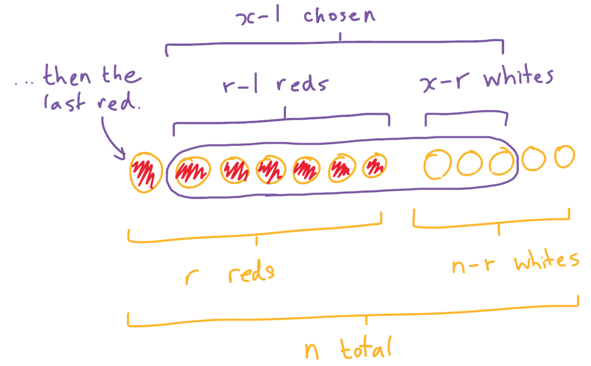

---

title: "Problem Solving #1"
subtitle: A problem exploring combinatorics and discrete probability distributions
date:
summary:
draft: true
featured: false
tags:
  - maths
  - statistics
  - combinatorics
categories: []

image:
    preview_only: true
    filename: featured.jpg

commentable: true
---

<b> Problem Statement: </b>

A bag contains 50 balls, of which 20 are red and the rest are white.

Balls are taken randomly from the bag without replacement until all of the red balls have been found.

Find the probability that, among the balls which have been taken, there are no more white balls than red 
balls.


---

I recently learned about the [hypergeometric distribution](https://en.wikipedia.org/wiki/Hypergeometric_distribution) and its [negative version](https://en.wikipedia.org/wiki/Negative_hypergeometric_distribution), and how they and many other discrete distributions are connected to combinatorics. As someone who used to struggle with concepts like this, I found it very useful to see how looking at the problem in a different way can lead to a far more obvious solution than before. I made up this puzzle to teach myself the various different ways this can be applied.

---

<b> Solution: </b>

To make it easier to generalise, let $ n = 50 $ for the total number of balls in the bag and $ r = 20 $ for the number which are red.

Let $ X $ be a random variable for the total number of balls chosen at the end of the process, so that all $ r $ of them are red and $ X - r $ are white.

We are looking for the event "There will be no more white balls than red balls". In symbols, this will occur if $ X ≤ 2r $, so we need to find out $ P(X ≤ 2r) $. Since we must have $ r ≤ X ≤ n $, this probability is equivalently written as $ P(r ≤ X ≤ 2r) $ (if restricting to the case $ n > 2r $; the probability would always be 1 otherwise).

We know that our last draw from the bag must be red - the last remaining red. All preceding draws must find exactly $ r - 1 $ red balls out of $ X - 1 $ draws.

In probabilities this reads

$$ P(X = x) = P(\text{draw } r - 1 \text{ red in } x - 1 \text{ draws}) $$
$$ \ \ \ \ \ \ \ \ \ \ \ \ \times P(\text{draw red on the last draw}) $$

Let's look at the first term first. To choose exactly $ r - 1 $ reds from $ x - 1 $ draws, we must choose exactly $ x - r $ of the $ n - r $ whites, and exactly $ r - 1 $ of the $ r $ reds:



We can find the number of ways to do this using combinations. The total number of ways to make a sample (succesful or not) is the number of ways to choose a sample of $ x - 1 $ balls from the population of $ n $ balls, so we get:

$$ P(\text{draw } r - 1 \text{ red in } x - 1 \text{ draws}) = \frac{\binom{n-r}{x-r} \binom{r}{r-1}}{\binom{n}{x-1}}. $$

We can simplify $ \binom{r}{r-1} = r $ to get

$$ P(\text{draw } r - 1 \text{ red in } x - 1 \text{ draws}) = \frac{\binom{n-r}{x-r} r}{\binom{n}{x-1}}. $$

Next, the second term. After selecting these $ x - 1 $ balls, there will be $ n - (x - 1) = n - x + 1 $ remaining balls left, only one of which is red, so we simply have

$$ P(\text{draw red on the last draw}) = \frac{1}{n - x + 1} $$

The overall probability expression is then

$$ P(X = x) = \frac{\binom{n-r}{x-r} r}{\binom{n}{x-1}(n - x + 1)} $$

This is effectively a probability mass function - and for this particular context, it has a name - the [Negative Hypergeometric Distribution](https://en.wikipedia.org/wiki/Negative_hypergeometric_distribution).

We can now get an answer, by summing over all allowed values of $ X $:

$$ P(r \leq X \leq 2r) = \sum_{x = r}^{2r} P(X = x) = \sum_{x = r}^{2r} \frac{\binom{n-r}{x-r} r}{\binom{n}{x-1}(n - x + 1)} $$

According to [WolframAlpha](https://www.wolframalpha.com/input?i2d=true&i=Sum%5BDivide%5BnCr%5C%2840%29n-r%5C%2844%29+x-r%5C%2841%29+*+r%2CnCr%5C%2840%29n%5C%2844%29+x-1%5C%2841%29+*+%5C%2840%29n+%2B+1+-+x%5C%2841%29%5D%2C%7Bx%2Cr%2C2r%7D%5D), this summation has a fairly simple closed form:


$$ P(r \leq X \leq 2r) = \frac{(r + 1) \binom{n-r}{r+1}}{(n - 2r) \binom{n}{2r}}. $$

Let's put the numbers in from the original question. We get:

$$ P(20 \leq X \leq 40) = \frac{3393}{1160054} = 0.002925... $$

which seems reasonable - since there were more white balls than red balls to begin with, you would not likely expect to come out with all the red balls without finding at least as many white balls. 

---

Having learned about the distribution, I checked the answer using a function in [`scipy.stats`](https://docs.scipy.org/doc/scipy/tutorial/stats/discrete_nhypergeom.html) with Python:

```python
from scipy.stats import nhypergeom

n = 50
r = 20
p = nhypergeom.cdf(r, n, n - r, r)

print(p)
```

which gives `0.0029248638425452573`.

The syntax is a little different due to the actual definition of the distribution, but this verifies the answer.

