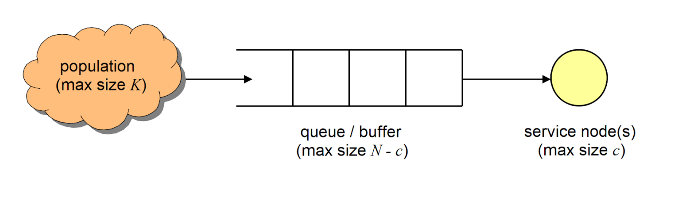
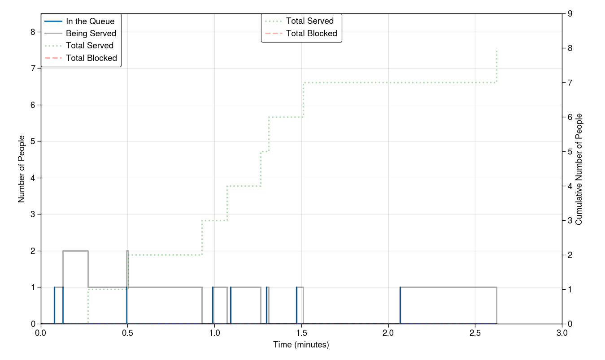

---

title: Simulating Queueing with SimPy in Python
subtitle: A simulation of a queueing system using the SimPy library in Python.
date:
summary:
draft: false
featured: true
tags:
  - travel
  - blog
categories: []

image:
    preview_only: true
    filename: featured.jpg

commentable: true

---

A simulation of a queueing system using the SimPy library in Python.


---

Queueing theory gives us a way to model the behaviour of queues in real life. It is used in many applications, such as traffic flow, call centres, and computer networks. In this post, I will show how I simulated a queueing system using the SimPy library in Python.

## The Problem

Queueing happens any time we have a system where inputs are received at random or regular times, and these inputs take some time to process with finite processing power, before being output from the system. In a conventional queue at a shop for example, the inputs are the customers, the processing is being served by the shop staff, and the output is leaving with the shopping. At different times of the day, the number of customers arriving will vary, and the time taken to serve each customer will vary too. This means that the length of the queue will vary throughout the day. How can the shop decide how many servers should be present at any given time to minimise the average queue length? Queueing theory gives the tools to solve problems like this.

## Queueing Theory

A simple starting point queueing model is as follows:



This shows how inputs from a population can enter a queue to be served by any number of servers. It is often assumed that arrival times and service times are exponentially distributed, which corresponds to arrivals occuring according to a Poisson point process.

A generalised single queue system can be denoted as $ M/M/c/N/K $, where:

- the first $ M $ indicates a Markovian distribution (aka exponential) for the arrival times
- the second $ M $ indicates the same for the service times
- $ c $ is the number of servers
- $ N $ is the maximum number of customers allowed in the system (queue + servers)
- $ K $ is the number of people in the population.

Theoretical results for the M/M/c/N queue can be found [here](https://en.wikipedia.org/wiki/M/M/c_queue#Finite_capacity:~:text=results.%5B15%5D-,Stationary%20analysis,-%5Bedit%5D).


## Simulation using Python (SimPy)

First, the modules that we'll be using.
```python
import simpy  # the main library, for discrete event simulation

import matplotlib.pyplot as plt  # for plotting results
from matplotlib.animation import FuncAnimation  # make a real-time animated plot
from matplotlib.ticker import MultipleLocator

import random  # to generate random arrival and service times
import math  # for computing theoretical results
import itertools  # for calculating cumulative sums of results
import logging  # for recording times of events
```

Now we'll define the Queue class and set up logging. The `env` parameter is a SimPy environment instance that we will pass in at runtime.

```python

class QueueSim:

    _LOG_FILE = 'queue_log.txt'

    def __init__(self, lambda_: float = 1, mu: float = 1, c: int = 1,
                 N: int = float('inf'), K: int = float('inf'),
                 env: simpy.Environment = None):     
        '''
        Define an M/M/c/N/K queue, a continuous-time Markov chain (CTMC) and stochastic process
        in which 'customers' from a 'population' arrive and are served according to a Poisson point process, with options for a finite queue size and finite population size.
        
        #### Arguments
        
        - `lambda_` (float, default = 1): the rate parameter for customers attempting to
        enter the system.
        - `mu` (float, default = 1): the rate parameter for each customer leaving a service node.
        - `c` (int, default = 1): the number of service nodes.
        - `N` (int, default = float('inf')): the maximum possible size of the system, so
        that the maximum queue length is `N - c`. If unset, the size is unlimited.
        - `K` (int, default = float('inf')): the maximum possible size of the population.
        If `K = N` then the queue is closed, so that customers leaving the service node
        immediately may wish to enter the queue again.
        - `env` (simpy.Environment, default = None): a `SimPy` environment instance to use
        in this simulation.
        ''' 
        self.env = simpy.Environment() if env is None else env
        self.server = simpy.Resource(self.env, capacity=c)
        self.queue = simpy.Store(self.env) if N == float('inf') else simpy.Store(self.env, capacity=N - c)
        self.lamda = lambda_
        self.mu = mu
        self.c = c
        self.K = K
        self.N = N
        self.num_people_served = 0  # people who entered the queue, went to a server, and left
        self.num_people_blocked_data = [(0, 0)]  # people who tried to enter but found a full queue, so did not get served never got served
        self.results = {}
        self.init_logger()

    def init_logger(self):
        self.logger = logging.getLogger(__name__)
        self.logger.setLevel(logging.DEBUG)
        file_formatter = logging.Formatter('%(asctime)s - %(levelname)s - %(message)s')
        file_handler = logging.FileHandler(self._LOG_FILE)
        file_handler.setFormatter(file_formatter)
        self.logger.addHandler(file_handler)  # send logs to file

```

Next, we'll make a generator that constantly yields customers. We also write a method to serve customers separately.

```python

    def generate_arrivals_forever(self, end_condition_customers: int = float('inf')) -> simpy.events.Timeout:
        '''
        _summary_
        
        ### Optional Arguments

        - `end_condition_customers` (int, default = float('inf')): optionally stop the simulation after a
        given number of customers are served.
        
        ### Yields
        - `Iterator[simpy.events.Timeout]`: waits the inter-arrival time between customers.
        '''        

        id_num = 0
        while True:
            # wait for the next customer
            inter_arrival_time = random.expovariate(self.lamda)
            yield self.env.timeout(inter_arrival_time)  # wait a random entry time

            # check there are some customers in the population - if not, cycle
            is_people_in_population = (self.K - len(self.queue.items) + len(self.server.users) > 0)
            if not is_people_in_population:
                continue

            # a wild customer appears! Can they fit in the queue?
            if len(self.queue.items) < self.queue.capacity:
                # admit to queue and enter process for them
                self.logger.info(f'Customer {id_num} admitted into queue at {self.env.now}')
                self.results.update({id_num: [self.env.now, None, None, True]})
                self.queue.put(id_num)
                self.env.process(self.process_customer(id_num))
            else:
                # record their attempted entry but do not enter the queue
                self.logger.info(f'Customer {id_num} blocked from queue at {self.env.now}')
                self.num_people_blocked_data.append((self.env.now, self.num_people_blocked_data[-1][1] + 1))
                self.results.update({id_num: [self.env.now, None, None, False]})

            # end simulation if end condition met
            if id_num >= end_condition_customers:
                self.logger.info(f'Customer {id_num} is the last customer allowed in.')
                break
            id_num += 1

    def process_customer(self, id_num):
            # serve a customer at the front of the queue
            with self.server.request() as request:
                yield request
                _id_moved = self.queue.get()  # remove this customer from the queue
                self.logger.info(f'Customer {id_num} began being served at {self.env.now}')
                self.results[id_num][1] = self.env.now  # time moved to the counter
                service_time = random.expovariate(self.mu)
                yield self.env.timeout(service_time)
                self.logger.info(f'Customer {id_num} finished at {self.env.now}')
                self.results[id_num][2] = self.env.now  # time left the system
                self.num_people_served += 1

```

We would like to record the wait times in our simulation, and compare them to standard steady-state results for our system.

```python

    def get_statistics(self):

        # calculate wait times per customer
        system_wait_times, queue_wait_times, service_times = zip(*[
            [val[2] - val[0], val[1] - val[0], val[2] - val[1]] for _, val in self.results.items() \
                if all([x is not None for x in val])])
        mean_queue_wait_time = sum(queue_wait_times) / len(system_wait_times)

        # calculate queue lengths
        join_times = [(1, val) for val in [data[0] for data in self.results.values() if data[3]]]
        leave_times = [(-1, val) for val in [data[1] for data in self.results.values() if data[3]]]
        leave_times = list(filter(lambda x: x[1] is not None, leave_times))
        change_times = sorted(join_times + leave_times, key=lambda x: x[1])
        queue_changes = [c[0] for c in change_times]
        queue_cumulative_changes = itertools.accumulate(queue_changes)
        queue_lengths = [(0, 0)] + [(total, time) for (total, (_, time)) in \
                                    zip(queue_cumulative_changes, change_times)]

        # get time weighted average queue length
        time_sum = 0
        for x, y in zip(queue_lengths[:-1], queue_lengths[1:]):
            time_sum += x[0] * (y[1] - x[1])
        mean_queue_length = time_sum / queue_lengths[-1][1]

        # get theoretical stats
        expected_queue_time, expected_queue_length = self.get_theoretical_statistics()

        print(f'Queue length: Simulated {mean_queue_length}, Theoretical {expected_queue_length}, '
              f'Diff {100 * (1 - mean_queue_length / expected_queue_length):.4f}%')
        print(f'Queue time: Simulated {mean_queue_wait_time}, Theoretical {expected_queue_time}, '
              f'Diff {100 * (1 - mean_queue_wait_time / expected_queue_time):.4f}%')
    
    def get_theoretical_statistics(self):
        '''
        Only valid for M/M/c/N queue (K is infinite)
        '''
        rho = self.lamda / (self.c * self.mu)  # server utilisation
        pi_0 = (1 + sum([(self.c * rho) ** n / math.factorial(n) for n in range(1, self.c + 1)])
                + (self.c * rho) ** self.c / math.factorial(self.c) * sum([
                    rho ** (n - self.c) for n in range(self.c + 1, self.N + 1)
                ])) ** -1
        pi_n = lambda n: pi_0 * (self.c * rho) ** n / math.factorial(n) if 0 <= n < self.c \
            else pi_0 * (self.c * rho) ** n * self.c ** (self.c - n) / math.factorial(self.c)
        pi_N = pi_0 * (self.c * rho) ** self.N / (math.factorial(self.c) * self.c ** (self.N - self.c))
        E_queue_length = pi_0 * (self.c * rho) ** self.c * rho / (math.factorial(self.c) * (1 - rho) ** 2) * (
            1 - rho ** (self.N - self.c) - (self.N - self.c) * (1 - rho) * rho ** (self.N - self.c)
        )
        lambda_eff = self.lamda * (1 - pi_N)
        E_queue_time = E_queue_length / lambda_eff  # Little's lemma

        return E_queue_time, E_queue_length

```

We can now animate the process in real time too:

```python

    def animate_queue_length(self, window_size: float = 1):
        fig, ax1 = plt.subplots(figsize=(10, 6))
        ax2 = ax1.twinx()

        ax1.set_xlabel("Time (minutes)")
        ax1.set_ylabel("Number of People")
        ax1.set_ylim(0, self.N - self.c + 0.5)
        ax1.yaxis.set_major_locator(MultipleLocator(base=1.0))
        ax1.minorticks_off()

        ax2.set_ylabel("Cumulative Number of People")
        ax2.yaxis.set_label_position("right")
        ax2.yaxis.tick_right()
        ax2.grid(False)
        ax2.minorticks_off()

        self.event_timepoints = [] 
        self.num_people_served_data = []
        self.queue_length_data = []
        self.server_length_data = []

        # Initialize the plot lines
        line_queue, = ax1.plot([], [], label='In the Queue')
        line_server, = ax1.plot([], [], color='black', alpha=0.3, label='Being Served')
        line_served, = ax2.plot([], [], color='green', linestyle=':', alpha=0.3, label='Total Served')
        line_blocked, = ax2.plot([], [], color='red', linestyle='--', alpha=0.3, label='Total Blocked')

        def init():
            line_queue.set_data([], [])
            line_server.set_data([], [])
            line_served.set_data([], [])
            line_blocked.set_data([], [])
            return line_queue, line_server, line_served, line_blocked

        def update(frame):
            if self.env.peek() is not simpy.core.Infinity:
                self.env.step()
            else:
                return

            queue_length = len(self.queue.items)
            server_length = len(self.server.users)
            self.queue_length_data.append((self.env.now, queue_length))
            self.server_length_data.append((self.env.now, server_length))
            self.num_people_served_data.append((self.env.now, self.num_people_served))
            self.num_people_blocked_data.append((self.env.now, self.num_people_blocked_data[-1][1]))
            self.event_timepoints.append(self.env.now)

            # add data points before step changes to make to the plot
            # look like rectangles rather than lines joining points
            for attr in ['queue_length_data', 'server_length_data', 'num_people_served_data', 'num_people_blocked_data']:
                if frame != 0 and getattr(self, attr)[-1][1] != getattr(self, attr)[-2][1]:
                    getattr(self, attr).insert(-1, (self.env.now, getattr(self, attr)[-2][1]))

            ax1.set_xlim(max(0, self.env.now - window_size), max(window_size, self.env.now))
            ax2.set_ylim(0, max(self.num_people_served, self.num_people_blocked_data[-1][1]) + 1)

            line_queue.set_data(*zip(*self.queue_length_data))
            line_server.set_data(*zip(*self.server_length_data))
            line_served.set_data(*zip(*self.num_people_served_data))
            line_blocked.set_data(*zip(*self.num_people_blocked_data))

            ax1.relim()
            ax1.autoscale_view()
            ax2.relim()
            ax2.autoscale_view()

            return line_queue, line_server, line_served, line_blocked

        ani = FuncAnimation(fig, update, init_func=init, interval=30, blit=False)

        # Manually create a single legend for both axes
        lines = [line_queue, line_server, line_served, line_blocked]
        labels = [line.get_label() for line in lines]
        ax1.legend(lines, labels, loc='upper left')
        ax2.legend(loc='upper center')

        plt.show()

```

And now we can run:

```python

def main():
    q = QueueSim(lambda_=5, mu=3, c=2, N=10)
    q.env.process(q.generate_arrivals_forever())  # process the generator
    q.animate_queue_length(window_size=3)  # animate at each yield from the generator
    q.get_statistics()

if __name__ == '__main__':
    main()

```

A screenshot from the animation (cannot show animations easily here...)



Here's a sample from the log file showing how we recorded the events:

```
2023-08-30 10:14:51,888 - INFO - Customer 0 admitted into queue at 0.07968689242355713
2023-08-30 10:14:52,365 - INFO - Customer 0 began being served at 0.07968689242355713
2023-08-30 10:14:52,678 - INFO - Customer 1 admitted into queue at 0.128119429755327
2023-08-30 10:14:53,049 - INFO - Customer 1 began being served at 0.128119429755327
2023-08-30 10:14:53,260 - INFO - Customer 1 finished at 0.2727061089992237
2023-08-30 10:14:53,580 - INFO - Customer 2 admitted into queue at 0.4943649913915312
2023-08-30 10:14:53,888 - INFO - Customer 2 began being served at 0.4943649913915312
2023-08-30 10:14:54,080 - INFO - Customer 0 finished at 0.5041083654489577
2023-08-30 10:14:54,355 - INFO - Customer 2 finished at 0.9274427514476721
2023-08-30 10:14:54,643 - INFO - Customer 3 admitted into queue at 0.988933676368025
2023-08-30 10:14:55,061 - INFO - Customer 3 began being served at 0.988933676368025
2023-08-30 10:14:55,380 - INFO - Customer 3 finished at 1.0715969343708087
```

After a very long time, the simulation will approach the theoretical steady-state results. However, for smaller times, there is an initialisation bias, since we start with an empty system instead of steady state. This can be overcome by only starting recording after a certain warm-up period has passed, but I didn't bother with this here.

Full code in one file on my GitHub repo [here](https://github.com/lorcan2440/Process-Simulation/tree/main/Queueing).