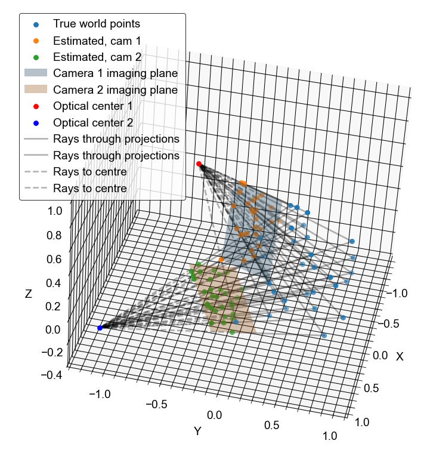

---

title: "Camera Calibration and 3D Reconstruction"
subtitle: Camera calibration, epipolar geometry and stereo vision from first principles
date:
summary:
draft: false
featured: false
tags:
  - computer vision
categories: []

image:
    preview_only: true
    filename: featured.png

commentable: true
---



Code on [GitHub gists here](https://gist.github.com/lorcan2440/f8bc2a48121f0e82db21d4c1c8625507):

```python
import numpy as np
import matplotlib.pyplot as plt
from mpl_toolkits.mplot3d import Axes3D
import matplotlib_inline
import scipy.optimize

matplotlib_inline.backend_inline.set_matplotlib_formats('svg')
#plt.style.use(r'C:\LibsAndApps\Python config files\proplot_style.mplstyle')

def R_axis_angle(n: np.ndarray, theta: float) -> np.ndarray:
    # function returning 3x3 rotation matrix given an axis and angle of rotation
    return np.eye(3) * np.cos(theta) + \
        (1 - np.cos(theta)) * np.outer(n, n) + \
        np.sin(theta) * np.array([[0, -n[2], n[1]], [n[2], 0, -n[0]], [-n[1], n[0], 0]])

def affine_matrix(R: np.ndarray, T: np.ndarray) -> np.ndarray:
    # function returning 4x4 affine matrix given a rotation matrix and a translation vector
    return np.hstack((np.vstack((R, np.array([0, 0, 0]))),
        np.vstack((T.reshape(3, 1), np.array([1])))))

# set camera intrinsic parameters - same in both cameras
k_u = 15  # pixel size, horizontal
k_v = 13  # pixel size, vertical
f = 1  # focal length
u_0 = 1  # optical center, horizontal
v_0 = 0.5  # optical center, vertical

# set camera extrinsic parameters
R_axis_1 = np.array([0.707, 0, 0.707])  # axis of rotation
R_axis_2 = np.array([0.9, 0.2, 0.8])
R_1 = R_axis_angle(R_axis_1 / np.linalg.norm(R_axis_1), np.pi / 2)  # rotation matrix, 3D
R_2 = R_axis_angle(R_axis_2 / np.linalg.norm(R_axis_2), np.pi / 3)
T_1 = np.array([0, 1, 1])  # translation vector, 3D
T_2 = np.array([-1, 0, 1])

P_r_1 = affine_matrix(R_1, T_1)  # rotation matrix: world to camera
P_r_2 = affine_matrix(R_2, T_2)
P_p = np.array([[f, 0, 0, 0], [0, f, 0, 0], [0, 0, 1, 0]])  # projection matrix: camera to image
P_c = np.array([[k_u, 0, u_0], [0, k_v, v_0], [0, 0, 1]])  # camera matrix: image to pixel
P_pr_1 = P_c @ P_p @ P_r_1  # projection matrix: world to pixel
P_pr_2 = P_c @ P_p @ P_r_2

print(P_pr_1)
print(P_pr_2)

# generate some random 3D points
N_pts = 30
pts_world_true_3d = np.random.rand(3, N_pts)
pts_world_true_4d = np.vstack((pts_world_true_3d, np.ones(N_pts)))  # homogeneous coordinates

# find true camera coords
pts_cam_1_true_3d = P_pr_1 @ pts_world_true_4d
pts_cam_2_true_3d = P_pr_2 @ pts_world_true_4d
pts_cam_1_true_2d = pts_cam_1_true_3d[:2, :] / pts_cam_1_true_3d[2, :]
pts_cam_2_true_2d = pts_cam_2_true_3d[:2, :] / pts_cam_2_true_3d[2, :]

# add some noise to the true points to simulate measured points
noise = 0.02
pts_cam_1_2d = pts_cam_1_true_2d + np.random.randn(2, N_pts) * noise
pts_cam_2_2d = pts_cam_2_true_2d + np.random.randn(2, N_pts) * noise

print(f'World points: {pts_world_true_3d[:, :5]}')
print(f'Camera 1 true points: {pts_cam_1_true_2d[:, :5]}')
print(f'Camera 2 true points: {pts_cam_2_true_2d[:, :5]}')
print(f'Camera 1 measured points: {pts_cam_1_2d[:, :5]}')
print(f'Camera 2 measured points: {pts_cam_2_2d[:, :5]}')

# use RANSAC and least squares to calibrate each camera

def calibrate_camera(pts_cam_2d, pts_world_true_4d, max_iter=1000, abs_tol=1e-2):

    # 1. RANSAC (random sample consensus) to estimate the projection matrix
    inlier_count_max = 0
    best_P_est = None

    for r_i in range(max_iter):
        selected_indices = np.random.choice(N_pts, 6, replace=False)
        A = np.zeros((12, 12))
        for i, j in zip(selected_indices, range(6)):
            A[2 * j, :] = np.hstack((pts_world_true_4d[:, i], np.zeros(4), -1 * pts_cam_2d[0, i] * pts_world_true_4d[:, i]))  # equation for u
            A[2 * j + 1, :] = np.hstack((np.zeros(4), pts_world_true_4d[:, i], -1 * pts_cam_2d[1, i] * pts_world_true_4d[:, i]))  # equation for v

        # orthogonal least squares solution to A @ p = 0 (right eigenvector corresponding to eigenvalue closest to 0)
        _, _, Vh = np.linalg.svd(A)
        P_est = Vh[-1, :].reshape(3, 4)  # estimated projection matrix
        P_est /= P_est[-1, -1]  # normalise

        # find estimated 3D points
        A_full = np.zeros((2 * N_pts, 12))
        for i in range(N_pts):
            A_full[2 * i, :] = np.hstack((pts_world_true_4d[:, i], np.zeros(4), -1 * pts_cam_2d[0, i] * pts_world_true_4d[:, i]))
            A_full[2 * i + 1, :] = np.hstack((np.zeros(4), pts_world_true_4d[:, i], -1 * pts_cam_2d[1, i] * pts_world_true_4d[:, i]))

        Ap_est = A_full @ P_est.flatten()
        # count inliers, should be very close to zero
        inliers = np.sum(np.abs(Ap_est) <= abs_tol)
        if inliers > inlier_count_max:
            inlier_count_max = inliers
            best_P_est = P_est
            print(f'Iteration {r_i}: found {inliers} inliers')

    print(f'RANSAC finished: found {inlier_count_max} out of {2 * N_pts} inliers with P = \n{best_P_est}')

    # 2. Minimise reprojection errors (nonlinear least squares: Levenberg-Marquardt algorithm)
    # starting from best_P_est as initial guess
    proj_2d = lambda P, X: (w := (P.reshape(3, 4) @ X))[:2] / w[2]
    P_opt = scipy.optimize.least_squares(
        lambda P: np.sum((pts_cam_2d - proj_2d(P, pts_world_true_4d))**2, axis=0), best_P_est.flatten())
    P_best = P_opt.x.reshape(3, 4) / P_opt.x[-1]
    print(f'Optimal solution: \n {P_best}, cost: {P_opt.cost}')

    # 3. Decomposition into intrinsic and extrinsic parameters from optimal estimate of P
    K_est, R_est = scipy.linalg.rq(P_best[:, :3])  # transposed QR decomposition
    T_est = np.linalg.inv(K_est) @ P_best[:, 3]
    K_est = np.hstack((K_est / K_est[-1, -1], np.zeros((3, 1))))
    print(f'Estimated parameters:\n K: \n{np.around(K_est, 5)}, \nR: \n{np.around(R_est, 5)}, \nT: {np.around(T_est, 5)}')

    return K_est, R_est, T_est


def triangulate(K, R, T, pts_cam_2d, X_c: np.array = None, invert_in_camera: bool = True):
    if X_c is None:
        N_pts = pts_cam_2d.shape[1]
        pts_cam_X_c = (-1 if invert_in_camera else 1) * np.linalg.inv(K[:, :3]) @ np.vstack((pts_cam_2d, np.ones(N_pts)))
    else:
        N_pts = X_c.shape[1]
        pts_cam_X_c = (-1 if invert_in_camera else 1) * X_c
    pts_cam_X = np.linalg.inv(R) @ (pts_cam_X_c - np.tile(T.reshape(3, 1), (1, N_pts)))
    return pts_cam_X

# Calibration: compute intrinsic and extrinsic camera parameters for each camera
K_1_est, R_1_est, T_1_est = calibrate_camera(pts_cam_1_2d, pts_world_true_4d)
K_2_est, R_2_est, T_2_est = calibrate_camera(pts_cam_2_2d, pts_world_true_4d)

# Triangulation: invert the projection to calculate 3D world points, projected to the image plane
pts_cam_1_X = triangulate(K_1_est, R_1_est, T_1_est, pts_cam_1_2d)
pts_cam_2_X = triangulate(K_2_est, R_2_est, T_2_est, pts_cam_2_2d)

# Epipolar constraint - can use the essential matrix since the cameras are calibrated
E = R_2_est @ np.array([[0, -T_2_est[2], T_2_est[1]], [T_2_est[2], 0, -T_2_est[0]], [-T_2_est[1], T_2_est[0], 0]]) @ R_1_est

### plots

fig = plt.figure(figsize=(8, 8))
ax = fig.add_subplot(111, projection='3d')
ax.scatter(pts_world_true_3d[0, :], pts_world_true_3d[1, :], pts_world_true_3d[2, :], label='True world points')
ax.scatter(pts_cam_1_X[0, :], pts_cam_1_X[1, :], pts_cam_1_X[2, :], label='Estimated, cam 1')
ax.scatter(pts_cam_2_X[0, :], pts_cam_2_X[1, :], pts_cam_2_X[2, :], label='Estimated, cam 2')

# draw imaging plane of camera 1
u1 = np.linspace(min(pts_cam_1_2d[0, :]), max(pts_cam_1_2d[0, :]), 10)
v1 = np.linspace(min(pts_cam_1_2d[1, :]), max(pts_cam_1_2d[1, :]), 10)
U1, V1 = np.meshgrid(u1, v1)
X1 = np.vstack((U1.flatten(), V1.flatten(), np.ones(100)))
X1_w = triangulate(K_1_est, R_1_est, T_1_est, None, X_c = np.linalg.inv(K_1_est[:, :3]) @ X1, invert_in_camera=True)
ax.plot_surface(X1_w[0, :].reshape(10, 10), X1_w[1, :].reshape(10, 10), X1_w[2, :].reshape(10, 10),
                alpha=0.3, label='Camera 1 imaging plane')

# draw imaging plane of camera 2
u2 = np.linspace(min(pts_cam_2_2d[0, :]), max(pts_cam_2_2d[0, :]), 10)
v2 = np.linspace(min(pts_cam_2_2d[1, :]), max(pts_cam_2_2d[1, :]), 10)
U2, V2 = np.meshgrid(u2, v2)
X2 = np.vstack((U2.flatten(), V2.flatten(), np.ones(100)))
X2_w = triangulate(K_2_est, R_2_est, T_2_est, None, X_c = np.linalg.inv(K_2_est[:, :3]) @ X2, invert_in_camera=True)
ax.plot_surface(X2_w[0, :].reshape(10, 10), X2_w[1, :].reshape(10, 10), X2_w[2, :].reshape(10, 10),
                alpha=0.3, label='Camera 2 imaging plane')

# draw optical centres
X_c = np.array([0, 0, 0])  # origin of camera-centred coordinates
X1_w = triangulate(K_1_est, R_1_est, T_1_est, None, X_c=X_c.reshape(3, 1))
ax.scatter(X1_w[0], X1_w[1], X1_w[2], c='r', label='Optical center 1')
X2_w = triangulate(K_2_est, R_2_est, T_2_est, None, X_c=X_c.reshape(3, 1))
ax.scatter(X2_w[0], X2_w[1], X2_w[2], c='b', label='Optical center 2')

# draw lines between the true and estimated points
for i in range(N_pts):
    ax.plot([pts_world_true_3d[0, i], pts_cam_1_X[0, i]],
            [pts_world_true_3d[1, i], pts_cam_1_X[1, i]],
            [pts_world_true_3d[2, i], pts_cam_1_X[2, i]], 'k-',
            alpha=0.3, label=('Rays through projections' if i == 0 else None))

    ax.plot([pts_world_true_3d[0, i], pts_cam_2_X[0, i]],
            [pts_world_true_3d[1, i], pts_cam_2_X[1, i]],
            [pts_world_true_3d[2, i], pts_cam_2_X[2, i]], 'k-',
            alpha=0.3, label=('Rays through projections' if i == 0 else None))

# draw lines between estimated and optical center
for i in range(N_pts):
    ax.plot([pts_cam_1_X[0, i], X1_w[0][0]],
            [pts_cam_1_X[1, i], X1_w[1][0]],
            [pts_cam_1_X[2, i], X1_w[2][0]], 'k--',
            alpha=0.3, label=('Rays to centre' if i == 0 else None))
    
    ax.plot([pts_cam_2_X[0, i], X2_w[0][0]],
            [pts_cam_2_X[1, i], X2_w[1][0]],
            [pts_cam_2_X[2, i], X2_w[2][0]], 'k--',
            alpha=0.3, label=('Rays to centre' if i == 0 else None))

ax.set_xlabel('X')
ax.set_ylabel('Y')
ax.set_zlabel('Z')
ax.legend(loc='upper left')
plt.show()
```