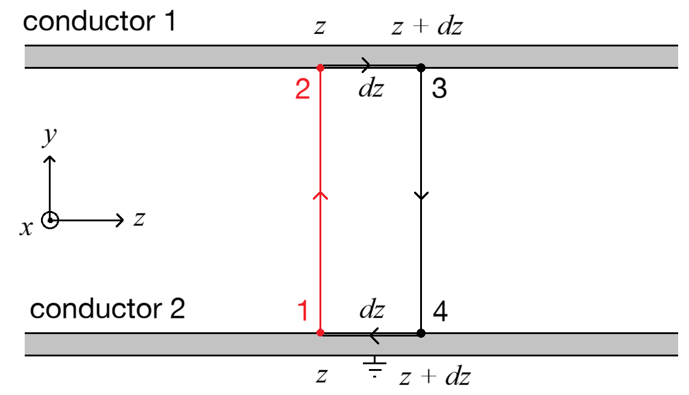

---

title: "Deriving the Telegrapher's Equations and the Transmission Line Model from Maxwell's Equations"
subtitle: Mathematically connecting the physics of electrodynamics to the engineering of transmission lines
date:
summary:
draft: false
featured: false
tags:
  - electrodynamics
  - transmission lines
  - maths
categories: []

image:
    preview_only: true
    filename: featured.png

commentable: true

---

The transmission line model was one of the most confusing concepts I remember encountering in my electromagnetics class. It was a model that seemed to be pulled out of nowhere, and it was never made clear exactly how the real physics of anything connects to the model. I wanted to go all the way from the fundamental physics of Maxwell's equations to the transmission line model, and pick up the intuitive understanding of the fields and waves along the way. 

Once we have the transmission line model, we can use it to gain a deeper understanding of what terms like "reactive power" and "line capacitance" really mean in terms of the underlying physics, and I will show some engineering applications of this model (the Ferranti effect and surge impedance loading). I will also show how the field theory of transmission lines reduces to AC circuit theory in the low-frequency limit, and even to DC circuit theory in the zero-frequency limit.

---

## Part 1: Deriving the Phasor Forms of Maxwell's Equations

We'll begin with Faraday's law and the Ampere-Maxwell law in their macroscopic differential forms.

$$ \nabla \times \mathbf{E} = -\frac{\partial \mathbf{B}}{\partial t} \ \ \ \ \ \ \textup{and} \ \ \ \ \ \ \nabla \times \mathbf{H} = \mathbf{J}_f + \frac{\partial \mathbf{D}}{\partial t}. $$

($ \mathbf{E} $: electric field strength, $ \mathbf{B} $: magnetic flux density, $ \mathbf{H} $: magnetic field strength, $ \mathbf{D} $: electric flux density, $ \mathbf{J}_f $: free current density)

We now assume a linear isotropic medium, so that we can write

$$ \mathbf{D} = \varepsilon \mathbf{E} \ \ \ \ \ \ \textup{and} \ \ \ \ \ \ \mathbf{B} = \mu \mathbf{H}, $$

($ \varepsilon $: permittivity, $ \mu $: permeability of the medium)

We will also use Ohm's law:

$$ \mathbf{J}_f = \sigma \mathbf{E}, $$

($ \sigma $: conductivity of the medium).

Substituting these into our two Maxwell equations, we get equations involving only the electric and magnetic field strengths:

$$ \nabla \times \mathbf{E} = -\mu \frac{\partial \mathbf{H}}{\partial t} \ \ \ \ \ \ \textup{and} \ \ \ \ \ \ \nabla \times \mathbf{H} = \sigma \mathbf{E} + \varepsilon \frac{\partial \mathbf{E}}{\partial t}. $$

We seek the harmonic (single frequency steady state) response of these equations: we assume that the fields vary sinusoidally in time with angular frequency $ \omega $. We will convert the fields $ \mathbf{E} $ and $ \mathbf{H} $ into phasors, which are complex-valued functions of space only, by writing

$$ \mathbf{E}(\mathbf{r}, t) = \textup{Re} \left [ \tilde{\mathbf{E}}(\mathbf{r}) e^{j \omega t} \right ] \ \ \ \ \ \ \textup{and} \ \ \ \ \ \ \mathbf{H}(\mathbf{r}, t) = \textup{Re} \left [ \tilde{\mathbf{H}}(\mathbf{r}) e^{j \omega t} \right ] $$

($ j = \sqrt{-1} $: imaginary unit). Note that $ \mathbf{\tilde{E}} \in \mathbb{C}^3 $ and $ \mathbf{\tilde{H}} \in \mathbb{C}^3 $ are complex-valued functions of space only, with their complex argument representing the phase of the fields. Substitute these into our Maxwell equations:

$$ \nabla \times \left [ \textup{Re} \left ( \tilde{\mathbf{E}} e^{j \omega t} \right ) \right ] = -\mu \frac{\partial}{\partial t} \left [ \textup{Re} \left ( \tilde{\mathbf{H}} e^{j \omega t} \right ) \right ] $$

$$ \nabla \times \left [ \textup{Re} \left ( \tilde{\mathbf{H}} e^{j \omega t} \right ) \right ] = \sigma \ \textup{Re} \left ( \tilde{\mathbf{E}} e^{j \omega t} \right ) + \varepsilon \frac{\partial}{\partial t} \left [ \textup{Re} \left ( \tilde{\mathbf{E}} e^{j \omega t} \right ) \right ]. $$

Both curl and time-differentiation are real-valued linear operations, so we can change the order of operations:

$$ \textup{Re} \left [ \nabla \times \left ( \tilde{\mathbf{E}} e^{j \omega t} \right ) \right ] = -\mu \ \textup{Re} \left [ \frac{\partial}{\partial t} \left ( \tilde{\mathbf{H}} e^{j \omega t} \right ) \right ] $$

$$ \textup{Re} \left [ \nabla \times \left ( \tilde{\mathbf{H}} e^{j \omega t} \right ) \right ] = \sigma \ \textup{Re} \left ( \tilde{\mathbf{E}} e^{j \omega t} \right ) + \varepsilon \ \textup{Re} \left [ \frac{\partial}{\partial t} \left ( \tilde{\mathbf{E}} e^{j \omega t} \right ) \right ]. $$

On the left, we note that the time dependence $ e^{j \omega t} $ can be pulled out of the curl operator, since it does not depend on position, and on the right, we can pull the phasor out of the time derivative, since it does not depend on time. We can then differentiate the exponential term with respect to time:

$$ \textup{Re} \left [ e^{j \omega t} \nabla \times \tilde{\mathbf{E}} \right ] = -\mu \ \textup{Re} \left [ e^{j \omega t} j \omega \tilde{\mathbf{H}} \right ] $$

$$ \textup{Re} \left [ e^{j \omega t} \nabla \times \tilde{\mathbf{H}} \right ] = \sigma \ \textup{Re} \left ( e^{j \omega t} \tilde{\mathbf{E}} \right ) + \varepsilon \textup{Re} \left [ e^{j \omega t} j \omega \tilde{\mathbf{E}} \right ]. $$

Now, we can divide both sides by $ e^{j \omega t} $, which is a non-zero complex number, and then we can drop the $ \textup{Re} $ operator, since the equations must hold for all time. This can be seen more clearly by expanding out the components with Euler's formula (omitted here for brevity - alternatively we can use the fact that the Fourier series of a function is unique). We get the **phasor form of Maxwell's equations**:

$$ \nabla \times \tilde{\mathbf{E}} = -j \omega \mu \tilde{\mathbf{H}} \ \ \ \ \ \ \textup{and} \ \ \ \ \ \ \nabla \times \tilde{\mathbf{H}} = (\sigma + j \omega \varepsilon) \tilde{\mathbf{E}}. $$

---

## Part 2: Deriving the Field Equations in the Transverse Plane

We are now ready to impose the geometry of a transmission line on these equations. We will assume that the transmission line is uniform and infinitely long in the $ z $-direction, surrounded by the linear isotropic medium of permittivity $ \varepsilon $ and permeability $ \mu $, and that it has some cross-sectional geometry in the $ x $-$ y $ plane. 

Since the separation between the two conductors are much shorter than the wavelength, we can also assume that the fields are **transverse electromagnetic (TEM)** waves, meaning that the electric and magnetic fields are both perpendicular to the direction of propagation (the $ z $-axis). Mathematically, this means we can set $ \tilde{E}_z = 0 $, $ \tilde{H}_z = 0 $.

Note that for an AC power line (the context we are working towards), the outgoing current travels along the "real" overhead line while the return current travels either through the physical earth or through a neutral conductor. For grid frequencies ($ f = 50 $ or $ 60 $ Hz), the wavelength of the field variations are roughly:

$$ \lambda \approx \frac{c}{f} = \frac{3 \times 10^8 \textup{ m/s}}{50 \textup{ Hz}} = 6 \times 10^6 \textup{ m} = 6000 \textup{ km}, $$

i.e. thousands of kilometers, far longer than the height of any power line above the ground, so the TEM assumption is very good for our purposes.

Let's recall the definition of curl in 3D Cartesian coordinates:

$$ \nabla \times \tilde{\mathbf{E}} = \left ( \frac{\partial \tilde{E}_z}{\partial y} - \frac{\partial \tilde{E}_y}{\partial z} \right ) \hat{\mathbf{x}} + \left ( \frac{\partial \tilde{E}_x}{\partial z} - \frac{\partial \tilde{E}_z}{\partial x} \right ) \hat{\mathbf{y}} + \left ( \frac{\partial \tilde{E}_y}{\partial x} - \frac{\partial \tilde{E}_x}{\partial y} \right ) \hat{\mathbf{z}}. $$

Since $ \tilde{E}_z = 0 $, we get

$$ \nabla \times \tilde{\mathbf{E}} = -\frac{\partial \tilde{E}_y}{\partial z} \hat{\mathbf{x}} + \frac{\partial \tilde{E}_x}{\partial z} \hat{\mathbf{y}} + \left ( \frac{\partial \tilde{E}_y}{\partial x} - \frac{\partial \tilde{E}_x}{\partial y} \right ) \hat{\mathbf{z}}. $$

By considering the $ x $ and $ y $ components of Faraday's law, we have

$$ -\frac{\partial \tilde{E}_y}{\partial z} = -j \omega \mu \tilde{H}_x \ \ \ \ \ \ \textup{and} \ \ \ \ \ \ \frac{\partial \tilde{E}_x}{\partial z} = -j \omega \mu \tilde{H}_y. $$

We can combine these equations together by considering 2D fields in the $ x $-$ y $ plane. Let

$$ \tilde{\mathbf{E}}_t = \tilde{E}_x \hat{\mathbf{x}} + \tilde{E}_y \hat{\mathbf{y}} \ \ \ \ \ \ \textup{and} \ \ \ \ \ \ \tilde{\mathbf{H}}_t = \tilde{H}_x \hat{\mathbf{x}} + \tilde{H}_y \hat{\mathbf{y}}, $$

Then our two equations can be written as

$$ \frac{\partial \tilde{\mathbf{E}}_t}{\partial z} = -j \omega \mu \hat{\mathbf{z}} \times \tilde{\mathbf{H}}_t. $$

It's easier to verify that these are equivalent by going the other way, using component form.

Repeating this with the curl of the magnetic field and considering the $ x $ and $ y $ components of the Ampère-Maxwell law, we have

$$ -\frac{\partial \tilde{H}_y}{\partial z} = (\sigma + j \omega \varepsilon) \tilde{E}_x \ \ \ \ \ \ \textup{and} \ \ \ \ \ \ \frac{\partial \tilde{H}_x}{\partial z} = (\sigma + j \omega \varepsilon) \tilde{E}_y $$

which can be combined similarly to give

$$ \frac{\partial \tilde{\mathbf{H}}_t}{\partial z} = (\sigma + j \omega \varepsilon) \hat{\mathbf{z}} \times \tilde{\mathbf{E}}_t. $$

---

## Part 3: From Electric and Magnetic Fields to Voltages and Currents

It's now time to go from electric fields and magnetic fields to voltages and currents. We'll work with the electric field first. Before we can even bring up voltage however, we need to justify the existence of "voltage" as a unique quantity, since the potential difference in general depends on the path taken between two points (especially when magnetic fields are present, as they are here). But, if we consider the $ z $ component of Faraday's law above, we have

$$ \frac{\partial \tilde{E}_y}{\partial x} - \frac{\partial \tilde{E}_x}{\partial y} = -j \omega \mu H_z, $$

which means that the 2D curl of the transverse (also 2D) electric field is $ \nabla \times \tilde{\mathbf{E}}_t = -j \omega \mu H_z \hat{\mathbf{z}} $. Since $ H_z = 0 $ for our TEM wave, we have $ \nabla \times \tilde{\mathbf{E}}_t = 0 $, which means that the transverse electric field is irrotational in the transverse plane. This allows us to define the scalar potential function $ V(z) $ at any point along the line such that

$$ \tilde{\mathbf{E}}\_t(x, y) = -\nabla V(z) \ \ \ \ \ \ \textup{i.e.} \ \ \ \ \ \ V(z) = -\int \limits_{1}^{2} \tilde{\mathbf{E}}_t(x', y') \cdot d\mathbf{l} $$

where $ 1 $ and $ 2 $ are two points on the two conductors in the same transverse plane (i.e. at the same $ z $ coordinate). Note that $ V(z) $ is a function of $ z $ only, since the transverse electric field is irrotational in the transverse plane, so the potential difference between the two conductors does not depend on the path taken in the transverse plane.

We now consider what will become one of our telegrapher's equations:

$$ \frac{\partial V}{\partial z} = -\int \limits_{1}^{2} \frac{\partial \tilde{\mathbf{E}}\_t}{\partial z} \cdot d\mathbf{l}. $$

Substitute into our combined equation:

$$ \frac{\partial V}{\partial z} = j \omega \mu \int \limits_{1}^{2} (\hat{\mathbf{z}} \times \tilde{\mathbf{H}}_t) \cdot d\mathbf{l}. $$

Use the cyclic property of the scalar triple product to rewrite the integrand:

$$ \frac{\partial V}{\partial z} = j \omega \mu \int \limits_{1}^{2} \tilde{\mathbf{H}}_t \cdot (d\mathbf{l} \times \hat{\mathbf{z}}). $$

At this point, a diagram will be helpful. Recall that $ 1 \rightarrow 2 $ is an open path from one conductor to the other in the transverse plane. We are going to consider a closed path that circulates a rectangle in the $ y $-$ z $ plane, of infinitesimal length $ dz $, so that one side of the rectangle is the path $ 1 \rightarrow 2 $, as shown:

Notice that $ d\mathbf{l} \times \hat{\mathbf{z}} $ is a vector perpendicular to this rectangle surface. It is essentially the surface normal vector of the rectangle, so we can let $ d\mathbf{S} = -d\mathbf{l} \times \hat{\mathbf{z}} $ be the infinitesimal surface element of this rectangle (sign chosen for orientation consistency later). Then we can rewrite the above equation as

$$ \frac{\partial V}{\partial z} = -j \omega \mu \int \limits_{1}^{2} \tilde{\mathbf{H}}_t \cdot d\mathbf{S}. $$

Let's apply Faraday's law in integral form to this closed path (call it $ C $):

$$ \oint \limits_{C} \tilde{\mathbf{E}} \cdot d\mathbf{l} = -\frac{\partial}{\partial t} \int \limits_{S} \tilde{\mathbf{B}} \cdot d\mathbf{S} $$

where $ S $ is the surface in the $ y $-$ z $ plane enclosed by the path $ C $. Since the fields are TEM waves, we have $ \tilde{E}_z = 0 $, so the line integral along the two sides of the rectangle parallel to the $ z $-axis are zero.

---

In principle, we could go all the way up to quantum electrodynamics and derive Maxwell's equations from that - it only takes three hours as beautifully explained in Richard Behiel's video [*Electromagnetism as a Gauge Theory*](https://www.youtube.com/watch?v=Sj_GSBaUE1o) - but I will take Maxwell's equations as given and start from there.

...

**Part 2: From Electric and Magnetic Fields to Voltages and Currents**

...

**Part 3: The Telegrapher's Equations and the Transmission Line Model**

...

**Part 4: Calculating the Transmission Line Parameters**

...

**Part 5: Applications (Ferranti Effect, Surge Impedance Loading, AC Circuits and DC Circuits)**

...
