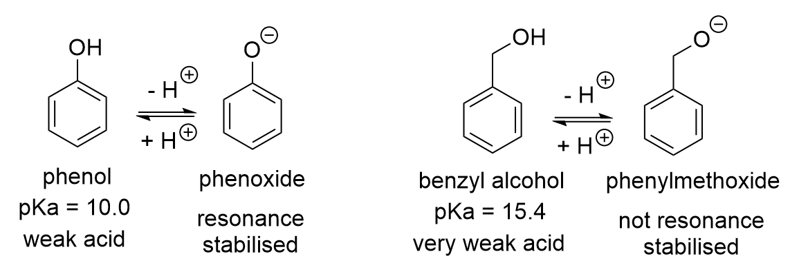

---

title: "How to calculate the pH of very weak acids and bases"
subtitle: 
date:
summary:
draft: false
featured: false
tags:
  - chemistry
categories: []

image:
    preview_only: true
    filename: featured.jpg

commentable: true

---

## Calculation for a Strong Acid

Let's start with a classic school chemistry exercise to warm up:

**If we have a 0.1 M solution of sulfuric acid, what is its pH?**

Sulfuric acid ($ H_2SO_4 $) is a *strong acid*, meaning it dissociates completely in water. A concentration of 0.1 M means there are 0.1 moles of $ H_2SO_4 $ in 1 litre of solution. 

Recall that the unit 'M' ("molar") represents $ mol/L $ ("moles per litre") and the litre (L) is sometimes also written as a 'cubic decimetre' ($ 1 \ L = 1 \ dm^3 $), so it is also sometimes written as $ mol/dm^3 $.

The dissociation of sulfuric acid in water can be represented as:

$$ H_2SO_4 (s) \rightarrow 2 \ H^+ (aq) + SO_4^{2-} (aq). $$

So, our 0.1 moles of $ H_2SO_4 $ will produce 0.2 moles of $ H^+ $ ions in 1 litre of solution.

The concentration of $ H^+ $ ions in the solution will be 

$$ \frac{0.2 \ mol}{1 \ L} = 0.2 \ M. $$

The pH of the solution, using its definition, is 

$$ pH = -\log_{10} \[H^+ \] = -\log_{10}(0.2) = 0.70. $$

This is very acidic! It would turn universal indicator paper a deep red.

This calculation is straightforward. But what if we have a weak acid?

## Calculation for a Weak Acid

Suppose instead we have a **0.1 M solution of acetic acid** ($ CH_3COOH $). Acetic acid is a *weak acid*, meaning it does not dissociate completely in water. What will the pH of this solution be?

The dissociation of acetic acid in water can be represented as:

$$ CH_3COOH (aq) \rightleftharpoons H^+ (aq) + CH_3COO^- (aq). $$

The equilibrium constant for this reaction is called the *acid dissociation constant*, $ K_a $, and is defined as:

$$ K_a = \frac{[H^+][CH_3COO^-]}{[CH_3COOH]}. $$

For acetic acid, it has been experimentally determined that $ K_a = 1.8 \times 10^{-5} \ M $ at 25 °C.

In any aqueous solution where acetic acid is present, the above relationship between those three species always holds true at equilibrium - no matter what else it is mixed with.

The usual method to solve for the pH of a weak acid solution is to set up an *ICE* table (initial, change, equilibrium), as follows:

| Species            | Initial (M)     | Change (M)     | Equilibrium (M)    |
|--------------------|-----------------|----------------|--------------------|
| $ [CH_3COOH] $     | $0.1$           | -$x$           | $0.1 - x$          |
| $ [H^+] $          | $0$             | +$x$           | $x$                |
| $ [CH_3COO^-] $    | $0$             | +$x$           | $x$                |

Note that it doesn't matter whether the units in our table are moles (amount) or molar (concentration), since the volume of the solution is constant. Here, we'll use molarity, so we don't need to worry about the volume.

Our solution starts with 0.1 M undissociated acetic acid, and no protons or acetate ions. During dissociation, $ x $ units of acetic acid react to form $ x $ units of protons and acetate ions in solution.

We now apply the equilibrium constant expression to the last column of the table:

$$ K_a = \frac{[H^+][CH_3COO^-]}{[CH_3COOH]} = \frac{x^2}{0.1 - x} = 1.8 \times 10^{-5} $$

With a little algebra, we can rearrange this into a quadratic equation:

$$ x^2 + (1.8 \times 10^{-5}) x - (1.8 \times 10^{-6}) = 0 $$

We can solve this equation using the quadratic formula to get solutions of

$$ x = 0.0013327 \ M \ \ \textrm{or} \ \ x = -0.0013507 \ M. $$

Since $ x $ represents a concentration, it cannot be negative, so we take the positive solution of $ x = 0.0013327 \ M $.

Now that we know that $ [H^+] = 0.0013327 \ M $, we can calculate the pH of the solution as usual:

$$ pH = -\log_{10} \[H^+ \] = -\log_{10}(0.0013327) = 2.88. $$

This is over 100 times less acidic than our sulfuric acid solution despite having equal concentrations, so the distinction between strong and weak acids is very clear!

## Calculation for a VERY Weak Acid

This time, suppose we're looking at organic molecules that we usually wouldn't think of as acids - even though they can be. For example, benzyl alcohol ($ C_6H_5CH_2OH $) is a common organic compound that is used as a solvent and in the manufacture of other chemicals. It has a hydroxyl group $(-OH)$ that can donate a proton to water, making it a weak acid.

In comparison to phenol ($ pK_a = 10.0 $), which is already a weak acid, benzyl alcohol ($ pK_a = 15.4 $) is even weaker. This is due to the fact that the conjugate base of phenol (the phenoxide anion) is stabilised by resonance with the aromatic ring. Benzyl alcohol's conjugate base (phenylmethoxide) has no such stabilisation, as it is one carbon away from the ring, so it is much less stable, favouring the undissociated form.

Let's try to calculate the pH of a 0.1 M solution of benzyl alcohol. Intuitively, we should expect the answer to be very close to 7, since the acidity barely moves away from the pH of neutral water (7.0 at 25 °C).

First of all, let's convert from $ pK_a $ to $ K_a $ using the formula:

$$ pK_a = -\log_{10} K_a \ \ \rightarrow \ \ K_a = 10^{-pK_a} $$

Therefore, the value of $ K_a $ for benzyl alcohol is:

$$ K_a = 10^{-15.4} = 3.9811 \times 10^{-16} \ M. $$

Now, we'll attempt to use the same method as before, with an ICE table:

| Species            | Initial (M)     | Change (M)     | Equilibrium (M)    |
|--------------------|-----------------|----------------|--------------------|
| $ [C_6H_5CH_2OH] $ | $0.1$           | -$x$           | $0.1 - x$          |
| $ [H^+] $          | $0$             | +$x$           | $x$                |
| $ [C_6H_5CH_2O^-] $| $0$             | +$x$           | $x$                |

Using the equilibrium constant expression on the last column, we get

$$ K_a = \frac{[H^+][C_6H_5CH_2O^-]}{[C_6H_5CH_2OH]} = \frac{x^2}{0.1 - x} = 3.9811 \times 10^{-16} $$

Rearranging this into a quadratic equation gives us:

$$ x^2 + (3.9811 \times 10^{-16}) x - (3.9811 \times 10^{-17}) = 0 $$

Solving for $ x $ gives us:

$$ x = 6.3096 \times 10^{-9} \ M \ \ \textrm{or} \ \ x = -6.3096 \times 10^{-9} \ M. $$

So, we take the solution of $ x = 6.3096 \times 10^{-9} \ M $ and compute the pH:

$$ pH = -\log_{10} \[H^+ \] = -\log_{10}(6.3096 \times 10^{-9}) = 8.20. $$

This is very strange! Why is the pH *greater* than 7, implying an *alkaline* solution?

**This must be wrong**. Let's find out why and how to fix it.

## The limitations of the ICE table method

When we set up our ICE table, we made the assumption that the initial value of $[H^+]$ was zero, i.e. no protons present in the solution prior to adding our compound. 

But, we should know that pure water experiences its own equilibrium reaction called *autoionisation*:

$$ H_2O (l) \rightleftharpoons H^+ (aq) + OH^- (aq). $$

The equilibrium constant for this reaction is called the *ionic product*, $ K_w $, and is defined as:

$$ K_w = [H^+][OH^-] = 1.0 \times 10^{-14} \ M^2 \ \ \textrm{at} \ 25 ^{\circ} C. $$

This means that in pure water, there is a constant concentration of $ [H^+] = 10^{-7} \ M $ and $ [OH^-] = 10^{-7} \ M $ at 25 °C. In most cases, these concentrations are tiny enough to be neglected and considered zero, like we did in our ICE table.

But in our 'very weak acid' example, the dissociation of benzyl alcohol is so weak that it becomes comparable to the autoionisation of water. In fact, the water becomes the dominant source of acidity in the solution.

## The correct way for very weak acids

Rather than rely on the ICE table method, we'll tackle this problem from first principles.

We can use the trick of setting the volume of the solution to 1 L, so that moles and molarity have the same numerical value, for convenience. So, we are adding 0.1 moles of benzyl alcohol to 1 L of water.

Once we add the benzyl alcohol, we will generate a solution containing four different ionic species:

- $ [H^+] $: protons, from autoionisation of water and dissociation of alcohol
- $ [OH^-] $: hydroxide ions, from autoionisation of water
- $ [C_6H_5CH_2OH] $: undissociated benzyl alcohol
- $ [C_6H_5CH_2O^-] $: phenylmethoxide ions, from dissociation of alcohol

as well as the neutral water itself.

We have two different equilibrium reactions happening in the solution:

1. The autoionisation of water:

$$ H_2O (l) \rightleftharpoons H^+ (aq) + OH^- (aq) $$

2. The dissociation of benzyl alcohol:

$$ C_6H_5CH_2OH (aq) \rightleftharpoons H^+ (aq) + C_6H_5CH_2O^- (aq). $$

We know equilibrium constants for both of these reactions, so we can write down two equations:

1. $$ K_w = [H^+][OH^-] = 1.0 \times 10^{-14} \ M^2 $$
2. $$ K_a = \frac{[H^+][C_6H_5CH_2O^-]}{[C_6H_5CH_2OH]} = 3.9811 \times 10^{-16} \ M $$

That's two equations in four unknowns, so we can't solve it just yet. We need to find *two* more constraints to help us out.

We know that the total amount of our organic compound can't change, since it's not present in the water originally. So, we can consider *conservation of mass* for our compound:

3. $$ [C_6H_5CH_2OH] + [C_6H_5CH_2O^-] = 0.1 \ M $$

because we started with 0.1 moles of benzyl alcohol in 1 L of water.

Next, we know that the solution must be electrically neutral, since charges always balance out. So we can get a fourth equation from *conservation of charge*:

4. $$ [H^+] = [C_6H_5CH_2O^-] + [OH^-] $$

since the total positive charge present must be exactly balanced by the total negative charge present.

Now that we have four equations in four unknowns, we can solve them simultaneously to find our concentrations at equilibrium. If we do the algebra to eliminate all the variables other than $ [H^+] $, we will end up with a cubic polynomial:

$$ [H^+]^3 + K_a [H^+]^2 - (K_w + K_a c_0) [H^+] - K_a K_w = 0 $$

where $ c_0 = 0.1, \ K_a = 3.9811 \times 10^{-16} \ \textrm{and} \ K_w = 1.0 \times 10^{-14} $, with all units in molar.

Cubic equations are tough to solve algebraically. We can solve it numerically instead to get three possible roots:

$$ [H^+] = 1.00199 \times 10^{-7}, \ \ -3.9652 \times 10^{-16}, \ \ -1.00199 \times 10^{-7} $$

(all units in molar). As before, we take the positive solution of $ [H^+] = 1.00199 \times 10^{-7} \ M $.

Solving systems of nonlinear equations like that is a bit time consuming, and since we resorted to using a numerical solver, we could have just used one from the beginning. Using [WolframAlpha](https://www.wolframalpha.com/input?i=x+%3D+y+%2B+z%2C+w+%2B+y+%3D+0.1%2C+x+*+z+%3D+10%5E%28-14%29%2C+%28x+*+y%29+%2F+w+%3D+3.9811+*+10%5E%28-16%29%2C+x+%3E+0%2C+y+%3E+0%2C+z+%3E+0%2C+w+%3E+0) to solve our system of four equations, and ignoring extraneous solutions, we find the appropriate solution to the system is:

$$ [H^+] = 1.00199 \times 10^{-7} \ M $$
$$ [OH^-] = 9.98015 \times 10^{-8} \ M $$
$$ [C_6H_5CH_2OH] \approx 0.1 \ M $$
$$ [C_6H_5CH_2O^-] = 3.9732 \times 10^{-10} \ M $$

so the value of $ [H^+] $ matches what we found, and we also get the other values for free as well.

Finally, we can calculate the pH of the solution:

$$ pH = -\log_{10} \[H^+ \] = -\log_{10}(1.00199 \times 10^{-7}) = 6.99914. $$

This is just barely below 7, which is exactly what we expected. The benzyl alcohol is such a weak acid that it has a negligible effect on the pH - but quantifying that effect precisely takes mathematical work!

## Some technicalities

**Activity vs concentration**

Throughout, we've been using concentration equilibrium constants, $ K_a $ and $ K_w $, which are defined in terms of molarity. This is usually the most convenient way to express them, but in some circumstances, we need to use the *activity* of the species instead of concentration.

*Activity* is simply a way to quantify the 'effective' concentration of a species. For example, if some of the ions in solution get 'stuck' to the hydrophilic walls of the container, they are much less available for reaction, so we say that their activity is lower, dropping the overall effective concentration.

To calculate pH, we should really be using the *activity* of protons, $ a_{H^+} $, instead of the concentration, as well as the dimensionless equilibrium constants, where we use activities instead of concentrations.

If all activity coefficients are equal to 1 (i.e. ideal behaviour, no species are 'getting stuck'), then all we are doing is removing the units from our concentrations without changing the numerical value, so our answers are all the same. But for our very weak acid calculation, the concentrations involved are so tiny that the usually small nonidealities in activity could have a significant effect on the final answer, in the same way that neglecting the autoionisation of water did as shown above.

**Temperature dependence of equilibria**

Additionally, like all physical or chemical changes, there is some associated enthalpy change, meaning there will be some amount of heat released or absorbed during the process. For acid dissociations, this is usually an exothermic process, so heat is released, slightly warming the solution for some time. Since equilibrium constants are strongly temperature dependent, the ratios of the ion concentrations would change too, affecting the transient pH while the heat is dissipated. Due to the high heat capacity of water, this effect is likely to be small, but as before, when desiring high precision, it may be worth considering. Another effect could be the thermal expansion of the solution on the slight heating, increasing the volume and diluting the concentrations, changing the equilibrium ratios again.

**Dissolving vs dissociating**

A common point of confusion is the difference between *dissolution* and *dissociation*. When something dissolves, it is being converted from a solid state to an aqueous state, meaning it gets separated and surrounded by water molecules ('solvated'). This is a purely physical process: no ionisation necessarily occurs at this step! Dissociation, on the other hand, is the process where ionisation of the solvated species occurs. It is this process for which our equilibrium constants are defined. In all of the above calculation, we assumed that the benzyl alcohol dissolved completely in the water, meaning that no solid state was present at equilibrium. This essentially means that we assumed that benzyl alcohol is *miscible* in water, meaning it can be mixed in practically all proportions.

It is often said that magnesium hydroxide ($Mg(OH)_2$) is a *strong base* yet is only *sparingly soluble* in water. This seems contradictory, but it is not: solid magnesium hydroxide first needs to be dissolved to get neutral aqueous complexes with formula $ [Mg(OH)_2] \ (aq) $: only a tiny proportion of the solid actually does this. But of those that do, they then completely dissociate into their ions: $ Mg^{2+} (aq) + 2 \ OH^- (aq) $: there will be no $ [Mg(OH)_2] \ (aq) $ left in solution. This is the criterion for a strong base. If we added magnesium hydroxide beyond its solubility limit, we would still have a pile of precipitated solid phase at the bottom of the container.

Solubility is typically determined by the degree of hydrogen bonding between the solute and solvent, in comparison to solute-solute interactions. In our case, the alcohol group serves as a hydrogen bond donor and acceptor, so we expect some degree of solubility, but the large phenyl group is hydrophobic, hindering solvation. The actual solubility limit of benzyl alcohol in water is about 4\% (i.e. 40 grams can dissolve in 1 L of water), which is fairly low: about 9 times smaller than for table salt ($ NaCl $). Using the molecular mass of benzyl alcohol ($C_7H_8O, \ M_r = 108.14 \ g/mol $), we find that our 0.1 M solution contains only 10.8 grams per litre, so it is within the solubility limit. So, on this occasion, precipitation is not a concern, and we can safely assume that complete dissolution followed by marginal dissociation is a good model for the system, as we presumed above.
