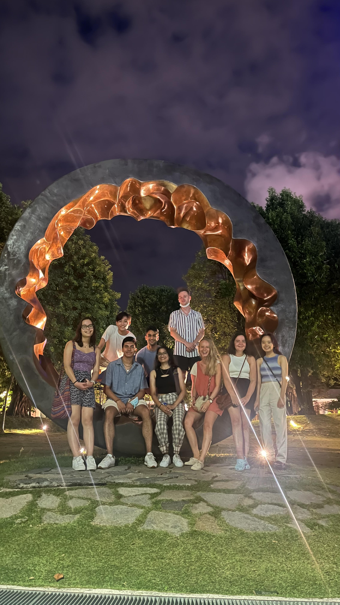

---

title: "My Year Abroad Review"
subtitle: A blog of my experiences as an exchange student at NUS, Singapore
date:
summary:
draft: false
featured: true
tags:
  - travel
  - blog
categories: []

image:
    preview_only: true
    filename: featured.jpg

commentable: true

---

A blog of my experiences as an exchange student at NUS, Singapore (and all the travelling too!)

---

## Flying Out - 31st July, 2022

I was headed to Manchester Airport at about 10 pm for my flight. Train strikes in the north of the UK meant I had to take a taxi. Needless to say I couldn't wait to escape it all! I flew first to Athens, Greece in just under four hours, landing in the early hours. Despite it being 4 am local time, the airport was extremely busy, with tons of tourists taking advantage of their recent opening up to the Greek islands. After a quick nap, I caught the second leg of my flight, flying Scoot to Singapore. I was a little worried about being confined to a box for 11 hours straight, but it wasn't so bad. The plane was spacious, with nine seats per row, which I'd never seen before. Eventually I landed at the world-renowned ✨ Changi Airport ✨ at 5 am local time.



## Settling In - 1st August, 2022

My check-in at Cinnamon College, NUS was due at 9 am, so I had about 3 hours after getting through immigration to figure out how to use Singapore's rail system, the MRT. I remember being quite confused when I got to the "station" - it just looked like a closed hall room. Where train? It didn't occur to me that there are doors all around that open directly to the trains! Certainly more modern than the UK.

I got off at Kent Ridge MRT and had about 15 minutes to decide whether I'd walk the rest or get a taxi. After walking for 10 minutes and realising I was just getting myself lost, I called a Grab and arrived at NUS more or less on time. I checked in and dropped my suitcase off in my room on the 13th floor, before heading out again to our first orientation event - a shopping tour at the local Clementi Mall. Throughout the year I'd shop here all the time and eat at the delicious hawker centres there.







Unfortunately I had to cut the shopping trip a little short as I had booked my mandatory health check-up at NUH, vaccination verification and student pass collection (possibly silly for trying to cram all the bureaucratic stuff in the first day, but at least it was out of the way). After returning to my room and unpacking my things, I noticed my ceiling fan seemed to be broken and would never stop. Oh well, rather it be stuck on than stuck off. The aircon was a lifesaver too. 

Soon enough I realised I was extremely tired, instantly crashed on my bed and slept for 10 hours. Pretty sure I was still in my clothes, but that's what you get after travelling and walking around for 30+ hours straight. It took several nights and days to adjust my body clock to the new time zone, but soon enough I got used to it. In the meantime, walking around the campus at night and still feeling the calm and warmth of the air was a beautiful experience, as routine as it was for all the locals. It took a few days for me to discover the range of food from UTown, the heart of the campus, which quickly became my usual for the year (even though I'd spent about a thousand dollars on a meal plan at college...oh well!)



## Mini Semester 1A Starts - 8th August, 2022

I had signed up to some weekly sports like running and frisbee (never knew frisbee could be competitive, but that's Singaporeans for you). Despite being reasonably athletic back home, I quickly found that the humidity, which I'd been just about OK with up until now, killed any pleasure in running as I was constantly drenched in sweat :(



My first lecture was on Process Dynamics and Control, a module from the Chemical Engineering track. I had never taken a Chem Eng class before and had chosen my modules this semester fairly randomly, just trying to explore different things. The lecturer was very friendly. There were very few exchangers in my lectures, a stark contrast from my experience up till now - turns out most exchangers just picked the easy classes! Luckly the workload was still very manageable and left plenty of free time for R&R, which I loved actually having the time for compared the ultra fast paced curriculum I had become accustomed to at Cambridge.

## National Day - 9th August, 2022

Only two days into term and already a holiday? Nice. I headed out to the Stadium area where there was an incredible parade and fireworks display. Made a nice first instagram photo, which I suddenly decided to start. I also got to see the famous Marina Bay Sands hotel, the Merlion, and those weird branching fountain tree things that I remember seeing in a *Call of Duty: Black Ops 3* mission, all of which glowed beautifully in the warm night.







## Trip 1 - to Johor Bahru, Malaysia - 19th August, 2022

Like every good exchange student, I made sure to take plenty of vacations in my year, especially during term time. The local students don't have that luxury! The first of many was a two-day trip to Malaysia's nearest city, Johor Bahru (JB). I met with some new friends at Clementi MRT and headed out into Malaysia via the Kranji checkpoint.

After a few weeks of living it large in Singapore, JB seemed a little...boring. There were no major landmarks, but still, we found some great places to eat and our hotel had a nice view.



## Trip 2 - to Batam, Indonesia - 26th August, 2022

It was around this time I became aware of *Hazel's Guestlist*, a coordinator of a lot of the student life around Singapore. They were selling a 3-day all-inclusive trip to a private island around Batam, so I snapped it up. The ocean was crystal clear, like you'd see in a travel brochure. Ended up getting sunburned pretty badly but it was a nice break from the city. We also went snorkelling and canoeing, although happened to get caught out in a thunderstorm which was pretty scary as the thunder was striking really close to us... All good fun in the end though.



## Trip 3 - to Ho Chi Minh City, Vietnam - 8th September, 2022

I hit up Ho Chi Minh City (Saigon) as a group of three. Gave us the benefit of flexibility compared to large groups, which was a theme for the rest of my trips. I stayed in a hostel near Bui Vien street, the main backpacker area and a place so bustling and loud that it was probably the cause of the permanent tinnitus that I ended up with after leaving. Worth it. The *Miss Saigon* dance club had a great atmosphere and we ended up going there nearly every night to just sit there and soak in the noise.

During the day, we hit all the tourist spots. First were the Cu Chi tunnels, used by the Viet Cong during the Vietnam war, as well as all the gory traps they used to maim and scare American soldiers, a fact that our local tour guide was extremely excited to tell us about. It was surprisingly tough to actually make it through the tunnels, they are far too small to stand up so you have to run through them for several minutes straight while crouching. A few in the tour group couldn't make it at all. Next was the War Remnants museum, which presented the atrocities of the war in the graphical way that you can't get just by reading a Wikipedia page about it.

A nice change of pace was a relaxing trip down the Mekong Delta in a canoe, then into some bike rides and horse rides. Pretty sure there were crocodiles in the river...although we could only see the ones that were on land as the water was so murky.



## Trip 4 - to Seoul and Busan, South Korea - 14th October, 2022

Despite being the trip that went furthest away from the plan, I still loved Korea, Seoul in particular. It was originally going to be a 3-day trip only to Seoul for the Blackpink concert that was happening. We never stood a chance at getting tickets - even though I was refreshing the *Global Interpark* website every two seconds, the tickets sold out instantly! But it turned out there was also the concert by BTS happening in Busan on the same weekend for the World Expo 2030, adn better yet, it was free (much to the dismay of the city council, who seemed surprised that hosting the biggest boy band on the planet would actually cost them money). I planned to meet up with someone who was also going, but we ended up staying separate, so this was my first time going solo.

Unfortunately, every traveller's nightmare happened to me - I lost my passport at some point while I was at N Seoul Tower on my last day, which I didn't realise until I got back to the airport and couldn't find it. I had to book an extra few nights in the hostel I was staying at, which was luckily very nice and cheap so I didn't mind at all. Plus it was an excuse to stay in Seoul for longer! Despite the circumstances I still kept myself busy and enjoyed it all. Ended up seeing K-Star Road, the SM Entertainment building, the old BigHit building, all the K-pop hot spots. In the middle of this I had to apply for an emergency travel passport which was basically a replacement passport that I could use to fly back to Singapore, which came in only a few days and I could collect it from the British Embassy in Seoul. I was thinking of taking a train ride to Daejeon to look around the KAIST campus, a university I had thoughts of doing my exchange year at instead of NUS, but didn't want to spend anymore money after having to buy a new return flight and I went to see Yonsei University instead, which was a nice change from the city.





## Trip 5 - back to the UK - 7th December, 2022

## Trip 6 - to Hong Kong - 10th February, 2023

## Trip 7 - to Kuala Lumpur, Malaysia - 7th April, 2023

## Trip 8 - to Shanghai, China - 12th April, 2023

## Trip 9 - to Taipei and Kaohsiung, Taiwan - 16th April, 2023

## Blackpink Concert - 13th May, 2023

## Returning Home - 15th May, 2023