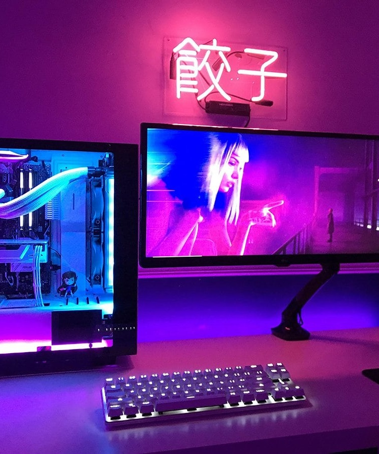

Main image with attribution.

---

Lots of other features for Wowchemy [here](https://iphysresearch.github.io/blog/post/writting-markdown/).

---

<html lang="en">
<head>
    <meta charset="UTF-8">
    <meta name="viewport" content="width=device-width, initial-scale=1.0">
    <meta http-equiv="X-UA-Compatible" content="ie=edge">
    <title>Fun Animated Card</title>
    <link rel="stylesheet" href="style.css"> 
</head>

<body>
    

        

            <h2 class="card-title">Something awesome</h2>
            

            Lorem ipsum, dolor sit amet consectetur adipsicing elit. Fuga placeat odio pariatur doloribus sint?
            

            <a href="#" class="button">
            Learn More
            </a>
        

    

</body>
</html>

---

Lorem ipsum dolor sit amet, consectetur adipiscing elit. Duis posuere tellus ac convallis placerat. Proin tincidunt magna sed ex sollicitudin condimentum. Sed ac faucibus dolor, scelerisque sollicitudin nisi. Cras purus urna, suscipit quis sapien eu, pulvinar tempor diam. Quisque risus orci, mollis id ante sit amet, gravida egestas nisl. Sed ac tempus magna. Proin in dui enim. Donec condimentum, sem id dapibus fringilla, tellus enim condimentum arcu, nec volutpat est felis vel metus. Vestibulum sit amet erat at nulla eleifend gravida.

Nullam vel molestie justo. Curabitur vitae efficitur leo. In hac habitasse platea dictumst. Sed pulvinar mauris dui, eget varius purus congue ac. Nulla euismod, lorem vel elementum dapibus, nunc justo porta mi, sed tempus est est vel tellus. Nam et enim eleifend, laoreet sem sit amet, elementum sem. Morbi ut leo congue, maximus velit ut, finibus arcu. In et libero cursus, rutrum risus non, molestie leo. Nullam congue quam et volutpat malesuada. Sed risus tortor, pulvinar et dictum nec, sodales non mi. Phasellus lacinia commodo laoreet. Nam mollis, erat in feugiat consectetur, purus eros egestas tellus, in auctor urna odio at nibh. Mauris imperdiet nisi ac magna convallis, at rhoncus ligula cursus.

Cras aliquam rhoncus ipsum, in hendrerit nunc mattis vitae. Duis vitae efficitur metus, ac tempus leo. Cras nec fringilla lacus. Quisque sit amet risus at ipsum pharetra commodo. Sed aliquam mauris at consequat eleifend. Praesent porta, augue sed viverra bibendum, neque ante euismod ante, in vehicula justo lorem ac eros. Suspendisse augue libero, venenatis eget tincidunt ut, malesuada at lorem. Donec vitae bibendum arcu. Aenean maximus nulla non pretium iaculis. Quisque imperdiet, nulla in pulvinar aliquet, velit quam ultrices quam, sit amet fringilla leo sem vel nunc. Mauris in lacinia lacus.

Suspendisse a tincidunt lacus. Curabitur at urna sagittis, dictum ante sit amet, euismod magna. Sed rutrum massa id tortor commodo, vitae elementum turpis tempus. Lorem ipsum dolor sit amet, consectetur adipiscing elit. Aenean purus turpis, venenatis a ullamcorper nec, tincidunt et massa. Integer posuere quam rutrum arcu vehicula imperdiet. Mauris ullamcorper quam vitae purus congue, quis euismod magna eleifend. Vestibulum semper vel augue eget tincidunt. Fusce eget justo sodales, dapibus odio eu, ultrices lorem. Duis condimentum lorem id eros commodo, in facilisis mauris scelerisque. Morbi sed auctor leo. Nullam volutpat a lacus quis pharetra. Nulla congue rutrum magna a ornare.

Aliquam in turpis accumsan, malesuada nibh ut, hendrerit justo. Cum sociis natoque penatibus et magnis dis parturient montes, nascetur ridiculus mus. Quisque sed erat nec justo posuere suscipit. Donec ut efficitur arcu, in malesuada neque. Nunc dignissim nisl massa, id vulputate nunc pretium nec. Quisque eget urna in risus suscipit ultricies. Pellentesque odio odio, tincidunt in eleifend sed, posuere a diam. Nam gravida nisl convallis semper elementum. Morbi vitae felis faucibus, vulputate orci placerat, aliquet nisi. Aliquam erat volutpat. Maecenas sagittis pulvinar purus, sed porta quam laoreet at.

Blocks of text.

---

Raster image.

---

 <iframe title="Hatchet" frameborder="0" allowfullscreen mozallowfullscreen="true" webkitallowfullscreen="true" allow="autoplay; fullscreen; xr-spatial-tracking" xr-spatial-tracking execution-while-out-of-viewport execution-while-not-rendered web-share width="720" height="480" src="https://sketchfab.com/models/997998bb3fd84908bfeed2f66fbd1d02/embed?autospin=1&ui_theme=dark&dnt=1"> </iframe> 

3D models (GLB, GLTF, etc) - using [SketchFab](https://help.sketchfab.com/hc/en-us/articles/203509907-Embedding-your-3D-models)

---

<iframe width="720" height="480" src="https://www.youtube-nocookie.com/embed/jjFSRDUvETQ" title="YouTube video player" frameborder="0" allow="accelerometer; autoplay; clipboard-write; encrypted-media; gyroscope; picture-in-picture" allowfullscreen></iframe>

YouTube video - using [YouTube IFrame](https://developers.google.com/youtube/iframe_api_reference)

---



<!--
Docs: https://developers.google.com/maps/documentation/embed/get-started
Seems to be OK to show API key..?
https://stackoverflow.com/questions/46247295/how-do-i-create-environment-variables-to-protect-my-google-maps-api-keyor-any-o
If want to try hiding it see:
https://www.youtube.com/watch?v=m2Dr4L_Ab14
-->

Google Maps - using [Google Maps Embed API](https://developers.google.com/maps/documentation/embed/get-started)

---



Spotify Playlist

---

<!--
Docs: https://developer.adobe.com/document-services/docs/overview/pdf-embed-api/howtos/
Need two api keys, one for local and one for production
-->

PDF - using [Adobe PDF Embed API](https://developer.adobe.com/document-services/docs/overview/pdf-embed-api/)

---

<iframe allowtransparency="true" width="720" height="480" src="//scratch.mit.edu/projects/175189448/embed?autostart=false"  frameborder="0" allowfullscreen></iframe>

Scratch project LOL

---

$$ f_X(x) = \frac{\mathrm{d} }{\mathrm{d} x} F_X(x) = - \frac{\mathrm{d} }{\mathrm{d} x} \int \limits_{\sqrt{gx}}^{\infty} \int \limits_{\frac{1}{2} \sin^{-1} \frac{gx}{u^2}}^{\frac{\pi}{2} - \frac{1}{2} \sin^{-1} \frac{gx}{u^2}} \underbrace{f_{u, \ \theta}(u, \ \theta)}_{\substack{\textup{joint probability} \\ \textup{density function (pdf)}}} \ \text{d} \theta \ \text{d} u. $$


Maths using LaTeX

---

<iframe width="720" height="480" frameborder="0"
src="https://embed.molview.org/v1/?mode=balls&cid=2519&bg=gray"></iframe>

MolView

---

<!-- jolecule widget will be inserted here, set the size with styles -->

Jolecule (proteins and biomolecules)

---

<iframe src="https://lorcan2440.pythonanywhere.com/" width="100%" height="730px" frameborder="0"></iframe>

Flask App hosted on Python Anywhere

---

Iframe from Map My Run

<iframe id='mapmyfitness_route' src='https://www.mapmyrun.com/routes/view/embedded/5895943552?width=600&height=376&elevation=true&info=true&line_color=E61900DC&rgbhex=DC0019&distance_markers=0&unit_type=metric&map_mode=ROADMAP&show_marker_every=1&last_updated=2024-01-27T21:38:34+00:00' height='679px' width='100%' frameborder='0' />
<a rel="noopener noreferrer" target="_blank" href="https://www.mapmyrun.com/routes/view/5895943552" class="jss1553">
View Route Details
</a>

Create routes or search for a route at <a rel="noopener noreferrer" target="_blank" href="https://www.mapmyrun.com/" string="MapMyRun." class="jss1554">MapMyRun.</a>

---

To try / keep in mind:

* [PowerPoint presentations](https://support.microsoft.com/en-us/office/embed-a-presentation-in-a-web-page-or-blog-19668a1d-2299-4af3-91e1-ae57af723a60#:~:text=Open%20your%20presentation%20in%20PowerPoint,Share%2C%20and%20then%20click%20Embed.&text=In%20the%20Embed%20box%2C%20under,Copy%2C%20and%20then%20click%20Close.)
* [Dash](https://dash.plotly.com/introduction) or [Bokeh](https://docs.bokeh.org/en/latest/) apps - find out if it's even possible
  
---
<!--
This code works, but I prefer to have it in the default (footer) position

Disqus comments section, movable on page

-->