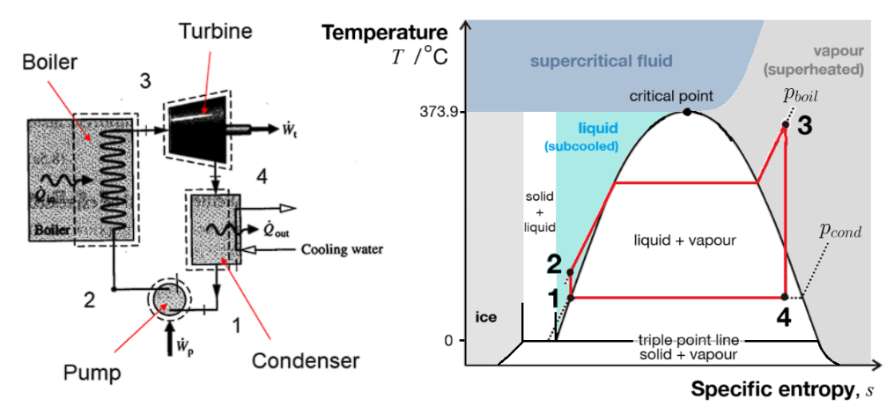
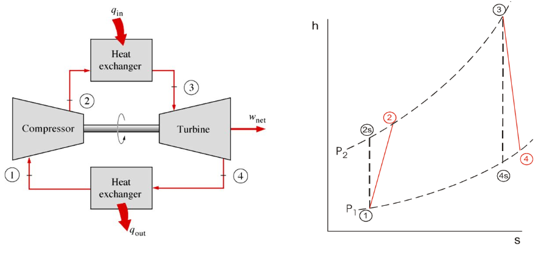

---

title: "Power Plant Thermodynamics"
summary: A simulation of a combined cycle gas turbine (CCGT) with energy and exergy analysis using CoolProp in Python.
tags:
  - Thermodynamics

links:
  - icon: github
    icon_pack: fab
    name: Go to project site
    url: https://github.com/lorcan2440/Process-Simulation/tree/main/CCGT-Thermodynamics

# Media and interaction
commentable: true
share: true
pager: true
show_related: true
profile: true

---

While the world transitions to cleaner energy sources, fossil-fuelled power plants remain prevalent for electrical energy generation due to their technological maturity. If we presume that an immediate 100\% transition to renewables is infeasible, as most experts agree, then improving the efficiency and sustainability of existing fossil fuel power plants is essential to reduce greenhouse gas emissions and air pollution in the short to medium term while we ramp up renewable and storage capacity.

## Basics of fossil fuel power

Historically, the steam turbine (invented in 1884) was the dominant technology for power generation, where water is boiled by burning coal, oil or gas to drive a turbine, generating electricity. The water circuit forms a closed loop, and cycles through four thermodynamic processes, as shown on the temperature-entropy ($ T $-$ s $) diagram below:



In the steam turbine, the **energy input** is the chemical energy released from burning the fuel plus the power input required to run the water pump (though the latter is negligible), and the **useful energy output** is the mechanical power from the turbine shaft, usually converted to electrical power by a generator. The other energy output is the waste heat rejected to the environment. The thermal efficiency is therefore:

$$ \eta_{th} = \frac{\text{net work produced}}{\text{heat input}} = \frac{W_{turbine} - W_{pump}}{Q_{in}} $$

However, this 'first law efficiency' metric ignores the fact that not all energy is equally useful: high-temperature heat is more valuable than low-temperature heat, and mechanical/electrical work is always more valuable than any kind of heat. Comparing the raw energy inputs and outputs can therefore be misleading, and can lead to such grave errors of judgement in energy policy that it has been termed the [the Second Sin of Thermodynamics](https://www.linkedin.com/pulse/primary-energy-fallacy-committest-thou-2nd-sin-paul-martin-nty3e/), as it is fundamentally a consequence of the *second law* of thermodynamics. The **exergy** (or available energy) of a system is the maximum useful work possible during a process that brings the system into equilibrium with the environment. The exergy efficiency (or second law efficiency) is therefore:

$$ \eta_{ex} = \frac{\text{net work produced}}{\text{maximum work produced}} = \frac{\text{net work produced}}{\text{exergy of heat input}} $$

The gas turbine (commercialised later in 1932) is an alternative to the steam turbine, using compressed fuel combustion (of e.g. methane, light crude oil, naphtha, syngas, kerosene, etc.) to drive a turbine directly, with the energy efficiencies of both having grown steadily over time.



The gas turbine is open-cycle, with ambient air drawn in and hot exhaust gases expelled out. These hot gases contain available power, which if not harvested, represents a loss in efficiency. Depending on the setup, a heat exchanger can be used to close the cycle and recover some of this waste heat. In a **combined cycle gas turbine (CCGT)**, the waste heat from the gas turbine is used as the heat input source for a steam turbine, forming a synergistic hybrid cycle with higher overall thermal and exergy efficiencies.

## Improving feedstock diversity

Cleaner fuel options than fossil fuels are available, such as ethanol/biofuel, ammonia or hydrogen, but these each come with their own challenges: biofuels are land-intensive and can compete with food production, ammonia combustion produces $ NO_x $ unless carefully managed, and hydrogen (unless derived entirely from renewables, e.g. 'green hydrogen') is still a fossil fuel derivative.

Improvements to fossil-fuelled power plants therefore focus on the infrastructure of the plant itself. Some well-established setups include:

- **Integrated gasification combined cycle (IGCC)**: solid fuels can be used by first converting to gaseous fuels (e.g. coal → syngas) in a gasifier, which is then used in the gas turbine. This allows for easier FGD and $ CO_2 $ capture than coal-fired steam turbines (so-called "clean coal", which still remains highly polluting relative to other more sustainable options). The fuel supply must be filtered to ensure it is particulate-free i.e. no charcoal, soot or tar, to avoid clogging and eroding the turbomachinery.

- **Steam injected gas turbine (STIG) cycle**: the hot turbine exhaust is passed through a heat recovery steam generator (HRSG) to heat an external water supply to steam, which is injected into the gas combustor to increase the mass flow rate and decrease the combustion temperature.

- **Combined cycle gas turbine (CCGT)**: the hot turbine exhaust is passed through a HRSG and used as the heat input to a closed-cycle steam turbine. Most modern gas turbine power plants are CCGTs for their increased efficiency (~63% LHV with natural gas).

## Improving efficiency

A given unit of fuel contains a fixed amount of chemical energy, but the electrical energy that can be extracted from it depends on the temperature of the cycle: heat is more valuable at higher temperature, so the aim is to maximise the temperature where heat is added and minimise the temperature of heat rejection. Higher efficiency means less fuel needs to be burned for the same electrical capacity, reducing costs and emissions.

Efficiency improvements to CCGTs include:

- **Superheating and reheating stages**: allows the steam turbine to reach higher temperatures.

- **Combined heat and power (CHP)**: heat can be extracted from any of the high-temperature points (e.g. HRSG outlet for hot steam, or pump outlet/coolant outlet for hot water) that can be sent directly to customers or used in thermal storage.

- **Solid oxide fuel cells (SOFCs)**: operate efficiently at high temperatures. They can generate extra electricity from supplied $ H_2 $ (waste heat utilisation) or from the gas supply (pre-combustion). Methane-fired plants can use steam-methane reforming (SMR) to convert $ CH_4 $ into $ H_2 $ for a SOFC.

- **Further advances in turbomachinery and combustion**: such as blade cooling, anti-creep ceramics and control of thermoacoustic oscillations can push turbine inlet temperatures higher and increase lifetime.

## Improving sustainability

Efficiency improvements alone do not address the real issue: fossil fuels still emit $ CO_2 $ when burned, as well as other pollutants such as $ NO_x $, $ SO_x $ and particulates.

Carbon capture is a set of technologies that aim to mitigate the $ CO_2 $ emissions from fossil fuel power plants. As the main culprit of anthropogenic climate change and global warming, minimising the amount of this greenhouse gas released into the atmosphere is a key goal. Critics argue that carbon capture is merely an excuse to continue unmitigated fossil fuel usage, referring to their low actual capture rates. Still, it is likely they will be pursued to some extent. Carbon capture can be broadly classed as 'storage' (CCS) or 'utilisation' (CCU) methods, such as:

- **Post-combustion capture**: use of amine scrubbers in the flue stack to remove $ CO_2 $ by chemisorption. They are expensive to retrofit and reduce plant efficiency, raising consumer electricity costs.

- **Pre-combustion capture**: pre-processing the fuel feedstock into syngas via gasification or reforming. The CO is converted to $ CO_2 $ by the water-gas shift reaction (WSGR) and then removed from the gas stream by liquid solvent (e.g. methanol, PEG or an ionic liquid) and the remaining hydrogen is used as the fuel for combustion to water vapour.

- **Oxy-combustion capture**: the flue gas is recycled back into a pure oxygen inlet of the combustion chamber, so the combustion occurs in an $ O_2 $-$ CO_2 $-$ H_2O $ atmosphere, concentrating the $ CO_2 $ at the output for easier removal.

- **Allam-Fetvedt supercritical $ CO_2 $ cycle (NET Power cycle)**: a synergistic implementation of the oxy-combustion cycle where the output $ CO_2 $ is compressed to the high pressure for use in a supercritical $ CO_2 $ power cycle, at very high capture efficiency and low cost. Commercialised by NET Power. Source: [R. J. Allam](https://committees.parliament.uk/writtenevidence/45190/pdf/).

- **Direct air capture (DAC)**: a separate unit for pulling $ CO_2 $ from the open air by chemisorption in alkaline solutions to form carbonate precipitates, intended to offset emissions from the flue. Critics argue that DAC is merely an excuse to continue unmitigated fossil fuel usage.

There are some low-TLR options for CCU with DAC using advanced chemistries e.g. $ CO_2 $ redox flow batteries, fluorenol photobase catalysis, photocatalytic syngas production, but these are not yet viable and can use scarce or toxic catalysts in their designs.

For non-cyclical CCS processes, high-pressure $ CO_2 $ is pumped into deep underground reservoirs for permanent storage, which is sequestered by rock. This shares similar seismic risks to fracking, but choice of geology and operations allow for easier mitigation.

Pollution management technologies include:

- **Bioenergy with CCS (BECCS)**: biogas (~75% methane) derived from anaerobic digestion of organic waste as a natural gas source with CCS. BECCS is ideally net-negative in carbon generation, with the possibility of SMR and SOFC for cogeneration, although due to the various losses, this is rarely realised in practice.

- **Flue gas desulfurisation (FGD)**: removal of $ SO_2 $ from flue gas exhausts due to sulfur impurities in the fuel (common in coal) using a wet alkaline sorbent slurry to prevent acid rain formation.

- **Combustion temperature control**: control systems and use of digital twins can tune turbine inlet temperatures online, e.g. Siemens’ reinforcement learning-based GT Auto Tuner, and reduce downstream $ NO_x $ emissions in selective catalytic reduction (SCR) systems.

## Modelling a Combined Cycle Gas Turbine

I wanted to simulate a typical power plant setup to understand the thermodynamics of power generation. I used Python to run through the calculations of a CCGT running an air-standard Brayton (gas turbine) cycle coupled to a Rankine (steam turbine) cycle. I made use of the [CoolProp library](https://coolprop.org/) to get accurate physical properties of air and water/steam mixtures at various states.

There are nine key states in a CCGT:

1. Steam pump inlet (steam condenser outlet)
2. Steam pump outlet (steam side HRSG inlet)
3. Steam turbine inlet (steam side HRSG outlet)
4. Steam turbine outlet (steam condenser inlet)
5. Gas compressor inlet (ambient air)
6. Gas compressor outlet (combustor inlet)
7. Gas turbine inlet (combustor outlet)
8. Gas turbine outlet (gas side HRSG inlet)
9. Gas turbine outlet (gas side HRSG exhaust)

These are shown numbered in the diagram below, and the thermodynamic processes between them are plotted on T-s diagrams for both cycles. The heat released between states 8 and 9 (HRSG gas side) is equal to the heat absorbed between states 2 and 3 (HRSG steam side).

{{< figure src="ccgt_diagram.png" title="States numbered 1-9 positioned along the cycles. $ Q_{in} $ is the heat input due to chemical energy release in combustion at high temperature, and $ Q_{out} $ is the heat rejected from the steam condenser at a low temperature." >}}

The conditions used in the simulation were:

- Gas turbine:
  - Compressor inlet pressure: 101.325 kPa (1 bar; ambient)
  - Compressor inlet temperature: 25 °C (ambient)
  - Compressor pressure ratio: 23
  - Compressor isentropic efficiency: 85%
  - Fuel heat input: 1045.3 MW
  - Turbine pressure ratio: 20.9186
  - Turbine isentropic efficiency: 85%
  - Mass flow rate of air: 1055.9 kg/s
- Steam turbine:
  - Mass flow rate of steam: 150.3 kg/s
  - Pump inlet pressure: 0.04 bar
  - Pump pressure ratio: 1000
  - Pump isentropic efficiency: 85%
  - Pump inlet temperature: 24.75 °C
  - Turbine isentropic efficiency: 100%

The full Python code is shown at the end of the post. Running the program gives the following output:

```
Gas turbine: 
        Compressor power input: 528.67 MW
        Combustion heat input: 1045.30 MW
        Turbine power output: 899.73 MW
Steam turbine: 
        Pump power input: 0.72 MW
        HRSG heat transfer: 519.15 MW
        Turbine power output: 176.60 MW
Efficiencies:
        Thermal efficiency, gas cycle: 35.50%
        Thermal efficiency, steam cycle: 33.88%
        Thermal efficiency, overall: 52.32%
        Maximum thermal efficiency, gas cycle: 74.13%
        Maximum thermal efficiency, steam cycle: 40.73%
        Maximum thermal efficiency, overall: 74.13%
        Exergy efficiency, gas cycle: 47.88%
        Exergy efficiency, steam cycle: 83.18%
        Exergy efficiency, overall: 70.58%
```

The figures allow us to visualise the energy and exergy flows in a CCGT. For this particular setup, while 52\% of the heat energy was converted to useful work (the thermal efficiency), about 71\% of the maximum possible work (the exergy efficiency) was achieved. The losses in exergy are due to irreversibilities in the real processes, such as friction, turbulence, and heat losses to the environment.







Code on [GitHub gists here](https://github.com/lorcan2440/Process-Simulation/blob/main/CCGT-Thermodynamics/ccgt_exergy.py):

```python
from matplotlib import pyplot as plt
import numpy as np
from CoolProp.CoolProp import PropsSI

#plt.style.use(r'C:\LibsAndApps\Python config files\proplot_style.mplstyle')

# Gas turbine (Brayton cycle) parameters

# compressor
gas_fluid = 'air'
p_5 = 101325 # gas cycle compressor inlet pressure [Pa]
T_5 = 298  # gas cycle compressor inlet temperature [K]
r_p_comp = 23 # pressure ratio across the gas cycle compressor
n_c = 0.85 # compressor isentropic efficiency
m_dot_gas = 1.0559e3  # gas cycle mass flow rate [kg/s]

# combustion chamber
Q_67 = 1.0453e9  # heat input to gas cycle [W]

# turbine
r_p_turb = 20.9186  # pressure ratio across the gas cycle turbine
n_t_gas = 0.85  # gas turbine isentropic efficiency

# Heat Recovery Steam Generator (gas side: 8-9, steam side: 2-3)
steam_fluid = 'water'
T_3 = 873  # HRSG steam side outlet temperature [K]
m_dot_steam = 150.3  # steam cycle mass flow rate [kg/s]

# Steam turbine (Rankine cycle) parameters

# pump
p_1 = 0.04 * 101325  # steam cycle pump inlet pressure (condenser pressure) [Pa]
r_p_pump = 1000  # pressure ratio across the steam cycle pump
n_p = 0.85  # pump isentropic efficiency
T_1 = 290  # steam cycle pump inlet temperature [K]

# turbine
n_t_steam = 1.00  # steam turbine isentropic efficiency


class CombinedCycleGasTurbine:
    def __init__(self, **kwargs):

        # GET PARAMETERS
        
        # gas turbine: compressor
        self.gas_fluid = kwargs.get('gas_fluid', 'air')
        self.p_5 = kwargs.get('p_5', 101325)
        self.T_5 = kwargs.get('T_5', 293.15)
        self.r_p_comp = kwargs.get('r_p_comp', 23)
        self.n_c = kwargs.get('n_c', 0.85)
        self.m_dot_gas = kwargs.get('m_dot_gas', 1.0559e3)

        # gas turbine: combustion chamber
        self.Q_67 = kwargs.get('Q_67', 1.0453e9)

        # gas turbine: turbine
        self.r_p_turb = kwargs.get('r_p_turb', 18)
        self.n_t_gas = kwargs.get('n_t_gas', 0.85)

        # HRSG
        self.steam_fluid = kwargs.get('steam_fluid', 'water')
        self.T_3 = kwargs.get('T_3', 873)
        self.m_dot_steam = kwargs.get('m_dot_steam', 150.3)

        # steam turbine: pump
        self.p_1 = kwargs.get('p_1', 0.04 * 101325)
        self.r_p_pump = kwargs.get('r_p_pump', 1000)
        self.n_p = kwargs.get('n_p', 0.85)
        self.T_1 = kwargs.get('T_1', 280)

    def calc_states(self):

        # calculate gas compressor outlet conditions
        self.p_6 = self.p_5 * self.r_p_comp
        self.h_5 = PropsSI('H', 'P', self.p_5, 'T', self.T_5, self.gas_fluid)
        self.s_5 = PropsSI('S', 'P', self.p_5, 'T', self.T_5, self.gas_fluid)
        self.ex_5 = self.specific_exergy_at_point(5)
        self.h_6s = PropsSI('H', 'P', self.p_6, 'S', self.s_5, self.gas_fluid)
        self.T_6s = PropsSI('T', 'P', self.p_6, 'S', self.s_5, self.gas_fluid)
        self.h_6 = self.h_5 + (self.h_6s - self.h_5) / self.n_c
        self.s_6 = PropsSI('S', 'P', self.p_6, 'H', self.h_6, self.gas_fluid)
        self.T_6 = PropsSI('T', 'P', self.p_6, 'H', self.h_6, self.gas_fluid)
        self.ex_6 = self.specific_exergy_at_point(6)

        # calculate combustion chamber outlet conditions
        self.p_7 = self.p_6  # assume isobaric combustion
        self.h_7 = self.h_6 + self.Q_67 / self.m_dot_gas
        self.T_7 = PropsSI('T', 'P', self.p_7, 'H', self.h_7, self.gas_fluid)
        self.s_7 = PropsSI('S', 'P', self.p_7, 'H', self.h_7, self.gas_fluid)
        self.ex_7 = self.specific_exergy_at_point(7)

        # calculate gas turbine outlet conditions
        self.p_8 = self.p_7 / self.r_p_turb
        self.h_8s = PropsSI('H', 'P', self.p_8, 'S', self.s_7, self.gas_fluid)
        self.h_8 = self.h_7 - (self.h_7 - self.h_8s) * self.n_t_gas
        self.s_8 = PropsSI('S', 'P', self.p_8, 'H', self.h_8, self.gas_fluid)
        self.T_8 = PropsSI('T', 'P', self.p_8, 'H', self.h_8, self.gas_fluid)
        self.ex_8 = self.specific_exergy_at_point(8)

        # calculate steam pump outlet conditions
        self.h_1 = PropsSI('H', 'P', self.p_1, 'T', self.T_1, self.steam_fluid)
        self.s_1 = PropsSI('S', 'P', self.p_1, 'T', self.T_1, self.steam_fluid)
        self.ex_1 = self.specific_exergy_at_point(1)
        self.p_2 = self.p_1 * self.r_p_pump
        self.h_2s = PropsSI('H', 'P', self.p_2, 'S', self.s_1, self.steam_fluid)
        self.h_2 = self.h_1 + (self.h_2s - self.h_1) / self.n_p
        self.s_2 = PropsSI('S', 'P', self.p_2, 'H', self.h_2, self.steam_fluid)
        self.T_2 = PropsSI('T', 'P', self.p_2, 'H', self.h_2, self.steam_fluid)
        self.ex_2 = self.specific_exergy_at_point(2)

        # calculate HRSG steam side outlet conditions
        self.p_3 = self.p_2
        self.h_3 = PropsSI('H', 'P', self.p_3, 'T', self.T_3, self.steam_fluid)
        self.s_3 = PropsSI('S', 'P', self.p_3, 'T', self.T_3, self.steam_fluid)
        self.ex_3 = self.specific_exergy_at_point(3)
        self.Q_23 = self.m_dot_steam * (self.h_3 - self.h_2)
        self.Q_89 = self.Q_23
        self.h_9 = self.h_8 - self.Q_89 / self.m_dot_gas
        self.T_9 = PropsSI('T', 'P', self.p_8, 'H', self.h_9, self.gas_fluid)
        self.s_9 = PropsSI('S', 'P', self.p_8, 'H', self.h_9, self.gas_fluid)
        self.ex_9 = self.specific_exergy_at_point(9)

        # calculate HRSG LMTD
        self.dT_hot_hrsg = self.T_8 - self.T_3
        self.dT_cold_hrsg = self.T_9 - self.T_2
        self.lmtd_hrsg = (self.dT_hot_hrsg - self.dT_cold_hrsg) / np.log(self.dT_hot_hrsg / self.dT_cold_hrsg)

        # calculate steam turbine outlet conditions
        self.p_4 = self.p_1
        self.h_4s = PropsSI('H', 'P', self.p_4, 'S', self.s_3, self.steam_fluid)
        self.h_4 = self.h_3 - (self.h_3 - self.h_4s) * n_t_steam
        self.s_4 = PropsSI('S', 'P', self.p_4, 'H', self.h_4, self.steam_fluid)
        self.T_4 = PropsSI('T', 'P', self.p_4, 'H', self.h_4, self.steam_fluid)
        self.ex_4 = self.specific_exergy_at_point(4)

        # calculate condenser heat transfer
        self.Q_14 = self.m_dot_steam * (self.h_4 - self.h_1)

    def calc_energy_exergy_balances(self):

        # actual energy balance
        # power input to gas compressor
        self.W_56 = self.m_dot_gas * (self.h_6 - self.h_5)
        # power output from gas turbine
        self.W_78 = self.m_dot_gas * (self.h_7 - self.h_8)
        # power input to steam pump
        self.W_12 = self.m_dot_steam * (self.h_2 - self.h_1)
        # power output from steam turbine
        self.W_34 = self.m_dot_steam * (self.h_3 - self.h_4)

        # powers
        self.W_gas = self.W_78 - self.W_56
        self.W_steam = self.W_34 - self.W_12
        self.W_total = self.W_gas + self.W_steam

        # exergies
        # gas combustor exergy input
        self.Ex_67 = self.m_dot_gas * (self.ex_7 - self.ex_6)
        # steam condenser exergy output
        self.Ex_14 = self.m_dot_steam * (self.ex_4 - self.ex_1)

        # efficiencies
        self.eta_gas_th = self.W_gas / self.Q_67
        self.eta_steam_th = self.W_steam / self.Q_23
        self.eta_th = self.W_total / self.Q_67

        self.eta_ex = self.W_total / self.Ex_67
        self.eta_th_max = self.Ex_67 / self.Q_67

        # losses of available power
        # gas compressor
        self.W_56_loss = self.m_dot_gas * 298 * (self.s_6 - self.s_5)
        # gas turbine
        self.W_78_loss = self.m_dot_gas * 298 * (self.s_8 - self.s_7)
        # HRSG
        self.hrsg_loss = 298 * (self.m_dot_steam * (self.s_3 - self.s_2) + self.m_dot_gas * (self.s_9 - self.s_8))
        # gas exhaust
        self.gas_exhaust_loss = self.m_dot_gas * (self.ex_9 - self.specific_exergy_at_state(101325, self.T_9, self.gas_fluid))
        # steam pump
        self.W_12_loss = self.m_dot_steam * 298 * (self.s_2 - self.s_1)
        # steam turbine
        self.W_34_loss = self.m_dot_steam * 298 * (self.s_4 - self.s_3)
        # condenser
        self.condenser_loss = self.m_dot_steam * 298 * (self.s_4 - self.s_1)

        fig, (ax1, ax2) = plt.subplots(1, 2, figsize=(12, 6), subplot_kw=dict(aspect="equal"))

        ax1.pie([self.W_total, self.m_dot_gas * (self.h_9 - self.h_5), self.Q_14], 
            labels=[f'Net power: \n{self.W_total / 1e6 :.2f} MW',
                f'Exhaust enthalpy: \n{self.m_dot_gas * (self.h_9 - self.h_5) / 1e6 :.2f} MW',
                f'Condenser heat rejection: \n{self.Q_14 / 1e6 :.2f} MW'],
            startangle=90, autopct='%1.1f%%', explode=(0.1, 0, 0), colors=['#4fc26e', '#f2b134', '#d15454'], )
        ax1.set_title(f'Total energy balance: from heat input rate {self.Q_67 / 1e6 :.2f} MW')

        ax2.pie([self.W_total, self.m_dot_gas * (self.ex_9 - self.ex_5), self.Ex_14, self.W_56_loss, self.W_78_loss, self.hrsg_loss, self.W_12_loss, self.W_34_loss],
            labels=[
                f'Net power: \n{(self.W_total) / 1e6 :.2f} MW', 
                f'Exhaust exergy: \n{(self.m_dot_gas * (self.ex_9 - self.ex_5)) / 1e6 :.2f} MW', 
                f'Condenser exergy rejection: \n{(self.Ex_14) / 1e6 :.2f} MW',
                f'Gas compressor loss: \n{(self.W_56_loss) / 1e6 :.2f} MW',
                f'Gas turbine loss: \n{(self.W_78_loss) / 1e6 :.2f} MW',
                f'HRSG loss: \n{(self.hrsg_loss) / 1e6 :.2f} MW',
                f'Steam pump loss: \n{(self.W_12_loss) / 1e6 :.2f} MW',
                f'Steam turbine loss: \n{(self.W_34_loss) / 1e6 :.2f} MW'],
            startangle=90, autopct='%1.1f%%', explode=(0.1, 0, 0, 0, 0, 0, 0, 0), 
            colors=['#4fc26e', '#9e3e3e', '#d15454', '#f2b134', '#f2b134', '#f2b134', '#f2b134', '#f2b134'])
        ax2.set_title(f'Total exergy balance: from heat input rate {self.Ex_67 / 1e6 :.2f} MW')

        fig.suptitle(f'Combined cycle gas turbine energy and exergy balances\nThermal efficiency: {self.eta_th :.2%}\nMaximum possible efficiency: {self.eta_th_max :.2%}\nExergy efficiency: {self.eta_ex :.2%}')
        fig.tight_layout()
        plt.show()

    def specific_exergy_at_point(self, n: int, p_0: float = 101325, T_0: float = 298.15) -> float:

        if n in (5, 6, 7, 8, 9):
            fluid = self.gas_fluid
        elif n in (1, 2, 3, 4):
            fluid = self.steam_fluid
        # fluid state
        h = getattr(self, f'h_{n}')
        s = getattr(self, f's_{n}')
        # dead state
        h_0 = PropsSI('H', 'T', T_0, 'P', p_0, fluid)
        s_0 = PropsSI('S', 'T', T_0, 'P', p_0, fluid)
        # specific steady flow availability function
        b = h - T_0 * s
        b_0 = h_0 - T_0 * s_0
        # specific exergy
        ex = b - b_0
        return ex

    def specific_exergy_at_state(self, p: float, T: float, fluid: str, 
            p_0: float = 101325, T_0: float = 298) -> float:
        
        # fluid state
        h = PropsSI('H', 'T', T, 'P', p, fluid)
        s = PropsSI('S', 'T', T, 'P', p, fluid)
        # dead state
        h_0 = PropsSI('H', 'T', T_0, 'P', p_0, fluid)
        s_0 = PropsSI('S', 'T', T_0, 'P', p_0, fluid)
        # specific steady flow availability function
        b = h - T * s
        b_0 = h_0 - T_0 * s_0
        # specific exergy
        ex = b - b_0
        return ex

    def __str__(self):
        return f'Gas turbine: \n' \
            f'\tCompressor power input: {self.W_56 / 1e6 :.2f} MW\n' \
            f'\tCombustion heat input: {self.Q_67 / 1e6 :.2f} MW\n' \
            f'\tTurbine power output: {self.W_78 / 1e6 :.2f} MW\n' \
            f'Steam turbine: \n' \
            f'\tPump power input: {self.W_12 / 1e6 :.2f} MW\n' \
            f'\tHRSG heat transfer: {self.Q_23 / 1e6 :.2f} MW\n' \
            f'\tTurbine power output: {self.W_34 / 1e6 :.2f} MW\n' \
            f'Efficiencies: \n' \
            f'\tGas turbine thermal efficiency: {self.eta_gas_th :.2%}\n' \
            f'\tSteam turbine thermal efficiency: {self.eta_steam_th :.2%}\n' \
            f'\tOverall thermal efficiency: {self.eta_th :.2%}\n' \
            f'\tMaximum possible thermal efficiency: {self.eta_th_max :.2%}\n' \
            f'\tOverall exergy efficiency: {self.eta_ex :.2%}\n'


ccgt = CombinedCycleGasTurbine(r_p_comp=23, m_dot_gas=1.0559e3, 
    n_c=0.85, p_5=101325, T_5=273.15 + 25, Q_67=1.0453e9, r_p_turb=20.9186, 
    n_t_gas=0.85,  m_dot_steam=150.3, p_1=0.04 * 101325, r_p_pump=1000, n_p=0.85, T_1=297.9, n_t_steam=1.00)

ccgt.calc_states()
ccgt.calc_energy_exergy_balances()
print(ccgt)
```