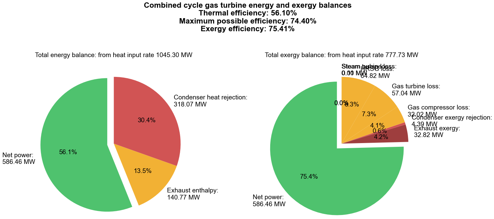

---

title: "Power Plant Thermodynamics"
summary: A simulation of a combined cycle gas turbine (CCGT) with energy and exergy analysis using CoolProp in Python.
tags:
  - Thermodynamics

links:
  - icon: github
    icon_pack: fab
    name: Go to project site
    url: https://github.com/lorcan2440/Process-Simulation/tree/main/CCGT-Thermodynamics

# Media and interaction
commentable: true
share: true
pager: true
show_related: true
profile: true

---



Code on [GitHub gists here](https://github.com/lorcan2440/Process-Simulation/blob/main/CCGT-Thermodynamics/ccgt_exergy.py):

```python
from matplotlib import pyplot as plt
import numpy as np
from CoolProp.CoolProp import PropsSI
from scipy.special import lambertw

plt.style.use(r'C:\LibsAndApps\Python config files\proplot_style.mplstyle')

# Gas turbine (Brayton cycle) parameters

# compressor
gas_fluid = 'air'
p_5 = 101325 # gas cycle compressor inlet pressure [Pa]
T_5 = 298  # gas cycle compressor inlet temperature [K]
r_p_comp = 23 # pressure ratio across the gas cycle compressor
n_c = 0.85 # compressor isentropic efficiency
m_dot_gas = 1.0559e3  # gas cycle mass flow rate [kg/s]

# combustion chamber
Q_67 = 1.0453e9  # heat input to gas cycle [W]

# turbine
r_p_turb = 20.9186  # pressure ratio across the gas cycle turbine
n_t_gas = 0.85  # gas turbine isentropic efficiency

# Heat Recovery Steam Generator (gas side: 8-9, steam side: 2-3)
steam_fluid = 'water'
T_3 = 873  # HRSG steam side outlet temperature [K]
m_dot_steam = 150.3  # steam cycle mass flow rate [kg/s]

# Steam turbine (Rankine cycle) parameters

# pump
p_1 = 0.04 * 101325  # steam cycle pump inlet pressure (condenser pressure) [Pa]
r_p_pump = 1000  # pressure ratio across the steam cycle pump
n_p = 0.85  # pump isentropic efficiency
T_1 = 290  # steam cycle pump inlet temperature [K]

# turbine
n_t_steam = 1.00  # steam turbine isentropic efficiency


class CombinedCycleGasTurbine:
    def __init__(self, **kwargs):

        # GET PARAMETERS
        
        # gas turbine: compressor
        self.gas_fluid = kwargs.get('gas_fluid', 'air')
        self.p_5 = kwargs.get('p_5', 101325)
        self.T_5 = kwargs.get('T_5', 293.15)
        self.r_p_comp = kwargs.get('r_p_comp', 23)
        self.n_c = kwargs.get('n_c', 0.85)
        self.m_dot_gas = kwargs.get('m_dot_gas', 1.0559e3)

        # gas turbine: combustion chamber
        self.Q_67 = kwargs.get('Q_67', 1.0453e9)

        # gas turbine: turbine
        self.r_p_turb = kwargs.get('r_p_turb', 18)
        self.n_t_gas = kwargs.get('n_t_gas', 0.85)

        # HRSG
        self.steam_fluid = kwargs.get('steam_fluid', 'water')
        self.T_3 = kwargs.get('T_3', 873)
        self.m_dot_steam = kwargs.get('m_dot_steam', 150.3)

        # steam turbine: pump
        self.p_1 = kwargs.get('p_1', 0.04 * 101325)
        self.r_p_pump = kwargs.get('r_p_pump', 1000)
        self.n_p = kwargs.get('n_p', 0.85)
        self.T_1 = kwargs.get('T_1', 280)

    def calc_states(self):

        # calculate gas compressor outlet conditions
        self.p_6 = self.p_5 * self.r_p_comp
        self.h_5 = PropsSI('H', 'P', self.p_5, 'T', self.T_5, self.gas_fluid)
        self.s_5 = PropsSI('S', 'P', self.p_5, 'T', self.T_5, self.gas_fluid)
        self.ex_5 = self.specific_exergy_at_point(5)
        self.h_6s = PropsSI('H', 'P', self.p_6, 'S', self.s_5, self.gas_fluid)
        self.T_6s = PropsSI('T', 'P', self.p_6, 'S', self.s_5, self.gas_fluid)
        self.h_6 = self.h_5 + (self.h_6s - self.h_5) / self.n_c
        self.s_6 = PropsSI('S', 'P', self.p_6, 'H', self.h_6, self.gas_fluid)
        self.T_6 = PropsSI('T', 'P', self.p_6, 'H', self.h_6, self.gas_fluid)
        self.ex_6 = self.specific_exergy_at_point(6)

        # calculate combustion chamber outlet conditions
        self.p_7 = self.p_6  # assume isobaric combustion
        self.h_7 = self.h_6 + self.Q_67 / self.m_dot_gas
        self.T_7 = PropsSI('T', 'P', self.p_7, 'H', self.h_7, self.gas_fluid)
        self.s_7 = PropsSI('S', 'P', self.p_7, 'H', self.h_7, self.gas_fluid)
        self.ex_7 = self.specific_exergy_at_point(7)

        # calculate gas turbine outlet conditions
        self.p_8 = self.p_7 / self.r_p_turb
        self.h_8s = PropsSI('H', 'P', self.p_8, 'S', self.s_7, self.gas_fluid)
        self.h_8 = self.h_7 - (self.h_7 - self.h_8s) * self.n_t_gas
        self.s_8 = PropsSI('S', 'P', self.p_8, 'H', self.h_8, self.gas_fluid)
        self.T_8 = PropsSI('T', 'P', self.p_8, 'H', self.h_8, self.gas_fluid)
        self.ex_8 = self.specific_exergy_at_point(8)

        # calculate steam pump outlet conditions
        self.h_1 = PropsSI('H', 'P', self.p_1, 'T', self.T_1, self.steam_fluid)
        self.s_1 = PropsSI('S', 'P', self.p_1, 'T', self.T_1, self.steam_fluid)
        self.ex_1 = self.specific_exergy_at_point(1)
        self.p_2 = self.p_1 * self.r_p_pump
        self.h_2s = PropsSI('H', 'P', self.p_2, 'S', self.s_1, self.steam_fluid)
        self.h_2 = self.h_1 + (self.h_2s - self.h_1) / self.n_p
        self.s_2 = PropsSI('S', 'P', self.p_2, 'H', self.h_2, self.steam_fluid)
        self.T_2 = PropsSI('T', 'P', self.p_2, 'H', self.h_2, self.steam_fluid)
        self.ex_2 = self.specific_exergy_at_point(2)

        # calculate HRSG steam side outlet conditions
        self.p_3 = self.p_2
        self.h_3 = PropsSI('H', 'P', self.p_3, 'T', self.T_3, self.steam_fluid)
        self.s_3 = PropsSI('S', 'P', self.p_3, 'T', self.T_3, self.steam_fluid)
        self.ex_3 = self.specific_exergy_at_point(3)
        self.Q_23 = self.m_dot_steam * (self.h_3 - self.h_2)
        self.Q_89 = self.Q_23
        self.h_9 = self.h_8 - self.Q_89 / self.m_dot_gas
        self.T_9 = PropsSI('T', 'P', self.p_8, 'H', self.h_9, self.gas_fluid)
        self.s_9 = PropsSI('S', 'P', self.p_8, 'H', self.h_9, self.gas_fluid)
        self.ex_9 = self.specific_exergy_at_point(9)

        # calculate HRSG LMTD
        self.dT_hot_hrsg = self.T_8 - self.T_3
        self.dT_cold_hrsg = self.T_9 - self.T_2
        self.lmtd_hrsg = (self.dT_hot_hrsg - self.dT_cold_hrsg) / np.log(self.dT_hot_hrsg / self.dT_cold_hrsg)

        # calculate steam turbine outlet conditions
        self.p_4 = self.p_1
        self.h_4s = PropsSI('H', 'P', self.p_4, 'S', self.s_3, self.steam_fluid)
        self.h_4 = self.h_3 - (self.h_3 - self.h_4s) * n_t_steam
        self.s_4 = PropsSI('S', 'P', self.p_4, 'H', self.h_4, self.steam_fluid)
        self.T_4 = PropsSI('T', 'P', self.p_4, 'H', self.h_4, self.steam_fluid)
        self.ex_4 = self.specific_exergy_at_point(4)

        # calculate condenser heat transfer
        self.Q_14 = self.m_dot_steam * (self.h_4 - self.h_1)

    def calc_energy_exergy_balances(self):

        # actual energy balance
        # power input to gas compressor
        self.W_56 = self.m_dot_gas * (self.h_6 - self.h_5)
        # power output from gas turbine
        self.W_78 = self.m_dot_gas * (self.h_7 - self.h_8)
        # power input to steam pump
        self.W_12 = self.m_dot_steam * (self.h_2 - self.h_1)
        # power output from steam turbine
        self.W_34 = self.m_dot_steam * (self.h_3 - self.h_4)

        # powers
        self.W_gas = self.W_78 - self.W_56
        self.W_steam = self.W_34 - self.W_12
        self.W_total = self.W_gas + self.W_steam

        # exergies
        # gas combustor exergy input
        self.Ex_67 = self.m_dot_gas * (self.ex_7 - self.ex_6)
        # steam condenser exergy output
        self.Ex_14 = self.m_dot_steam * (self.ex_4 - self.ex_1)

        # efficiencies
        self.eta_gas_th = self.W_gas / self.Q_67
        self.eta_steam_th = self.W_steam / self.Q_23
        self.eta_th = self.W_total / self.Q_67

        self.eta_ex = self.W_total / self.Ex_67
        self.eta_th_max = self.Ex_67 / self.Q_67

        # losses of available power
        # gas compressor
        self.W_56_loss = self.m_dot_gas * 298 * (self.s_6 - self.s_5)
        # gas turbine
        self.W_78_loss = self.m_dot_gas * 298 * (self.s_8 - self.s_7)
        # HRSG
        self.hrsg_loss = 298 * (self.m_dot_steam * (self.s_3 - self.s_2) + self.m_dot_gas * (self.s_9 - self.s_8))
        # gas exhaust
        self.gas_exhaust_loss = self.m_dot_gas * (self.ex_9 - self.specific_exergy_at_state(101325, self.T_9, self.gas_fluid))
        # steam pump
        self.W_12_loss = self.m_dot_steam * 298 * (self.s_2 - self.s_1)
        # steam turbine
        self.W_34_loss = self.m_dot_steam * 298 * (self.s_4 - self.s_3)
        # condenser
        self.condenser_loss = self.m_dot_steam * 298 * (self.s_4 - self.s_1)

        fig, (ax1, ax2) = plt.subplots(1, 2, figsize=(12, 6), subplot_kw=dict(aspect="equal"))

        ax1.pie([self.W_total, self.m_dot_gas * (self.h_9 - self.h_5), self.Q_14], 
            labels=[f'Net power: \n{self.W_total / 1e6 :.2f} MW',
                f'Exhaust enthalpy: \n{self.m_dot_gas * (self.h_9 - self.h_5) / 1e6 :.2f} MW',
                f'Condenser heat rejection: \n{self.Q_14 / 1e6 :.2f} MW'],
            startangle=90, autopct='%1.1f%%', explode=(0.1, 0, 0), colors=['#4fc26e', '#f2b134', '#d15454'], )
        ax1.set_title(f'Total energy balance: from heat input rate {self.Q_67 / 1e6 :.2f} MW')

        ax2.pie([self.W_total, self.m_dot_gas * (self.ex_9 - self.ex_5), self.Ex_14, self.W_56_loss, self.W_78_loss, self.hrsg_loss, self.W_12_loss, self.W_34_loss],
            labels=[
                f'Net power: \n{(self.W_total) / 1e6 :.2f} MW', 
                f'Exhaust exergy: \n{(self.m_dot_gas * (self.ex_9 - self.ex_5)) / 1e6 :.2f} MW', 
                f'Condenser exergy rejection: \n{(self.Ex_14) / 1e6 :.2f} MW',
                f'Gas compressor loss: \n{(self.W_56_loss) / 1e6 :.2f} MW',
                f'Gas turbine loss: \n{(self.W_78_loss) / 1e6 :.2f} MW',
                f'HRSG loss: \n{(self.hrsg_loss) / 1e6 :.2f} MW',
                f'Steam pump loss: \n{(self.W_12_loss) / 1e6 :.2f} MW',
                f'Steam turbine loss: \n{(self.W_34_loss) / 1e6 :.2f} MW'],
            startangle=90, autopct='%1.1f%%', explode=(0.1, 0, 0, 0, 0, 0, 0, 0), 
            colors=['#4fc26e', '#9e3e3e', '#d15454', '#f2b134', '#f2b134', '#f2b134', '#f2b134', '#f2b134'])
        ax2.set_title(f'Total exergy balance: from heat input rate {self.Ex_67 / 1e6 :.2f} MW')

        fig.suptitle(f'Combined cycle gas turbine energy and exergy balances\nThermal efficiency: {self.eta_th :.2%}\nMaximum possible efficiency: {self.eta_th_max :.2%}\nExergy efficiency: {self.eta_ex :.2%}')
        fig.tight_layout()
        plt.show()

    def specific_exergy_at_point(self, n: int, p_0: float = 101325, T_0: float = 298.15) -> float:

        if n in (5, 6, 7, 8, 9):
            fluid = self.gas_fluid
        elif n in (1, 2, 3, 4):
            fluid = self.steam_fluid
        # fluid state
        h = getattr(self, f'h_{n}')
        s = getattr(self, f's_{n}')
        # dead state
        h_0 = PropsSI('H', 'T', T_0, 'P', p_0, fluid)
        s_0 = PropsSI('S', 'T', T_0, 'P', p_0, fluid)
        # specific steady flow availability function
        b = h - T_0 * s
        b_0 = h_0 - T_0 * s_0
        # specific exergy
        ex = b - b_0
        return ex

    def specific_exergy_at_state(self, p: float, T: float, fluid: str, 
            p_0: float = 101325, T_0: float = 298) -> float:
        
        # fluid state
        h = PropsSI('H', 'T', T, 'P', p, fluid)
        s = PropsSI('S', 'T', T, 'P', p, fluid)
        # dead state
        h_0 = PropsSI('H', 'T', T_0, 'P', p_0, fluid)
        s_0 = PropsSI('S', 'T', T_0, 'P', p_0, fluid)
        # specific steady flow availability function
        b = h - T * s
        b_0 = h_0 - T_0 * s_0
        # specific exergy
        ex = b - b_0
        return ex

    def __str__(self):
        return f'Gas turbine: \n' \
            f'\tCompressor power input: {self.W_56 / 1e6 :.2f} MW\n' \
            f'\tCombustion heat input: {self.Q_67 / 1e6 :.2f} MW\n' \
            f'\tTurbine power output: {self.W_78 / 1e6 :.2f} MW\n' \
            f'Steam turbine: \n' \
            f'\tPump power input: {self.W_12 / 1e6 :.2f} MW\n' \
            f'\tHRSG heat transfer: {self.Q_23 / 1e6 :.2f} MW\n' \
            f'\tTurbine power output: {self.W_34 / 1e6 :.2f} MW\n' \
            f'Efficiencies: \n' \
            f'\tGas turbine thermal efficiency: {self.eta_gas_th :.2%}\n' \
            f'\tSteam turbine thermal efficiency: {self.eta_steam_th :.2%}\n' \
            f'\tOverall thermal efficiency: {self.eta_th :.2%}\n' \
            f'\tMaximum possible thermal efficiency: {self.eta_th_max :.2%}\n' \
            f'\tOverall exergy efficiency: {self.eta_ex :.2%}\n'


ccgt = CombinedCycleGasTurbine(r_p_comp=23, m_dot_gas=1.0559e3, 
    n_c=0.85, p_5=101325, T_5=273.15 + 25, Q_67=1.0453e9, r_p_turb=20.9186, 
    n_t_gas=0.85,  m_dot_steam=150.3, p_1=0.04 * 101325, r_p_pump=1000, n_p=0.85, T_1=297.9, n_t_steam=1.00)

ccgt.calc_states()
ccgt.calc_energy_exergy_balances()
print(ccgt)
```