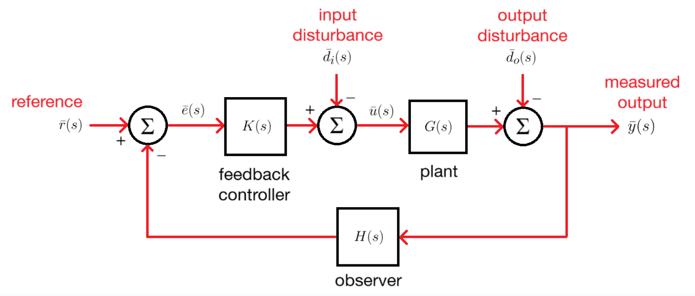
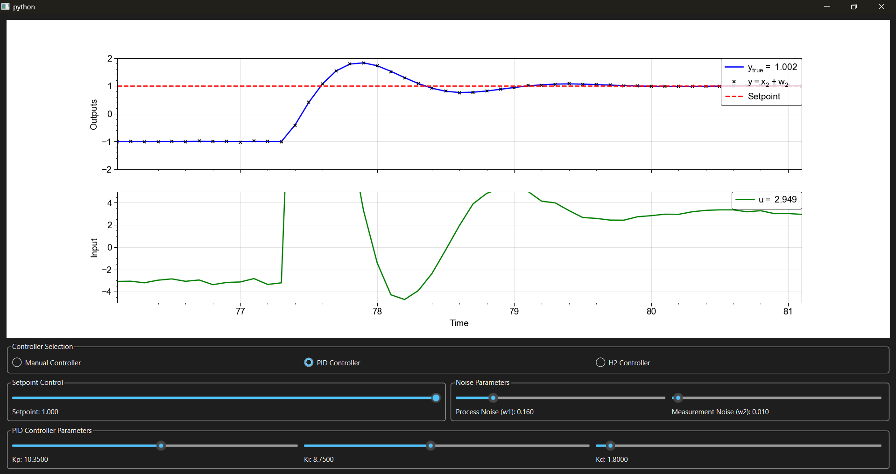

---

title: "Interactive Control System"
summary: An interface to explore control of dynamical systems in Python.
tags:
  - Featured
  - Control Systems
  - Process Simulation

links:
  - icon: github
    icon_pack: fab
    name: Go to project site
    url: https://github.com/lorcan2440/Interactive-Control-System

# Media and interaction
commentable: true
share: true
pager: true
show_related: true
profile: true

---

Write-up coming soon...! Code available [on GitHub here](https://github.com/lorcan2440/Interactive-Control-System) in the meantime.

## The plant

The plant that is implemented currently in the program is described by:

$$ \dot{x}\_1 = -(k_{12} + d) x_1 + k_{21} x_2 + u, $$

$$ \dot{x}\_2 = k_{12} x_1 - (k_{21} + d) x_2 + w_1, $$

$$ y = x_2 + w_2. $$

This plant comes from Question 2 of the final exam for the 4th year (Part IIB) Optimal Controls (4F3) class of 2021 at University of Cambridge (availiable [here](https://camcribs.com/viewer?year=IIB&type=tripos&module=4F3&id=QP_2021)), whose cribs I used to verify my controller implementations. This is a two-compartment model of drug diffusion in the body, where:

- $ x_1 $: drug concentration in compartment 1 (state 1)
- $ x_2 $: drug concentration in compartment 2 (state 2)
- $ y $: measured drug concentration in compartment 2 (measured output)
- $ u $: drug injection into compartment 1 (control input)
- $ w_1 $: drug concentration disturbance in compartment 2 (process noise)
- $ w_2 $: measurement disturbance (measurement noise)

The constants used in the model are:

- $ k_{12} = 10 $ and $ k_{21} = 20 $ are the flow rates between compartments
- $ d = 1 $ is the drug's degradation rate.

## The controllers

Why do we need controllers? The limitations of open-loop control...

### Bang-bang control

### Proportional-integral-derivative (PID) control

### Lead-lag compensation

### Model predictive control (MPC)

### $ \mathcal{H}_2 $ optimal control (linear quadratic Gaussian; LQG)

### $ \mathcal{H}_{\infty} $ optimal control

### Reinforcement learning (RL)-based control

## Feedback control system design

### Block diagrams and transfer functions

### The frequency response

Bode, Nyquist, Nichols, root-locus plots...

