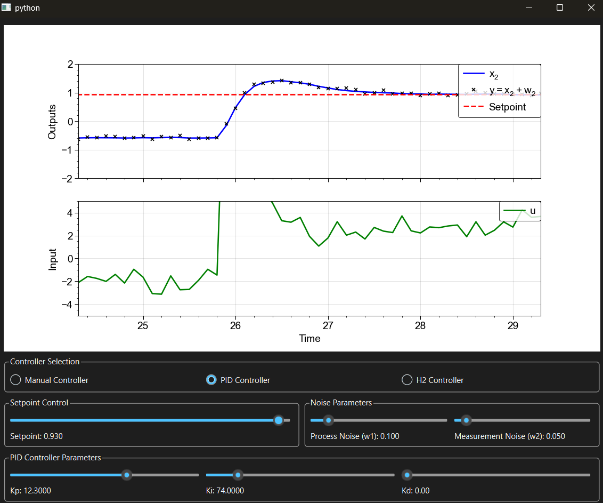

---

title: "Interactive Control System"
summary: An interface to explore control of dynamical systems in Python.
tags:
  - Featured
  - Control Systems
  - Process Simulation

links:
  - icon: github
    icon_pack: fab
    name: Go to project site
    url: https://github.com/lorcan2440/Interactive-Control-System

# Media and interaction
commentable: true
share: true
pager: true
show_related: true
profile: true

---



Code on [GitHub gists here](https://gist.github.com/lorcan2440/2de2397793311f484a4c47cc21183347):

```python
import sys

import numpy as np
import matplotlib.pyplot as plt
from matplotlib.backends.backend_qtagg import FigureCanvasQTAgg as FigureCanvas
from scipy.integrate import solve_ivp
from scipy.linalg import solve_continuous_are

from PyQt6.QtWidgets import (QApplication, QWidget, QVBoxLayout, QHBoxLayout, 
                             QGridLayout, QSlider, QLabel, QGroupBox, QRadioButton,
                             QCheckBox)
from PyQt6.QtCore import Qt, QTimer


try:
    plt.style.use(r'C:\LibsAndApps\Python config files\proplot_style.mplstyle')
except OSError:
    plt.style.use('ggplot')


class ControlSimulator(QWidget):

    def __init__(self):
        super().__init__()

        # system Parameters
        self.k12 = 10
        self.k21 = 20
        self.d = 1
        self.dt = 0.1  # GUI update step
        self.solver_dt = 0.001  # Solver step size

        # disturbance parameter initial values
        self.w1_stddev = 0.1  # process noise standard deviation
        self.w2_stddev = 0.05  # measurement noise standard deviation

        # initial States
        self.x = np.array([0.0, 0.0])  # x1, x2

        # controller type default
        self.controller_type = 'Manual'  # 'Manual', 'PID', or 'H2'

        # Manual Controller initial values
        self.manual_u = 0.0
        self.manual_enabled = True

        # PID Parameter initial values
        self.setpoint = 1.0
        self.Kp = 5.0
        self.Ki = 0.0
        self.Kd = 0.0

        # H2 Parameter initial values
        self.h2_C1_1 = 0.0
        self.h2_C1_2 = 1.0

        # slider configuration: set min, max and step here for each slider.
        self.slider_configs = {
            'manual_u':  {'min': -5.0, 'max': 5.0,  'step': 0.1,    'init': self.manual_u},
            'setpoint':  {'min': -1.0, 'max': 1.0,  'step': 0.01,   'init': self.setpoint},
            'w1_stddev': {'min': 0.0,  'max': 1.0,  'step': 0.01,   'init': self.w1_stddev},
            'w2_stddev': {'min': 0.0,  'max': 1.0,  'step': 0.01,   'init': self.w2_stddev},
            'Kp':        {'min': 0.0,  'max': 20.0, 'step': 0.05,   'init': self.Kp},
            'Ki':        {'min': 0.0,  'max': 500,  'step': 1.00,   'init': self.Ki},
            'Kd':        {'min': 0.0,  'max': 0.02, 'step': 0.0001, 'init': self.Kd},
            'h2_C1_1':   {'min': -3.0, 'max': 3.0,  'step': 0.01,   'init': self.h2_C1_1},
            'h2_C1_2':   {'min': -3.0, 'max': 3.0,  'step': 0.01,   'init': self.h2_C1_2},
        }

        # PID Memory
        self.integral = 0.0
        self.prev_error = 0.0

        # store latest control input
        self.last_u = 0.0

        # UI Setup
        self.user_interface()

        # start simulation timer
        self.timer = QTimer()
        self.timer.timeout.connect(self.update_simulation)
        self.timer.start(int(self.dt * 1000))  # Convert dt to milliseconds

    def system_dynamics(self, t: float, x: np.ndarray):
        '''
        Defines the system's differential equations.

        Variables:
        - x_1: drug concentration in compartment 1 (state variable 1)
        - x_2: drug concentration in compartment 2 (state variable 2)
        - u: drug injection (control input)
        - w_1: model disturbance in compartment 2
        - w_2: measurement noise
        - y: measurement of compartment 2
        - t: time

        Constants:
        - k_12, k_21: flow rates between compartments
        - d: drug degradation rate

        State space model:
        - x_1' = -(k_12 + d) * x_1 + k_21 * x_2 + u
        - x_2' = k_12 * x_1 - (k_21 + d) * x_2 + w_1
        - y = x_2 + w_2
        '''
        # generate noise samples
        w1 = np.random.normal(0, self.w1_stddev)  # process noise
        w2 = np.random.normal(0, self.w2_stddev)  # measurement noise
        
        # noisy measurement
        y_noisy = x[1] + w2
        
        # the controller only sees the noisy measurement
        if self.controller_type == 'Manual':
            u = self.controller_manual(t, y_noisy)
        elif self.controller_type == 'PID':
            u = self.controller_pid(t, y_noisy)
        elif self.controller_type == 'H2':
            u = self.controller_h2(t, y_noisy)

        # rates of change with control input and process noise
        dx1 = -(self.k12 + self.d) * x[0] + self.k21 * x[1] + u
        dx2 = self.k12 * x[0] - (self.k21 + self.d) * x[1] + w1
        
        return [dx1, dx2]

    def user_interface(self):
        '''
        Contains the sliders and plots on screen.
        '''

        layout = QVBoxLayout()  # overall layout: vertical

        #### Plots ####

        self.fig, (self.ax1, self.ax2) = plt.subplots(2, 1, sharex=True, figsize=(6, 6))
        self.canvas = FigureCanvas(self.fig)
        layout.addWidget(self.canvas)

        # Initialize plot data for both true and measured outputs
        self.t_data = [0]
        self.y_true_data = [self.x[1]]  # true output y = x2
        self.y_measured_data = [self.x[1]]  # measured output (initially same)
        self.u_data = [self.last_u]

        # Output plot with both true and measured signals
        self.ax1.set_ylabel("Outputs")
        self.line_y_true, = self.ax1.plot(
            self.t_data, self.y_true_data, 'b-', label="$ x_2 $")
        self.line_y_measured, = self.ax1.plot(
            self.t_data, self.y_measured_data, 'kx', markersize=3, label="$ y = x_2 + w_2 $")
        self.ref_line, = self.ax1.plot(self.t_data, [self.setpoint], 'r--', label="Setpoint")
        self.ax1.legend(loc="upper right")
        self.ax1.set_xlim(0, 5)
        self.ax1.set_ylim(-2, 2)

        # Control input plot
        self.ax2.set_xlabel("Time")
        self.ax2.set_ylabel("Input")
        self.line_u, = self.ax2.plot(self.t_data, self.u_data, 'g-', label="$ u $")
        self.ax2.legend(loc="upper right")
        self.ax2.set_xlim(0, 5)
        self.ax2.set_ylim(-5, 5)

        #### Simulation Settings ####

        control_layout = QVBoxLayout()

        # controller selection radio buttons
        controller_select_box = QGroupBox("Controller Selection")
        controller_select_layout = QHBoxLayout()
        
        self.manual_radio = QRadioButton("Manual Controller")
        self.manual_radio.setChecked(True)
        self.manual_radio.toggled.connect(self.on_controller_changed)
        
        self.pid_radio = QRadioButton("PID Controller")
        self.pid_radio.toggled.connect(self.on_controller_changed)
        
        self.h2_radio = QRadioButton("H2 Controller")
        self.h2_radio.toggled.connect(self.on_controller_changed)
        
        controller_select_layout.addWidget(self.manual_radio)
        controller_select_layout.addWidget(self.pid_radio)
        controller_select_layout.addWidget(self.h2_radio)
        controller_select_box.setLayout(controller_select_layout)
        control_layout.addWidget(controller_select_box)

        # horizontal layout for setpoint and noise boxes
        setpoint_noise_layout = QHBoxLayout()
        
        # setpoint control (left side)
        setpoint_box = QGroupBox("Setpoint Control")
        setpoint_layout = QVBoxLayout()

        self.setpoint_slider = self.make_slider_from_cfg('setpoint')
        self.setpoint_slider.valueChanged.connect(self.update_setpoint)
        self.setpoint_label = QLabel(f"Setpoint: {self.setpoint:.2f}")
        
        setpoint_layout.addWidget(self.setpoint_slider)
        setpoint_layout.addWidget(self.setpoint_label)
        setpoint_box.setLayout(setpoint_layout)
        setpoint_noise_layout.addWidget(setpoint_box)

        # noise control box (right side)
        noise_box = QGroupBox("Noise Parameters")
        noise_layout = QGridLayout()
        
        # w1_stddev (process noise)
        self.w1_stddev_slider = self.make_slider_from_cfg('w1_stddev')
        self.w1_stddev_slider.valueChanged.connect(self.update_w1_stddev)
        self.w1_stddev_label = QLabel(f"Process Noise (w1): {self.w1_stddev:.3f}")
        noise_layout.addWidget(self.w1_stddev_slider, 0, 0)
        noise_layout.addWidget(self.w1_stddev_label, 1, 0)
        
        # w2_stddev (measurement noise)
        self.w2_stddev_slider = self.make_slider_from_cfg('w2_stddev')
        self.w2_stddev_slider.valueChanged.connect(self.update_w2_stddev)
        self.w2_stddev_label = QLabel(f"Measurement Noise (w2): {self.w2_stddev:.3f}")
        noise_layout.addWidget(self.w2_stddev_slider, 0, 1)
        noise_layout.addWidget(self.w2_stddev_label, 1, 1)
        
        noise_box.setLayout(noise_layout)
        setpoint_noise_layout.addWidget(noise_box)
        
        # add the horizontal layout to the main control layout
        control_layout.addLayout(setpoint_noise_layout)

        #### Control Parameters ####

        # Manual Controls
        self.manual_box = QGroupBox("Manual Controller Parameters")
        manual_layout = QVBoxLayout()
        
        # Enable/disable checkbox
        self.manual_enable_checkbox = QCheckBox("Enable Manual Control")
        self.manual_enable_checkbox.setChecked(self.manual_enabled)
        self.manual_enable_checkbox.stateChanged.connect(self.update_manual_enabled)
        manual_layout.addWidget(self.manual_enable_checkbox)
        
        # Manual control slider
        self.manual_slider = self.make_slider_from_cfg('manual_u')
        self.manual_slider.valueChanged.connect(self.update_manual_u)
        self.manual_label = QLabel(f"Manual Control u: {self.manual_u:.2f}")
        manual_layout.addWidget(self.manual_slider)
        manual_layout.addWidget(self.manual_label)
        
        self.manual_box.setLayout(manual_layout)
        control_layout.addWidget(self.manual_box)

        # PID Controls
        self.pid_box = QGroupBox("PID Controller Parameters")
        pid_layout = QGridLayout()

        # Kp
        self.Kp_slider = self.make_slider_from_cfg('Kp')
        self.Kp_slider.valueChanged.connect(self.update_Kp)
        self.Kp_label = QLabel(f"Kp: {self.Kp:.2f}")
        pid_layout.addWidget(self.Kp_slider, 0, 0)
        pid_layout.addWidget(self.Kp_label, 1, 0)

        # Ki
        self.Ki_slider = self.make_slider_from_cfg('Ki')
        self.Ki_slider.valueChanged.connect(self.update_Ki)
        self.Ki_label = QLabel(f"Ki: {self.Ki:.2f}")
        pid_layout.addWidget(self.Ki_slider, 0, 1)
        pid_layout.addWidget(self.Ki_label, 1, 1)

        # Kd
        self.Kd_slider = self.make_slider_from_cfg('Kd')
        self.Kd_slider.valueChanged.connect(self.update_Kd)
        self.Kd_label = QLabel(f"Kd: {self.Kd:.2f}")
        pid_layout.addWidget(self.Kd_slider, 0, 2)
        pid_layout.addWidget(self.Kd_label, 1, 2)

        self.pid_box.setLayout(pid_layout)
        control_layout.addWidget(self.pid_box)

        # H2 Controls
        self.h2_box = QGroupBox("H2 Controller Parameters")
        h2_layout = QGridLayout()
        
        # C1_1
        self.h2_C1_1_slider = self.make_slider_from_cfg('h2_C1_1')
        self.h2_C1_1_slider.valueChanged.connect(self.update_h2_C1_1)
        self.h2_C1_1_label = QLabel(f"C1_1 (performance gain of x_1): {self.h2_C1_1:.2f}")
        h2_layout.addWidget(self.h2_C1_1_slider, 0, 0)
        h2_layout.addWidget(self.h2_C1_1_label, 1, 0)
        
        # C1_2
        self.h2_C1_2_slider = self.make_slider_from_cfg('h2_C1_2')
        self.h2_C1_2_slider.valueChanged.connect(self.update_h2_C1_2)
        self.h2_C1_2_label = QLabel(f"C1_2 (performance gain of x_2): {self.h2_C1_2:.2f}")
        h2_layout.addWidget(self.h2_C1_2_slider, 0, 1)
        h2_layout.addWidget(self.h2_C1_2_label, 1, 1)
        
        self.h2_box.setLayout(h2_layout)
        control_layout.addWidget(self.h2_box)
        
        self.manual_box.setVisible(True)  # the manual box is shown first, others hidden
        self.h2_box.setVisible(False)
        self.pid_box.setVisible(False)

        # manual slider enabled state based on checkbox
        self.update_manual_slider_state()

        layout.addLayout(control_layout)
        self.setLayout(layout)

    def on_controller_changed(self):
        '''
        Handle controller type change via radio buttons.
        '''
        if self.manual_radio.isChecked():
            self.controller_type = 'Manual'
            self.manual_box.setVisible(True)
            self.pid_box.setVisible(False)
            self.h2_box.setVisible(False)
        elif self.pid_radio.isChecked():
            self.controller_type = 'PID'
            self.manual_box.setVisible(False)
            self.pid_box.setVisible(True)
            self.h2_box.setVisible(False)
            # reset PID memory when switching back
            self.integral = 0.0
            self.prev_error = 0.0
        else:
            self.controller_type = 'H2'
            self.manual_box.setVisible(False)
            self.pid_box.setVisible(False)
            self.h2_box.setVisible(True)

    def controller_manual(self, _t: float, _y: float):
        '''
        Manual controller that directly sets the control input.
        '''
        if self.manual_enabled:
            u = self.manual_u
        else:
            u = 0.0
            
        self.last_u = u
        return u

    def controller_pid(self, _t: float, y: float):
        '''
        Compute the PID control input based on the output y = x2.

        A PID controller performs three separate operations on the error signal:

        1) P (proportional): multiplies the error by the parameter Kp
        2) I (integral): sums the error over all previous values and multiplies by the parameter Ki
        3) D (derivative): computes the rate of change of the error and multiplies by the parameter Kd

        These three are added up to give the control signal, which is returned.
        '''
        # error signal e
        error = self.setpoint - y

        # transfer function
        # K = lambda s: self.Kp + self.Ki / s + self.Kd * s

        # proportional signal
        u_p = self.Kp * error
        # integral signal (trapezium rule)
        self.integral += 1/2 * (error + self.prev_error) * self.solver_dt
        u_i = self.Ki * self.integral
        # derivative signal
        derivative = (error - self.prev_error) / self.solver_dt
        u_d = self.Kd * derivative

        # control input
        u = u_p + u_i + u_d

        self.prev_error = error
        self.last_u = u
        return u
    
    def controller_h2(self, _t: float, y: float):
        '''
        Compute the H2 optimal control input with output feedback.

        A H2 controller aims to minimise the H2 norm (total signal energy gain) of an input disturbance w 
        to the performance output signal z. The performance output is given by:

        `z = [C1_1 * x_1 + C1_2 * x_2, u].T`

        where C1_1 and C1_2 are the controller parameters (multipliers of the state variables in the objective function).
        
        For white noise disturbances (Gaussian with zero mean), H2 optimal control equivalent to LQR 
        (linear quadratic regulator) with a Kalman filter as the optimal observer (LQG - linear quadratic 
        Gaussian control).
        '''

        # check if we need to recompute performance output vector (C1 may have changed)
        current_C1 = (self.h2_C1_1, self.h2_C1_2)
        
        if not hasattr(self, 'h2_gains_computed') or not hasattr(self, 'last_C1') or \
                self.last_C1 != current_C1:
            
            # set up state space matrices
            A = np.array([[-self.k12 - self.d, self.k21], [self.k12, -self.k21 - self.d]])
            B1 = np.array([[0], [1]])
            B2 = np.array([[1], [0]])
            C2 = np.array([[0, 1]])

            # performance output matrix
            C1 = np.array([[self.h2_C1_1, self.h2_C1_2]])

            # solve algebraic Riccati equations (AREs)
            X = solve_continuous_are(A, B2, C1.T @ C1, np.eye(1))  # CARE (control ARE)
            Y = solve_continuous_are(A.T, C2.T, B1 @ B1.T, np.eye(1))  # FARE (filter ARE)

            # controller gains
            self.F = -B2.T @ X   # state feedback gain
            self.H = Y @ C2.T    # Kalman gain
            self.A_cl = A + B2 @ self.F - self.H @ C2  # closed-loop observer matrix
            
            # cache system matrices for steady-state calculation
            self.A_matrix = A
            self.B2_matrix = B2
            self.C2_matrix = C2
            
            self.h2_gains_computed = True
            self.last_C1 = current_C1  # cache performance vector

            # optimal H2 norm - note that MATLAB omits the sqrt(2 * pi) factor
            norm = np.sqrt(2 * np.pi * (np.trace(B1.T @ X @ B1) + np.trace(self.F @ Y @ self.F.T)))
            print(norm)

        # initialise state estimate
        if not hasattr(self, 'x_k'):
            self.x_k = np.array([[0.0], [0.0]])  # [x1_hat, x2_hat].T
        
        # recalculate steady-state values at each call (setpoint may have changed)
        # compute the steady-state control input and state for the current setpoint
        # we want C2 @ x_ss = setpoint and A @ x_ss + B2 @ u_ss = 0
        M = np.vstack([
            np.hstack([self.A_matrix, self.B2_matrix]),
            np.hstack([self.C2_matrix, np.zeros((1, 1))])
        ])
        rhs = np.vstack([np.zeros((2, 1)), np.array([[self.setpoint]])])
        
        try:
            solution = np.linalg.solve(M, rhs)
            x_ss = solution[:2]  # state at steady state
            u_ss = solution[2:]  # control input at steady state
        except np.linalg.LinAlgError:
            # fallback if the system is singular
            if hasattr(self, 'prev_x_ss'):  # use cache
                x_ss = self.prev_x_ss
                u_ss = self.prev_u_ss
            else:  # set to zero (assume regulation)
                x_ss = np.zeros((2, 1))
                u_ss = np.zeros((1, 1))
        
        # cache steady state values
        self.prev_x_ss = x_ss
        self.prev_u_ss = u_ss

        # observer dynamics - track error from steady state
        y_measured = np.array([[y]])
        output_error = y_measured - self.C2_matrix @ x_ss
        dx_k = self.A_cl @ (self.x_k - x_ss) - self.H @ output_error
        self.x_k += dx_k * self.solver_dt  # Euler's method (simple)
        
        # Control input: u = u_ss + F @ (x_k - x_ss)
        u = u_ss + self.F @ (self.x_k - x_ss)
        u = float(u[0][0])  # convert back to scalar

        self.last_u = u
        return u
    
    def update_setpoint(self, value):
        cfg = self.slider_configs['setpoint']
        self.setpoint = cfg['min'] + value * cfg['step']
        self.setpoint_label.setText(f"Setpoint: {self.setpoint:.3f}")
        # if plot exists, update reference immediately 
        # (safe-guard in case method called before plotting)
        if hasattr(self, 'ref_line') and len(self.t_data) > 0:
            self.ref_line.set_ydata([self.setpoint] * len(self.t_data))

    def update_w1_stddev(self, value):
        cfg = self.slider_configs['w1_stddev']
        self.w1_stddev = cfg['min'] + value * cfg['step']
        self.w1_stddev_label.setText(f"Process Noise (w1): {self.w1_stddev:.3f}")

    def update_w2_stddev(self, value):
        cfg = self.slider_configs['w2_stddev']
        self.w2_stddev = cfg['min'] + value * cfg['step']
        self.w2_stddev_label.setText(f"Measurement Noise (w2): {self.w2_stddev:.3f}")

    def update_manual_u(self, value):
        cfg = self.slider_configs['manual_u']
        self.manual_u = cfg['min'] + value * cfg['step']
        self.manual_label.setText(f"Manual Control u: {self.manual_u:.3f}")

    def update_manual_enabled(self, state):
        self.manual_enabled = (state == Qt.CheckState.Checked.value)
        self.update_manual_slider_state()

    def update_manual_slider_state(self):
        # Enable/disable slider based on checkbox state
        self.manual_slider.setEnabled(self.manual_enabled)
        self.manual_label.setEnabled(self.manual_enabled)
        
        # Update label to show disabled state
        if self.manual_enabled:
            self.manual_label.setText(f"Manual Control u: {self.manual_u:.3f}")
        else:
            self.manual_label.setText(f"Manual Control u: {self.manual_u:.3f} (Disabled)")

    def update_Kp(self, value):
        cfg = self.slider_configs['Kp']
        self.Kp = cfg['min'] + value * cfg['step']
        self.Kp_label.setText(f"Kp: {self.Kp:.4f}")

    def update_Ki(self, value):
        cfg = self.slider_configs['Ki']
        self.Ki = cfg['min'] + value * cfg['step']
        self.Ki_label.setText(f"Ki: {self.Ki:.4f}")

    def update_Kd(self, value):
        cfg = self.slider_configs['Kd']
        self.Kd = cfg['min'] + value * cfg['step']
        self.Kd_label.setText(f"Kd: {self.Kd:.4f}")

    def update_h2_C1_1(self, value):
        cfg = self.slider_configs['h2_C1_1']
        self.h2_C1_1 = cfg['min'] + value * cfg['step']
        self.h2_C1_1_label.setText(f"C1_1: {self.h2_C1_1:.2f}")

    def update_h2_C1_2(self, value):
        cfg = self.slider_configs['h2_C1_2']
        self.h2_C1_2 = cfg['min'] + value * cfg['step']
        self.h2_C1_2_label.setText(f"C1_2: {self.h2_C1_2:.2f}")

    def update_simulation(self):
        '''
        Simulate the system trajectory between now and the next frame.
        '''
        t_span = (0, self.dt)
        t_eval = np.arange(0, self.dt, self.solver_dt)
        _current_true_state = self.x.copy()

        # integrate the dynamic model over this animation time span
        sol = solve_ivp(self.system_dynamics, t_span, self.x, t_eval=t_eval, method='RK45')

        # update state
        self.x = sol.y[:, -1]  # last row

        # generate measurement noise for the final state
        w2_final = np.random.normal(0, self.w2_stddev)
        y_measured = self.x[1] + w2_final

        # update plot data
        self.t_data.append(self.t_data[-1] + self.dt)
        self.y_true_data.append(self.x[1])  # true output y = x2
        self.y_measured_data.append(y_measured)  # noisy measurement
        self.u_data.append(self.last_u)

        # only retain the 1000 most recent data points
        if len(self.t_data) > 1000:
            self.t_data.pop(0)
            self.y_true_data.pop(0)
            self.y_measured_data.pop(0)
            self.u_data.pop(0)

        # use a sliding window of 5 time units
        if self.t_data[-1] > 5:
            self.ax1.set_xlim(self.t_data[-1] - 5, self.t_data[-1])
            self.ax2.set_xlim(self.t_data[-1] - 5, self.t_data[-1])

        # update plots with truncated data
        self.line_y_true.set_xdata(self.t_data)
        self.line_y_true.set_ydata(self.y_true_data)
        self.line_y_measured.set_xdata(self.t_data)
        self.line_y_measured.set_ydata(self.y_measured_data)
        self.ref_line.set_xdata(self.t_data)
        self.ref_line.set_ydata([self.setpoint] * len(self.t_data))

        self.line_u.set_xdata(self.t_data)
        self.line_u.set_ydata(self.u_data)
        self.line_u.set_label('$ u = $' + f' {self.last_u:.3f}')

        # adjust autoscaling
        self.ax1.relim()
        self.ax1.autoscale_view(scaley=True)
        self.ax2.relim()
        self.ax2.autoscale_view(scaley=True)

        self.canvas.draw()

    def make_slider_from_cfg(self, key: str, orientation=Qt.Orientation.Horizontal):
        # Helper function to make slider from {min, max, step, init}
        cfg = self.slider_configs[key]
        if cfg['step'] <= 0:
            raise ValueError(f"slider step must be > 0 for '{key}'")
        # number of steps (integer)
        n_steps = max(1, int(round((cfg['max'] - cfg['min']) / cfg['step'])))
        s = QSlider(orientation)
        s.setMinimum(0)
        s.setMaximum(n_steps)
        # initial integer position
        init_int = int(round((cfg.get('init', cfg['min']) - cfg['min']) / cfg['step']))
        init_int = min(max(init_int, 0), n_steps)
        s.setValue(init_int)
        s.setSingleStep(1)
        s.setPageStep(max(1, n_steps // 10))
        return s


def main():
    app = QApplication(sys.argv)
    sim = ControlSimulator()
    sim.show()
    sys.exit(app.exec())


if __name__ == "__main__":
    main()
```