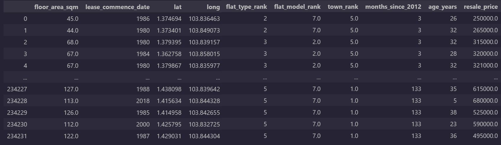
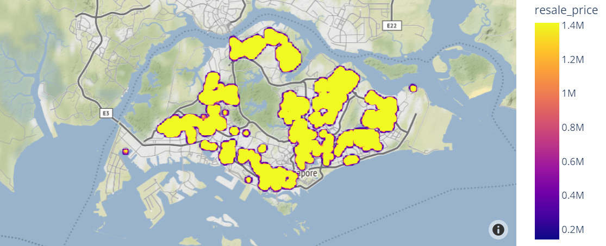
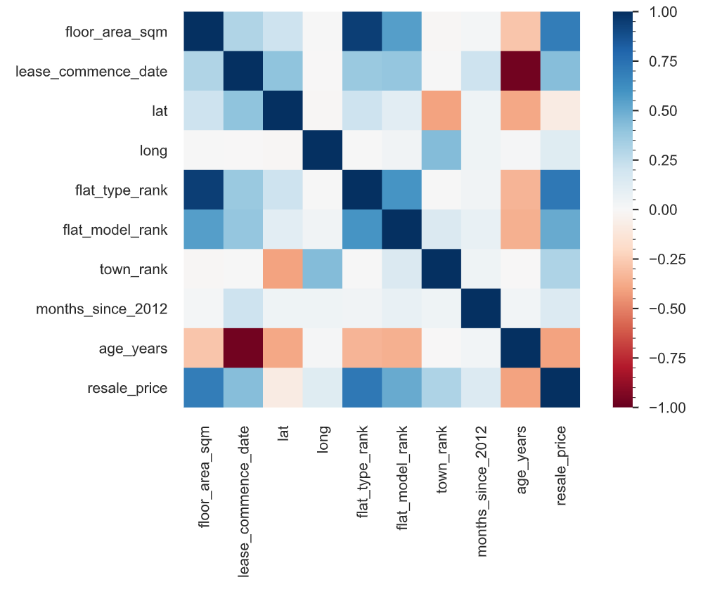
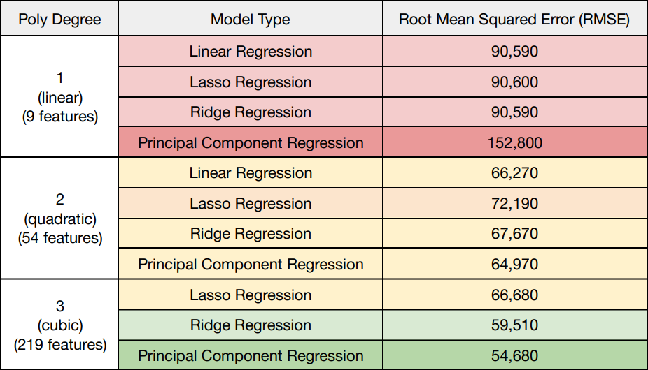
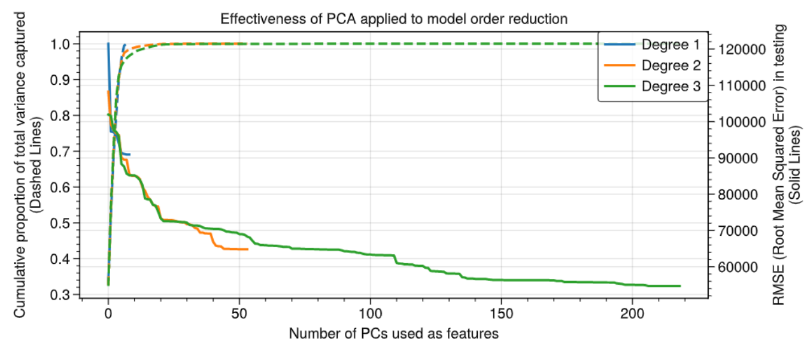
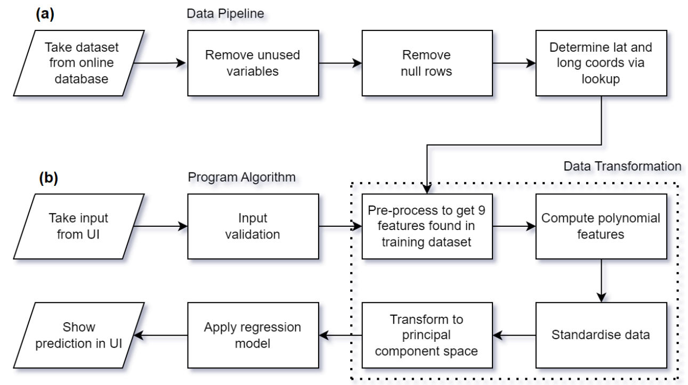

## Background

Singapore, like many developed and population-dense countries, has a housing problem. As of 2020, almost 80% of Singaporeans live in public (government subsidised) housing, commonly known as HDBs. With the high demand for housing, buyers may sometimes find themselves exploited by current owners who will only sell at exorbitant prices. It is therefore in everyone's best interest that there exists a way to determine a fair resale price of a HDB property in Singapore.

In this project I created a regression model for predicting HDB resale prices, which had been trained on a large dataset provided by a government database, made alongside the [EE4802 Learning From Data](https://nusmods.com/modules/EE4802/learning-from-data) Project work at NUS. I found that the model performed well, with a root mean squared error (RMSE) of under $60,000, representing a mean absolute percentage error (MAPE) of approximately 10%. A web application is also designed, which is suitable for usage by the general public and could readily be embedded into a larger service.

For this project I used libraries `scikit-learn`, `numpy`, `pandas` and `flask`, as well as other utilities.

A demo of the app is available <a href="#app">below</a>.

## Data Acquisition, Exploration and Preprocessing

The initial raw dataset was obtained from the Singapore government’s [public datasets](https://data.gov.sg/dataset/resale-flat-prices) using an API to fetch and download data on flat resale prices. Data from 2012 to present was used, since prior to this date, alternative fields were used which could result in a bias due to the change in data collection methodology. The incoming data was saved locally as a JSON file with 234,235 records of 11 variables totalling 44 MB in memory.

The data was loaded in Python. All data manipulation was performed using the pandas and
NumPy libraries. The labels remaining_lease and storey_range were deemed unsuitable
for the prediction of resale price, and were dropped from the dataset. The labels town and
street_name were used to find the latitude and longitude of the house using the
[OneMapSG API](https://www.onemap.gov.sg/docs/).

After this basic preprocessing, I obtained a dataset that looked like this:

These coordinates were used to generate a map using the [plotly](https://plotly.com/python/) library:

I then generated an exploratory data analysis (EDA) report of the data using [pandas-profiling](https://pypi.org/project/pandas-profiling/), and analysed for potential correlations. Observations of the map data showed clusters but no clear geographic trend in house price was evident. The correlations tab was useful in getting an idea of the general trends across other variables:

I processed the remaining labels as follows:
- `flat_type`: ordinally encoded from 0 to 7 (1-5 rooms < Executive < Multi Generation).
- `flat_model`: ordinally encoded using the mean resale_price grouped on flat_model.
- `town`: ordinally encoded using the mean `resale_price` grouped on town.
- `month`: parsed using datetime and converted to a number of months since January 2012,
and used them to calculate `age_years` (years between the lease start date and sell date).

Contrary to expectations, I found that the one-hot encoding of town produced poor results during preliminary testing. Therefore, I used a grouping method to rank towns by their mean resale_price value. This provided 9 features to use in our analysis, which were `floor_area_sqm, lease_commencement_date, lat, long, flat_type_rank, flat_model_rank, town_rank, months_since_2012` and `age_years`, all of which were numeric. By design, `lease_commencement_date`, `months_since_2012` and `age_years` would be mutually dependent, but I decided to keep them, as correlations would be excluded in a subsequent processing step (principal component analysis).

## Model Selection and Hyperparameter Tuning

Using these 9 features as a base, I built several regression models: all combinations of linear / quadratic / cubic with lasso / ridge / no regularisation, as well as principal component regression (PCR). All polynomial features were normalised to zero mean and unit variance prior to regression, as required by principal component analysis (PCA). Where PCR was used, all components were included initially, and no regularisation was applied. The performance, as analysed by K-fold cross-validation scheme (with $ K = 10 $ and an $ 80:20 $ train-test split), is shown below.

In order to assess the potential for model dimensionality reduction, I then investigated the dominance of the principal components by creating a scree plot of each PCR model. This shows the fraction of the variance captured by the top $ n $ most dominant eigenvalues of the covariance matrix. (For a rigorous review, I have explained the maths behind PCA near the bottom of the page, as well as some info on regression.) The 3rd degree linear regressor did not yield a valid model, as it returned an extremely large RMSE and is omitted.

I decided to use the first 136 PCs (a 40% reduction in the dimension count), which gave an RMSE of 57,600 (5% higher than using all PCs), while using 100% of the variance.

## Model Prediction and User Interfacing

Here is a summary of the data processing stages used by the program to make predictions, showing (a) training the model, and (b) making a prediction given a user’s input.

A simple web application was written using Flask. Various design considerations were taken
into account in order to improve the accessibility and ease of use by the general public:
- A responsive layout was used, which fits screen dimensions on any platform.
- Users can choose the house location by clicking on an interactive map, which drops
a pin and automatically fills in the coordinates, provided via the Google Maps JS API.
- Familiar text fields with example default values and buttons are used to handle user
input selection. Inputs are validated by exception handling and shown with an error.
- The app was deployed on the Cloud service [PythonAnywhere](https://lorcan2440.pythonanywhere.com/) and embedded here as a demonstration of its ease of integration into larger services.

With a little more knowledge of web design, such as use of CSS, I could have made this demo a bit prettier, but for now, I am happy with the basics.

Here's the final app - hosted using [PythonAnywhere](https://lorcan2440.pythonanywhere.com/) and embedded here...

#### <a id="app"> The House Prediction Program Demo</a>

{}
Use Light Mode on the website! Click the 🌙 icon in the bar at the top right.
{}

<iframe src="https://lorcan2440.pythonanywhere.com/" width="100%" height="730px" frameborder="0"></iframe>

## Extra Notes: A Mathematical Overview of Regression and PCA

#### Linear Regression

A regressor aims to find unknown coefficients of a mathematical model such that a certain loss function is minimised. The loss function is typically the sum of two terms: a penalty on the model’s inaccuracies, and a penalty on the model’s choice of coefficients. The former term typically represents a least-squares problem, but in some cases (e.g. support vector machines), the absolute error is used. The latter term is known as regularisation, and aims to reduce the magnitude of the coefficients in order to avoid overfitting. Various types of regularisation exist e.g. Lasso ($L_1$ norm) and Ridge ($L_2$ norm). The model objective can be stated as an (in general, nonlinear and not convex) optimisation problem (where $x$ is a set of features). For example, the ridge regressor is characterised by:


$$ \underbrace{C(\mathbf{y}, \mathbf{x}, \mathbf{w})}_{\substack{\textup{cost function:} \\ \textup{to be minimised}}}  =\underbrace{\frac{1}{2n}\sum_{i=1}^{n}(y_i-\hat{y}_i)^2}_{\text{sum of squared errors}}+\alpha \underbrace{\sum_{j=1}^{m}|w_j|}_{\text{regularisation}}\text{   with   }\underbrace{\hat{y}_i=\sum_{j=0}^{m}w_{j}x_{ij}}_{\text{model estimate}}. $$


($y_i$: observed target variable, $\hat{y}_{i}$: predicted target variable, $x_{ij}$: observation $ i $ of independent variable $ j $, $n$: number of training examples, $m$: number of independent variables to be fitted, $\alpha$: regularisation hyperparameter controlling trade-off, $x_{i0}:=1$.)

If polynomial regression is used, then $x_i$ contains all product combination terms up to a specified degree. This significantly increases the number of features used, many of which are strongly correlated.

#### Principal Component Analysis

Principal component analysis (PCA) identifies a set of new variables which are linear combinations of the existing features in a dataset. PCA aims to produce variables which are the most uncorrelated with each other, and thus are useful for model order reduction. Considering a dataset of $m$ predictor variables (features) with $n$ observations, the data matrix $\mathbf{X}$ is defined as the real $ n \times m $ matrix containing each observation in a row, where all columns (features) are rescaled to zero mean. If the singular value decomposition (SVD) of $\mathbf{X}$ is denoted as $\mathbf{X}$ = $\mathbf{U \Sigma V}^{\text{T}}$, then the columns of $\mathbf{V}$ (rows of $\mathbf{V}^{\text{T}}$) are the principal components (PCs). The PCs can be interpreted as the principal axes of the $m$-dimensional ellipsoidal contour surfaces of equal probability density for the dataset. The singular values $ \sigma $, listed in descending order along the leading diagonal of $\mathbf{\Sigma}$, represent the relative significance of each PC. The matrix $\mathbf{U \Sigma} = \mathbf{X V}$ is the transformed dataset, whose features are guaranteed to be independent: since the columns of $\mathbf{V}$ are the right eigenvectors of $\mathbf{XX}^{\text{T}}$, a square symmetric (real Hermitian) matrix, these columns must be orthogonal, so the PCs are uncorrelated. This can also be demonstrated by showing that the covariance matrix of $ \mathbf{X V} $ is diagonal.

An alternative computation uses the eigendecomposition of the covariance matrix $\mathbf{C}$ where
$ \mathbf{C} = (n - 1)^{-1} \mathbf{XX}^{\text{T}} $, so that $ \mathbf{C} = (n - 1)^{-1} \mathbf{V \Sigma^2 V}^{\text{T}} $. The eigenvalues of $ \mathbf{C} $, given by $ \lambda = (n - 1)^{-1} \sigma^2 $, then represent the variances of data in the respective PC, which can be plotted to form a 'scree plot'. This is useful for choosing the desired number $ k \leq m $ of PCs to retain such that the most variance is captured, while reducing the model dimension count and the memory space required. However, in Python’s `scikit-learn` library, the SVD approach is used, since [highly optimised algorithms](https://towardsdatascience.com/pca-and-svd-explained-with-numpy-5d13b0d2a4d8) exist for the efficient computation of a direct SVD.