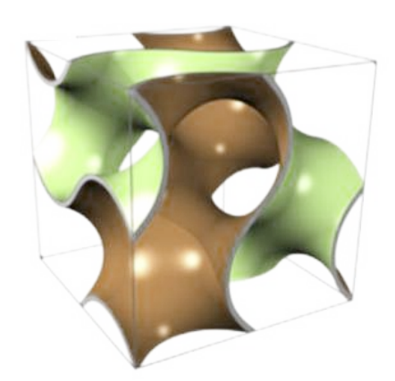
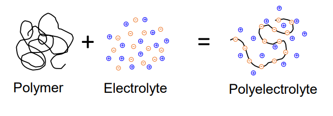
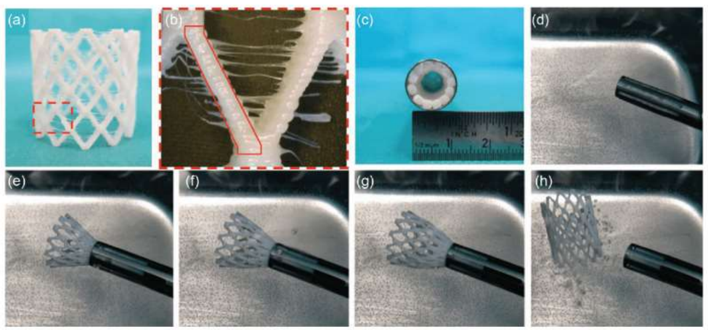
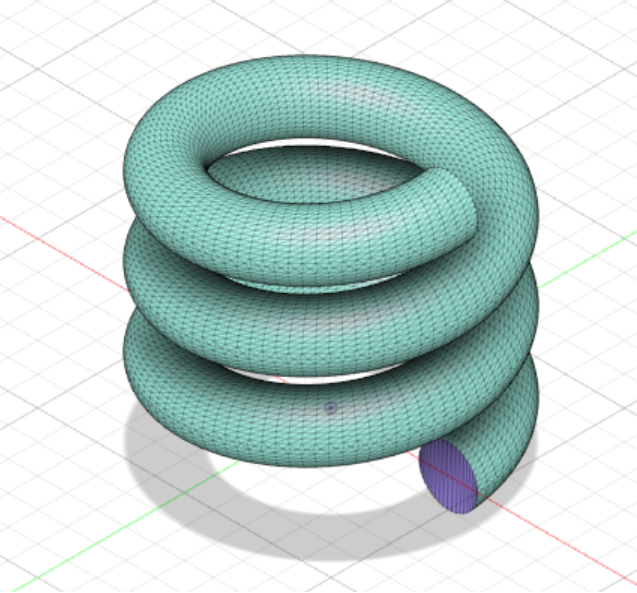
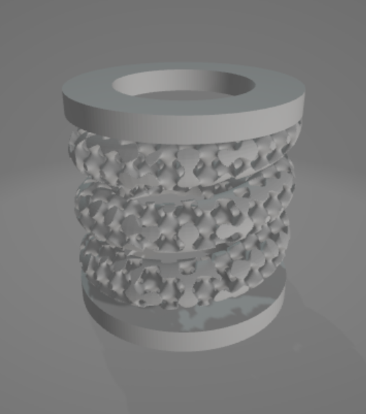
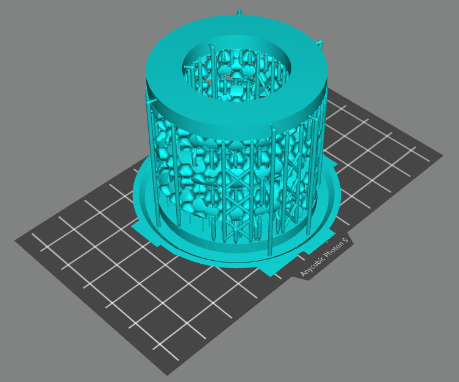
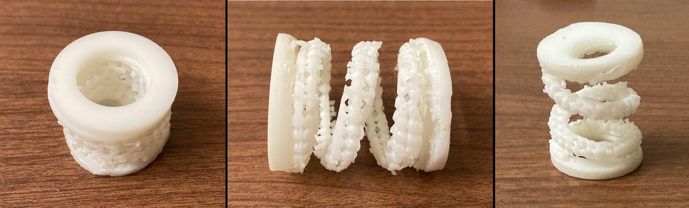

This was a project made alongside a class on Polymeric Biomedical Materials. It's a highly interdisciplinary field and I enjoyed studying the various links between biology, chemistry, engineering and materials a lot, and I picked up some useful CAD and fabrication techniques along the way!

## Background

A current field of biomedical engineering is the applications of regenerative medicine. This aims to treat cases where the structure of a particular organ or tissue has been completely destroyed. Cells can be embedded at the site of damage, which grow and eventually replace the lost tissue. Currently, the most common form of regenerative medicine is to use 'pluripotent stem cells'. This is a type of cell which can, under certain conditions, be encouraged to convert themselves into a more specialised cell.

However, we cannot simply inject cells and hope that they will grow on their own, because native cells also do not do that. Cells require a 'matrix' (aka scaffold), which is a porous network made up of hard substances like collagen, or can be mimicked by synthetic polymers like PLGA. This matrix will house the cells and should be slowly degraded as the cells grow, without leaving any toxic byproducts. In order to induce this growth, we use special growth factors (such as the Yamanaka factors for differentiation), cytokines and other small molecules. When combined, the system can communicate with neighbouring cells and act as part of the native structure. To allow for a high cell density when used <i>in vivo</i>, our matrix should be porous and have high surface area, which inspires the use of [minimal surfaces](https://en.wikipedia.org/wiki/Minimal_surface), like this one:

Another place where shape plays an important role is in the field of responsive materials. These materials change their properties such as their shape in the presence of a stimulus. A common example in engineering is the [bimetallic strip](https://en.wikipedia.org/wiki/Bimetallic_strip), which curves into a circle when a heat source is applied, due to the differential thermal expansion coefficients of two sides of metal. Recently, many biologically relevant cases of this phenomenon have been investigated, such as tissues which fold or bend in the presence of magnetic fields, pH gradients, light.

A [polyelectrolyte](https://en.wikipedia.org/wiki/Polyelectrolyte) is a polymer (long chain molecule) with electrically charged groups, which are balanced by counterions in an electrolye. In the case of hydrogels, the electrolyte is water with dissolved salt.

There is a balance between the charged group interactions versus the polymer self interactions, which depends on the energy supplied to the system. A system will always tend towards its equilibrium state, which minimises the Gibbs free energy of its constituents. For a polyelectrolyte, the free energy is the sum of that of the polymer, the solvent, and an additional interfacial energy term. This is the basis of the [Flory-Huggins solution theory](https://en.wikipedia.org/wiki/Flory%E2%80%93Huggins_solution_theory) of polymeric colloidal sols. Under some conditions, the polymer is swelled (gel-like state) because it is favourable to permit the solvent to enter the polymer's interstitial space, while under other conditions, the two phases separate completely, producing a collapsed state. This in turn affects mechanical properties, allowing us to design materials which modulate their strength to controllable stimuli.

The use of responsive materials in the scaffolds for stem cell therapies is an emerging field and one which interests me greatly, so I aimed to replicate a responsive material which I had seen used as a stent in a recent study.

## Design

First, I made a quick model of the geometry in Solidworks. I used the helix tool to create the winding path, then use the Extrude Along Path tool with a circular section to fill the spring. Finally, I added two hollow cylindrical caps to the top and bottom with the help of reference planes.

With the model geometry set, I moved over to AutoDesk CAD, where I would replicate what I just made:

I then used a volumetric lattice to decrease the density of the spring section. I opted for the [Schwarz P cell](https://en.wikipedia.org/wiki/Schwarz_minimal_surface), which is a type of triply periodic [minimal surface](https://en.wikipedia.org/wiki/Minimal_surface). I used a porosity of 60%, meaning that the mass of this component of the spring would be 2.5 times lighter than if I had used a solid structure. This also permits the passing of fluid through the spacing in the spring more easily, preventing blockages.

I then used AnyCubic Photon Workshop to see how this would look when 3D printed. A supporting truss was added to help stabilise the model during printing.

And here's the final product, printed with a modified blend of PMMA (acrylic), a very biocompatible material. Typically, PMMA is non-biodegradable, but can be made biodegradable if treated chemically before transplant.

Tensile testing showed that my spring had a force constant of $ k \approx 7 $ N/m, making it very flexible.

