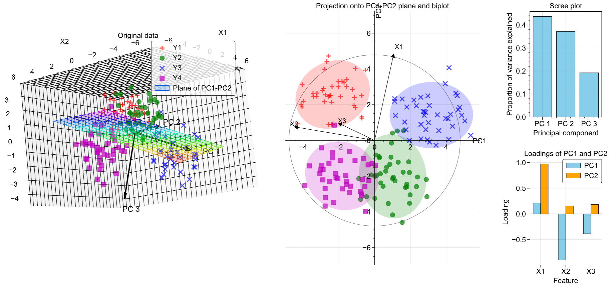

---

title: "Principal Component Analysis Explained"
summary: Understanding PCA from first principles with a visual example in Python.
tags:
  - Statistics
  - Machine Learning

links:
  - icon: github
    icon_pack: fab
    name: Go to project site
    url: https://gist.github.com/lorcan2440/125e05b82a327f22c3b90928a57f8b47

# Media and interaction
commentable: true
share: true
pager: true
show_related: true
profile: true

---

## What is PCA?

Given a set of features $ \left\[ X_1, X_2, ..., X_p \right\] $ that are used to predict a target variable $ y $, these features may be correlated with each other, and thus contain redundant information. This can lead to overfitting of machine learning models, and also increases the computational cost of training and using the model.

{{< figure src="image-1.png" title="The data matrix $ \mathbf{X} $ is the table formed by the features." >}}

Principal component analysis (PCA) is a transformation of the original features into a set of new features that are uncorrelated, and ordered by the amount of variance they capture from the original data. Mathematically, it is a rotation of the coordinate axes used to specify the data into axes along which variance is maximised and covariance is minimised. This allows for dimensionality reduction by selecting only the first few principal components, which retain most of the information while reducing redundancy.

We can denote the new features returned by PCA (called principal components, PCs) as $ \left\[ X_1', X_2', ..., X_p' \right\] $. The first principal component $ X_1' $ captures the most variance in the data, the second principal component $ X_2' $ captures the second most variance, and so on. Each principal component is a linear combination of the original features. 

If the original data matrix is $ \mathbf{X} \in \mathbb{R}^{n \times p} $, then the new data matrix transformed into PC space is denoted $ \mathbf{X}' \in \mathbb{R}^{n \times p} $.

## Standardised data

Before computing the PCs, we need to *standardise* the data, which is a simple shifting and scaling to ensure the dataset has a mean of 0 and a standard deviation of 1 in each feature. For column $ j $ of the data matrix, we replace each column with

$$ X_j \leftarrow \frac{X_j - \mu_j}{\sigma_j} $$

where $ \mu_j $ is the mean of column $ j $, and $ \sigma_j $ is the standard deviation of column $ j $. This ensures that all features are on the same scale.

## The PCA transformation (using SVD)

Given our standardised data matrix $ \mathbf{X} $, there are two ways to compute the PCA transformation:

1. Singular value decomposition (SVD) of the data matrix $ \mathbf{X} $.
2. Eigendecomposition of the covariance matrix $ \mathbf{C} $ of $ \mathbf{X} $.

We will use the SVD approach here, since it is more numerically stable and efficient for large datasets, and then show how it is equivalent to the covariance matrix method.

The SVD of any matrix $ \mathbf{X} $ can be written as

$$ \mathbf{X} = \mathbf{U \Sigma V}^{\top} $$

where $ \mathbf{U} \in \mathbb{R}^{n \times n} $ and $ \mathbf{V} \in \mathbb{R}^{p \times p} $ are square orthogonal matrices, and $ \mathbf{\Sigma} \in \mathbb{R}^{n \times p} $ is a diagonal matrix containing the singular values of $ \mathbf{X} $ in descending order along its leading diagonal. To compute these:

- The columns of $ \mathbf{V} $ are the normalised eigenvectors of $ \mathbf{X}^{\top} \mathbf{X} $.
- The columns of $ \mathbf{U} $ are the normalised eigenvectors of $ \mathbf{X} \mathbf{X}^{\top} $.
- The singular values in $ \mathbf{\Sigma} $ are the square roots of the eigenvalues from either $ \mathbf{X}^{\top} \mathbf{X} $ or $ \mathbf{X} \mathbf{X}^{\top} $ (they are the same).

Now to apply the PCA transformation, we just compute

$$ \mathbf{X}' = \mathbf{X V} \ \ \ \ \text{or} \ \ \ \ \mathbf{X}' = \mathbf{U \Sigma} $$

Either formula gives the same result: the first one is a little easier to interpret, as it can be written like a transformation matrix acting on our data:

$$ \mathbf{X}'^{\top} = \mathbf{V}^{\top} \mathbf{X}^{\top} $$

so $ \mathbf{V}^{\top} $ is the matrix that transforms the original data into the new PC space, noting that now the rows of $ \mathbf{X}^{\top} $ and $ \mathbf{X}'^{\top} $ are the features due to the transpose.

We can see that the formula for computing $ X' $ as a linear combination of the original features $ X_j $ is given by

$$ X_{j}' = \sum_i V_{ij} X_i $$

where $ V_{ij} $ are the *loadings* of $ X_i $ (coefficient in the expression for computing the $j$th PC, $ X_j' $).

The fact that the columns of $ \mathbf{V} $ are orthogonal means that the PCs are uncorrelated, which is a key property of PCA.

## Covariance matrix

The covariance matrix $ \mathbf{C} $ of the data matrix $ \mathbf{X} $ is given by

$$ \mathbf{C} = \frac{1}{n - 1} \mathbf{X}^{\top} \mathbf{X}, $$ 

such that the covariance of features $ X_i $ and $ X_j $ is given by the entry $ C_{ij} $ in the covariance matrix. The diagonal entries $ C_{ii} $ are the variances of each feature.

The uncorrelatedness (independence) of the PCs can be seen by the fact that the covariance matrix of $ \mathbf{X}' $ is diagonal:

$$ \mathbf{C}' = \frac{1}{n - 1} \mathbf{X}'^{\top} \mathbf{X}' = \frac{1}{n - 1} (\mathbf{V}^{\top} \mathbf{X}^{\top}) (\mathbf{X V}) $$

$$ = \mathbf{V}^{\top} \left( \frac{1}{n - 1} \mathbf{X}^{\top} \mathbf{X} \right) \mathbf{V} = \mathbf{V}^{\top} \mathbf{C} \mathbf{V}. $$

which can be rearranged to get $ \mathbf{C} = \mathbf{V C' V}^{\top} $, which is the precisely the eigendecomposition of $ \mathbf{C} $, so the columns of $ \mathbf{V} $ are the eigenvectors of $ \mathbf{C} $, and the diagonal entries of $ \mathbf{C}' $ are the eigenvalues of $ \mathbf{C} $. Since $ \mathbf{C}' $ is diagonal, the PCs are uncorrelated (all covariances between PCs are zero).

This also provides an alternative way to compute the PCA transformation: by first computing $ \mathbf{C} $ from $ \mathbf{X} $, and then computing the eigenvectors of $ \mathbf{C} $ to get $ \mathbf{V} $, and then using $ \mathbf{X}' = \mathbf{X V} $. However, in practice (e.g. Python’s `scikit-learn` library), the SVD approach is used, since [highly optimised algorithms](https://towardsdatascience.com/pca-and-svd-explained-with-numpy-5d13b0d2a4d8) exist for the efficient computation of a direct SVD.

## Dimensionality reduction

Since the PCs are ordered by the amount of variance they capture from the original data, we can reduce the dimensionality of the data by selecting only the first $ k $ PCs, where $ k < p $. This is done by selecting the first $ k $ columns of $ \mathbf{X}' $, denoted $ \mathbf{X}'_k \in \mathbb{R}^{n \times k} $. This reduces the number of features from $ p $ to $ k $, while retaining most of the information in the data.

We can illustrate this with an example. A dataset in three features $ \left\[ X_1, X_2, X_3 \right\] $ is generated with four clusters of points, plotted in 3D space. The PCA transformation is applied, and only the first two PCs are retained, resulting in a new dataset in two features $ \left\[ X_1', X_2' \right\] $. The figure below shows the original data in 3D space, the plane spanned by the first two PCs, and the projection of the data onto this plane.



Notice that the clusters remain well-separated in the reduced 2D space, indicating that most of the information in the original data is retained. This would allow algorithms such as regression, classification or clustering to perform well with a lower dataset size, giving faster performance. The arrows in the first figure show the directions of the three PCs in the original feature space.

The second figure shows the directions of each original feature in the PC space. When superimposed on the PCs, this is called a *biplot*. On the right of the figure, the *scree plot* shows the proportion of variance explained by each PC, which are the relative size of the eigenvalues of $ \mathbf{C} $, and the *loadings* plot shows the contribution of each original feature to the first two PCs. Notice that most of the variance is captured by the first two PCs, so discarding the third PC results in minimal loss of information.

Python code to generate the figure above (on [GitHub Gists here](https://gist.github.com/lorcan2440/125e05b82a327f22c3b90928a57f8b47)):

```python
import numpy as np
import matplotlib.pyplot as plt
import matplotlib.gridspec as gridspec
import matplotlib_inline
from sklearn.decomposition import PCA

#plt.style.use(r'C:\LibsAndApps\Python config files\proplot_style.mplstyle')
matplotlib_inline.backend_inline.set_matplotlib_formats('svg')


# input settings
means = np.array([[2, 2, 2], [-2, -2, 1], [2, -2, -2], [-2, 2, -1]])
n_points = 40
spread = 1.0
colors = ['r', 'g', 'b', 'm']
label_names = ['Y1', 'Y2', 'Y3', 'Y4']
markers = ['+', 'o', 'x', 's']
arrow_scale = 5
feature_names = ['X1', 'X2', 'X3']

# generate data with clusters
data = np.array([mean + spread * np.random.randn(n_points, 3) for mean in means])
X = np.vstack(data)

# transform into PC coordinates
pca = PCA(n_components=3)
X_pca = pca.fit_transform(X)  # this is X' in the text above

#### Figure ####

fig = plt.figure(figsize=(17, 7))
fig.subplots_adjust(wspace=0.7, hspace=0.4)
grid = gridspec.GridSpec(2, 5)

#### First subplot: points in 3D space with plane spanning PC1 and PC2 (where PC3 = 0)
ax1 = fig.add_subplot(grid[0:2, 0:2], projection='3d')

# data points
for i, (cluster, color, marker) in enumerate(zip(data, colors, markers)):
    ax1.scatter(cluster[:, 0], cluster[:, 1], cluster[:, 2], 
               c=color, marker=marker, s=50, alpha=0.7, label=label_names[i])

# plane PC3 = 0
pc1, pc2, pc3 = pca.components_
mean = pca.mean_

u_min = int(np.floor(min(X_pca[:, 0])))
u_max = int(np.ceil(max(X_pca[:, 0])))
v_min = int(np.floor(min(X_pca[:, 1])))
v_max = int(np.ceil(max(X_pca[:, 1])))

u = np.linspace(u_min, u_max, u_max - u_min + 1)
v = np.linspace(v_min, v_max, v_max - v_min + 1)
U, V = np.meshgrid(u, v)

plane_points = mean + U[:, :, np.newaxis] * pc1 + V[:, :, np.newaxis] * pc2
X_plane, Y_plane, Z_plane = plane_points[:, :, 0], plane_points[:, :, 1], plane_points[:, :, 2]

ax1.plot_surface(X_plane, Y_plane, Z_plane, 
                facecolors=plt.cm.gist_rainbow((Z_plane - Z_plane.min()) / (Z_plane.max() - Z_plane.min())),
                alpha=0.2, rstride=1, cstride=1, label='Plane of PC1-PC2')

# arrows for PC axes
for i, pc in enumerate(pca.components_):
    ax1.quiver(mean[0], mean[1], mean[2],
            pc[0]*arrow_scale, pc[1]*arrow_scale, pc[2]*arrow_scale,
            color='k', linewidth=2, arrow_length_ratio=0.1)
    ax1.text(mean[0] + pc[0]*arrow_scale*1.2, mean[1] + pc[1]*arrow_scale*1.2, mean[2] + pc[2]*arrow_scale*1.2,
            f'PC {i+1}', color='k', fontsize=12)

ax1.set_box_aspect(None, zoom=1.3)
ax1.set_xlabel('X1')
ax1.set_ylabel('X2')
ax1.set_zlabel('X3')
ax1.set_title('Original data')
ax1.legend()

#### Second subplot: projection onto PC1 and PC2
ax2 = fig.add_subplot(grid[0:2, 2:4])

for i, color, marker in zip(range(means.shape[0]), colors, markers):

    # data points
    X_pca_i = X_pca[n_points * i : n_points * (i + 1), :]
    ax2.scatter(X_pca_i[:, 0], X_pca_i[:, 1], c=color, marker=marker, s=50, alpha=0.7, label=colors[i])
    
    # confidence ellipses for clusters
    cov = np.cov(X_pca_i.T)
    sigma = 2  # 2 sigma = 95% confidence interval
    lambda_, v = np.linalg.eig(cov)  # eigenvalues and eigenvectors of covariance matrix
    lambda_ = np.sqrt(lambda_)  # square root of eigenvalues
    ell = plt.matplotlib.patches.Ellipse(
        xy=np.mean(X_pca_i, axis=0),
        width=lambda_[0] * sigma * 2, height=lambda_[1] * sigma * 2,
        angle=np.rad2deg(np.arccos(v[0, 0])), facecolor=colors[i], alpha=0.2)

    ax2.add_artist(ell)

circle_scale = min([abs(x) for x in [*ax2.get_xlim(), *ax2.get_ylim()]])

for (feature_name, pc1, pc2) in zip(feature_names, pca.components_[0], pca.components_[1]):
    ax2.arrow(0, 0, pc1 * circle_scale, pc2 * circle_scale, head_width=0.2, head_length=0.2, fc='k', ec='k')
    ax2.text(pc1 * circle_scale * 1.1, pc2 * circle_scale * 1.1, feature_name, fontsize=10)

circle = plt.Circle((0, 0), circle_scale, color='black', alpha=0.5, fill=False)
ax2.add_artist(circle)
ax2.set_xlabel(f'PC2 ({pca.explained_variance_ratio_[0]:.2%})')
ax2.set_ylabel(f'PC2 ({pca.explained_variance_ratio_[1]:.2%})')
ax2.set_xlabel("PC1")
ax2.set_ylabel("PC2")
ax2.set_title('Projection onto PC1-PC2 plane and biplot')

ax2.axis('equal')
ax2.xaxis.set_label_coords(1, 0.5)
ax2.yaxis.set_label_coords(0.5, 1)

ax2.spines['bottom'].set_position(("data", 0))
ax2.spines['left'].set_position(("data", 0))
ax2.spines['top'].set_visible(False)
ax2.spines['right'].set_visible(False)

#### Third subplot: Scree plot
ax3 = fig.add_subplot(grid[0, 4])

ax3.bar(['PC 1', 'PC 2', 'PC 3'], pca.explained_variance_ratio_, color='skyblue', edgecolor='black')
ax3.set_xlabel('Principal component')
ax3.set_ylabel('Proportion of variance explained')
ax3.set_title('Scree plot')

#### Fourth subplot: Loadings
ax4 = fig.add_subplot(grid[1, 4])

ax4.bar([i - 0.15 for i in range(1, len(pca.components_[0]) + 1)], pca.components_[0],
        color='skyblue', width=0.3, edgecolor='black', label='PC1')
ax4.bar([i + 0.15 for i in range(1, len(pca.components_[1]) + 1)], pca.components_[1],
        color='orange', width=0.3, edgecolor='black', label='PC2')
ax4.set_xlabel('Feature')
ax4.set_ylabel('Loading')
ax4.set_xticks(range(1, len(pca.components_[0]) + 1))
ax4.spines['top'].set_visible(False)
ax4.spines['right'].set_visible(False)
ax4.spines['left'].set_visible(False)
ax4.spines['bottom'].set_visible(False)
ax4.axhline(0, color='black', linewidth=0.8)

ax4.set_xticklabels(feature_names, rotation=0)
ax4.minorticks_off()
ax4.legend()
ax4.set_title('Loadings of PC1 and PC2')

plt.savefig('Figure.svg')
plt.show()
```