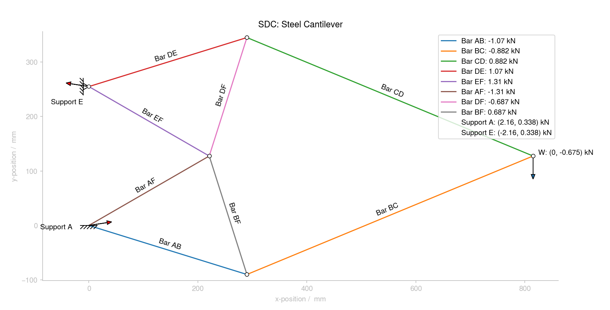

The idea for creating this came from the Structural Design Course (SDC) long lab project in Part IA (1st year) of the Engineering course at the University of Cambridge. I originally wrote about 30 lines of code just to check some calculations of my own, then thought about making it work for any truss so I could improve it. After the lab ended I continued working on it in my spare time just for fun, and it evolved into a fairly neat project!

I used this project as an opportunity to develop some important software concepts - object-oriented programming (OOP), test-driven development (TDD) and the use of design patterns.

Soon, I'll be writing a Flask app to allow interactive designing of trusses and real-time viewing. In the long term, I want to explore truss optimisation to various design constraints.

