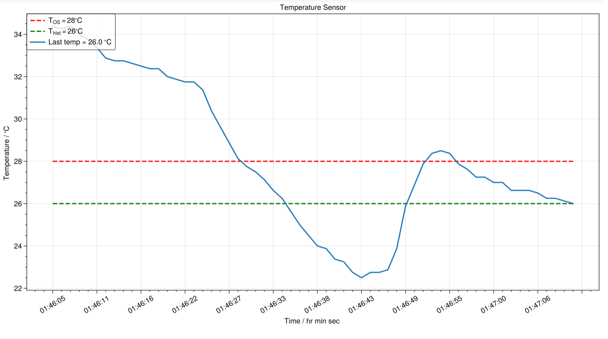

This was an introductory project for exploring serial communications, sensing with hardware and live data processing. I initially built it with an STM32 Nucleo microcontroller with a USB cable link, then improved it to use an Arduino Uno WiFi to communicate wirelessly over Bluetooth to a remote screen for viewing.

I built the Arduino version during the mid-July 2022 UK heatwave, where outside temperatures reached  sizzling 40 degrees C. I felt that my room was even hotter, but I didn't have a thermometer, so I made this mini-project to find out.

To use Bluetooth functionality, I used the `WiFiNINA` library to run a simple loop in which the Arduino reads a value from the sensor and sends it over the Bluetooth channel once per second. For simplicity I sent the value as a string (which would be sent as ASCII bits rather than a binary representation of the temperature).

```cpp
// Arduino code
void setup() {
  // initialise serial communications:
  pinMode(NINA_RESETN, OUTPUT);         
  digitalWrite(NINA_RESETN, LOW);
  Serial.begin(115200);  // baud rate
  SerialNina.begin(115200);
  
  int i = 0;  // measurement number (index)
  
  while (true) {
    // convert sensor reading to temperature using the formula given in the datasheet (pg. 7)
    int sensorValue = analogRead(A0);
    float voltage = sensorValue * (5.0 / 1023.0);
    float temperature = (voltage - 1.375) / 0.0225;

    SerialNina.print("Measurement #");
    SerialNina.print(i);
    SerialNina.print(" - Temperature = ");
    SerialNina.println(temperature);
    
    
    if (Serial.available()) {
      SerialNina.write(Serial.read());}
    /*
    if (SerialNina.available()) {
      Serial.write(SerialNina.read());}*/  // for two-way comms - disable for now
      
    i += 1;
    delay(1000);  // time delay between readings = 1000 ms = 1 s
  };
};
```

Once this program is running on the Arduino, we can capture the signals from a device running some Python code:

```python
# Python code, to be run on computer
import datetime as dt
import time

from matplotlib import pyplot as plt
from matplotlib.ticker import MaxNLocator
import matplotlib.animation as anim

from serial import Serial
from serial.serialutil import PortNotOpenError
from serial.tools.list_ports import comports

# can change these
VALS_WINDOW = 60  # seconds before moving graph along
USE_COM_PORT = None  # can be autodetected if not known e.g. 'COM5'
OUTPUT_FILENAME = 'all_temp_vals.csv'  # output all temp data after closing

# set by microcontroller program
T_OS = 28  # maximum safe temperature
T_HIST = 26  # temp must fall below this after overheating (hysteresis) to turn off warning light
_TIME_STEP = 1  # value sent once per second

# hardware properties
_BAUD_RATE = 115200  # baud rate
_PORT_DESC_KEYWORD = 'Standard Serial over Bluetooth link'  # search COM port descriptions for this keyword


def read_last_temp(frame: int, current_time: dt.datetime):

    data = str(s.readline())

    while 'Measurement' not in data:
        time.sleep(_TIME_STEP / 1000)
        data = str(s.readline())
    else:
        temp = float(data.split('Temperature = ')[-1].split(r'\r')[0])
        temp = round(temp, 1)
        print(f'T = {temp} \t\t t = {current_time} \t\t frame = {frame}')
        return temp


def animate(frame: int, times_raw: list[float], temps_raw: list[float]):

    current_time = dt.datetime.now()
    last_temp = round(read_last_temp(frame, current_time), 3)

    times_raw.append(current_time)
    temps_raw.append(last_temp)

    times = [timestamp.strftime('%H:%M:%S') for timestamp in times_raw[-1 * VALS_WINDOW :]]
    temps = temps_raw[-1 * VALS_WINDOW :]

    plt.cla()
    plt.title('Temperature Sensor')
    plt.xlabel('Time / hr min sec ')
    plt.ylabel('Temperature / $ ^{\circ} C $ ')
    plt.xticks(rotation=30)
    plt.gca().xaxis.set_major_locator(MaxNLocator(15))

    plt.plot(times, [T_OS] * len(times),
        label=r'$ T_{OS} = $' + f'{T_OS} ' + r'$ ^{\circ} C $', color='red', linestyle='dashed')
    plt.plot(times, [T_HIST] * len(times),
        label=r'$ T_{hist} = $' + f'{T_HIST} ' + r'$ ^{\circ} C $', color='green', linestyle='dashed')

    plt.plot(times, temps, label=f'Last temp = {last_temp}' + r' $ ^{\circ} C $')
    plt.legend(loc='upper left')


if __name__ == '__main__':

    # init
    times_raw, temps_raw = [], []
    fig = plt.figure()

    # find COM port of arduino
    if USE_COM_PORT is None:
        port_nos = [(portno, desc) for portno, desc, _ in comports() if _PORT_DESC_KEYWORD in desc]
        port_nos.sort(key=lambda p: p[0])
        if port_nos != []:
            port, desc = port_nos[-1]
        else:
            raise NameError('Could not find a COM port. Try specifying the port number in USE_COM_PORT.')
    else:
        port, desc = USE_COM_PORT, None

    # read data continuously from serial and make animated live plot
    with Serial(port, _BAUD_RATE, timeout=1) as s:
        if not s.is_open:
            raise PortNotOpenError
        print(f'Connected to {port}: {desc}')
        ani = anim.FuncAnimation(fig, animate, fargs=(times_raw, temps_raw))
        plt.show()

    # export all data as .csv when graph window closed
    with open(OUTPUT_FILENAME, 'a') as f:
        f.truncate(0)
        f.write('Number,Time / hh:mm:ss,Temperature / C\n')
        for frame, (timestamp, temp) in enumerate(zip(times_raw, temps_raw)):
            f.write(f'{frame},{timestamp},{temp}\n')
        print(f'Output data written to {OUTPUT_FILENAME}')
```

In addition to logging the data for later analysis if needed, this allows us to plot the temperature in real time and see the graph:

